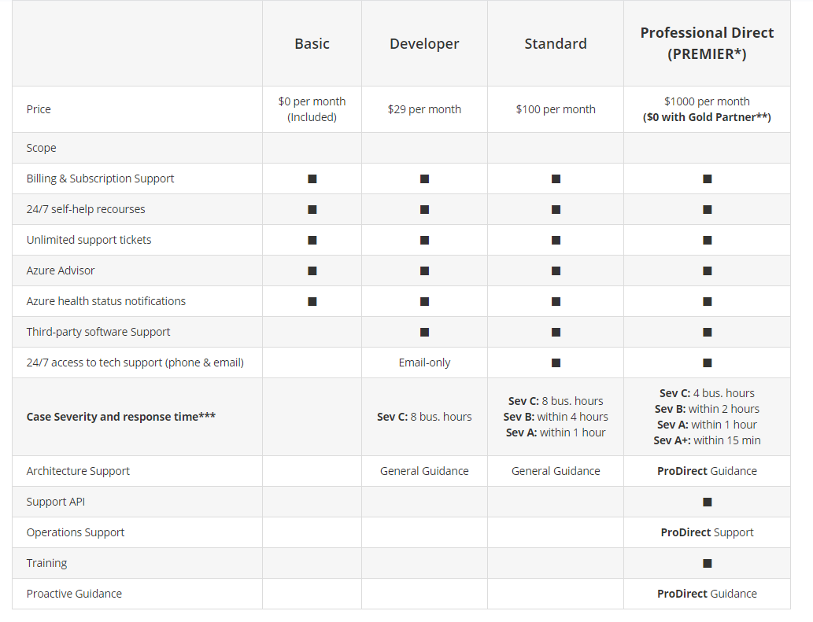

# Describe Azure cost management and Service Level Agreements (10~15%)

# Describe methods for planning and managing costs

## Identify factors that can affect costs (resource types, services, locations, ingress and egress traffic)

일반적인 요인에는 리소스를 사용하는 방식, 구독 유형 및 타사 공급업체의 가격이 있습니다. 각각에 대해 간단히 살펴보겠습니다.

### **리소스 유형**

Azure 리소스 비용에 영향을 주는 여러 요인이 있습니다. 이러한 요인은 리소스 종류 또는 리소스를 사용자 지정하는 방법에 따라 다릅니다.

예를 들어 스토리지 계정을 사용하는 경우 종류(예: 블록 Blob 스토리지 또는 테이블 스토리지), 성능 계층(표준 또는 프리미엄) 및 액세스 계층(핫, 쿨 또는 보관)을 지정합니다. 선택 사항에 따라 비용이 달라집니다.

### **사용량 미터**

리소스를 프로비저닝하면 Azure는 해당 리소스의 사용량을 추적하는 ‘미터’를 만듭니다. Azure는 미터를 사용하여 사용량 레코드를 생성하며, 생성된 레코드는 나중에 청구서를 사용하는 데 사용됩니다.

사용량 미터는 집에서 전기나 수도를 사용하는 것과 비슷하게 작동합니다. 매월 전기나 수도 서비스에 대해 기본 가격을 지불할 수 있지만, 최종 요금은 사용한 총 양을 기준으로 합니다.

단일 VM을 예로 들어 살펴보겠습니다. 가상 머신의 사용량을 추적할 때는 다음과 같은 종류의 미터가 사용됩니다.

- 전체 CPU 시간
- 하나의 공용 IP 주소로 소요된 시간
- VM을 들어오고 나가는 수신 및 송신 네트워크 트래픽
- 디스크 크기와 디스크 읽기 및 디스크 쓰기 작업의 양

각 미터는 특정 유형의 사용량을 추적합니다. 예를 들어 미터는 대역폭 사용량(수신 또는 송신 네트워크 트래픽을 초당 비트로 측정), 작업 수, 크기(스토리지 용량을 바이트로 측정)를 추적할 수 있습니다.

미터에서 추적하는 사용량은 청구 가능 단위의 수량과 관련이 있습니다. 이러한 단위는 각 청구 기간별로 계정에 청구됩니다. 청구 가능 단위의 요율은 사용하는 리소스 종류에 따라 달라집니다.

### **리소스 사용량**

Azure에서는 항상 사용한 양에 따라 요금이 청구됩니다. 예를 들어 VM을 할당 취소하면 요금이 어떻게 적용되는지 살펴보겠습니다.

Azure에서는 VM을 삭제하거나 할당을 취소할 수 있습니다. VM을 삭제한다는 것은 더 이상 VM이 필요 없다는 뜻입니다. 해당 VM은 구독에서 제거되고 다른 고객이 사용할 수 있도록 준비됩니다.

VM의 할당을 취소하면 VM이 더 이상 실행되지 않습니다. 하지만 연결된 하드 디스크와 데이터는 계속 Azure에 유지됩니다. 해당 VM은 Azure 데이터 센터의 CPU나 네트워크에 할당되지 않으므로 컴퓨팅 시간이나 VM의 IP 주소와 관련된 비용을 생성하지 않습니다. 디스크 및 데이터는 계속 저장되고 있으며 해당 리소스가 Azure 구독에 표시되므로 디스크 스토리지에 대한 요금은 계속해서 청구됩니다.

일정 시간 동안 VM을 사용하지 않으려는 경우 VM 할당을 취소하는 것은 비용을 최소화하는 한 가지 방법입니다. 예를 들어 테스트를 위해 사용하는 VM은 테스트 팀이 사용하지 않는 주말에 할당 취소할 수 있습니다. 비용을 최소화하는 방법은 이 모듈의 뒷부분에서 자세히 알아봅니다.

### **Azure 구독 형식**

일부 Azure 구독 유형에는 비용에 영향을 주는 사용 허용량도 포함되어 있습니다.

예를 들어 Azure 평가판 구독은 12개월 동안 무료로 제공되는 다양한 Azure 제품에 대한 액세스를 제공합니다. 또한 가입 후 30일 이내에 사용할 수 있는 크레딧이 제공됩니다. 그리고 항상 무료로 제공되는 25개가 넘는 제품을 사용할 수 있습니다(리소스 및 지역 가용성에 따라 다름).

## **위치나 네트워크 트래픽이 비용에 영향을 주나요?**

Azure에서 리소스를 프로비저닝할 대 리소스를 배포할 위치(Azure 지역이라고 함)를 정의해야 합니다. 이러한 결정이 비용에 영향을 주는 이유를 살펴보겠습니다.

### **위치**

Azure 인프라는 전 세계에서 배포되므로 서비스를 중앙에서 배포하거나 고객이 사용하는 위치와 가장 가까운 곳에서 서비스를 프로비저닝할 수 있습니다.

각 지역에는 서로 다른 가격이 적용될 수 있습니다. 지리적 지역은 네트워크 트래픽 흐름에 영향을 줄 수 있으므로 네트워크 트래픽 또한 고려해야 하는 비용 영향 요인이 됩니다.

예를 들어 Tailwind Traders가 Azure 리소스를 가장 저렴한 가격을 제공하는 Azure 지역에서 프로비저닝하도록 결정했다고 가정하겠습니다. 이 결정으로 회사 비용이 약간 절약될 것입니다. 그러나 이러한 지역 간에 데이터를 전송해야 하거나 사용자가 서로 다른 지역에 있는 경우에는 해당 리소스 간에 데이터를 전송하는 데 소요되는 추가 네트워크 사용량 비용이 기존의 잠재적인 절감액을 상쇄할 수 있습니다.

### **네트워크 트래픽 요금 청구 영역**

청구 영역은 일부 Azure 서비스의 비용을 결정하는 요인입니다.

[대역폭](https://azure.microsoft.com/pricing/details/bandwidth)이란 Azure 데이터 센터로 들어오고 나가는 데이터를 말합니다. 일부 인바운드 데이터 전송(Azure 데이터 센터로 들어오는 데이터)은 무료입니다. 아웃바운드 데이터 전송(Azure 데이터 센터에서 나가는 데이터)의 경우 *영역* 에 따라 데이터 전송 가격이 책정됩니다.

영역은 대금을 청구할 목적으로 Azure 지역을 지리적으로 그룹화한 것입니다. 다음 영역에는 여기에 표시된 영역 중 일부가 포함되어 있습니다.

- **영역 1**: 오스트레일리아 중부, 미국 서부, 미국 동부, 캐나다 서부, 서유럽, 프랑스 중부 및 기타 영역
- **영역 2**: 한국 남부, 오스트레일리아 동부, 일본 서부, 인도 중부 및 기타 영역
- **영역 3**: 브라질 남부, 남아프리카 공화국 북부, 남아프리카 공화국 서부, 아랍에미리트 중부, 아랍에미리트 북부
- **독일 영역 1**: 독일 중부, 독일 북동부

### **예상 총 비용을 계산하려면 어떻게 해야 하나요?**

앞에서 알아보았듯이, 정확한 비용을 예상하려면 위의 모든 요인을 고려해야 합니다. 다행히 Azure 가격 계산기를 사용하면 이 프로세스에 도움이 됩니다.

가격 계산기는 Azure 제품을 범주별로 표시합니다. 이러한 범주를 예상치에 추가하고 요구 사항에 따라 구성합니다. 이렇게 하면 솔루션에 추가한 각 리소스와 관련된 비용에 대한 자세한 분석과 함께 통합된 예상 가격을 볼 수 있습니다. 예상 가격을 내보내거나 공유하거나 나중을 위해 저장할 수 있습니다. 저장된 예상 가격을 로드하고 업데이트된 요구 사항에 맞게 수정할 수 있습니다.

가격 계산기 내에서 각 제품에 대한 가격 세부 정보, 제품 세부 정보 및 설명서에 액세스할 수도 있습니다.

가격 계산기에서 구성할 수 있는 옵션은 제품마다 다르지만 다음과 같은 옵션이 포함될 수 있습니다.

- **지역**

    지역은 서비스를 프로비저닝할 수 있는 지리적 위치입니다. 그 예로 동남 아시아, 캐나다 중부, 미국 서부, 유럽 북부를 들 수 있습니다.

- **계층**

    무료 계층, 기본 계층 등의 계층마다 가용성 또는 성능 수준이 다르며 따라서 비용도 다릅니다.

- **청구 옵션**

    청구 옵션은 서비스 요금을 지불할 수 있는 여러 가지 방법을 보여 줍니다. 옵션은 고객 유형과 구독 유형에 따라 다를 수 있으며 비용 절감 옵션을 포함할 수 있습니다.

- **지원 옵션**

    이 옵션을 사용하여 특정 서비스에 대한 추가 지원 가격 옵션을 선택할 수 있습니다.

- **프로그램 및 제품**

    고객이나 구독 유형에 따라 여 특정 라이선스 프로그램이나 기타 제품을 선택할 수 있습니다.

- **Azure 개발/테스트 가격 책정**

    이 옵션에는 개발 및 테스트 워크로드에 사용할 수 있는 가격이 나열됩니다. 개발/테스트 가격은 개발/테스트 제품 기반의 Azure 구독 내에서 리소스를 실행하는 경우에 적용됩니다.

가격 계산기는 실제 가격이 *아닌* 예상 가격을 제공한다는 사실을 기억하세요. 실제 가격은 구매 날짜, 사용하는 결제 통화 및 Azure 고객 유형에 따라 달라질 수 있습니다.

## Identify factors that can reduce costs (reserved instances, reserved capacity, hybrid use benefit, spot pricing)

주거 개선 용품 소매업체인 Tailwind Traders의 팀에게는 “여러 번 측정하고 한번 재단하라”라는 경구가 적용됩니다.

다음은 비용을 최소화하는 데 도움이 되는 몇 가지 권장 사례입니다.

### **배포 전에 예상 비용 이해하기**

Azure에서 솔루션을 계획하는 데 도움이 되도록 필요한 제품, 서비스 및 리소스를 신중하게 고려해야 합니다. 관련 설명서를 읽고 선택한 각 항목의 사용량을 측정하고 요금을 청구하는 방법을 알아보세요.

가격 계산기와 TCO(총 소유 비용) 계산기를 사용하여 예상 비용을 계산합니다. 솔루션에 필요한 제품, 서비스 및 리소스만 추가합니다.

### **Azure Advisor를 사용하여 사용량 모니터링하기**

실제 사용량에 맞게 리소스를 프로비저닝하는 것이 가장 좋습니다.

Azure Advisor는 사용되지 않거나 사용량이 저조한 리소스를 식별하여 제거해도 되는 미사용 리소스를 추천해 줍니다. 이 정보는 실제 워크로드와 일치하도록 리소스를 구성하는 데 도움이 됩니다.

다음 이미지는 Azure Advisor의 몇 가지 샘플 권장 사항을 보여 줍니다.

권장 사항은 높음, 중간, 낮음 영향력을 기준으로 정렬됩니다. 때에 따라 Azure Advisor가 기본 문제를 자동으로 수정하기도 합니다. 높음 영향력에 나열된 두 가지 문제와 같이 사용자의 개입이 필요한 문제도 있습니다.

### **지출 한도를 사용하여 지출 제한하기**

평가판 또는 크레딧 기반 Azure 구독이 있는 경우 지출 한도를 사용하여 실수로 인한 초과 사용을 방지할 수 있습니다.

예를 들어 Azure 체험 계정에 포함된 크레딧을 모두 사용한 경우 배포된 Azure 리소스가 프로덕션에서 제거되고 Azure 가상 머신이 중지 및 할당 취소됩니다. 스토리지 계정의 데이터는 읽기 전용으로 사용할 수 있습니다. 현재 평가판 구독을 종량제 구독으로 업그레이드할 수 있습니다.

크레딧 기반 구독을 사용 중이고 구성된 지출 한도에 도달한 경우, Azure는 새로운 청구 기간이 시작될 때까지 구독을 일시 중단합니다.

이와 관련된 개념이 ‘할당량’, 즉 구독에서 프로비저닝할 수 있는 비슷한 리소스의 수에 대한 한도입니다. 예를 들어 지역마다 최대 25,000개의 VM을 할당할 수 있습니다. 이러한 한도는 주로 Microsoft에서 데이터 센터 용량을 계획하는 데 도움이 됩니다.

### **Azure Reservations를 사용하여 선납**

Azure Reservations는 특정 Azure 서비스에 대해 할인된 가격을 제공합니다. Azure Reservations를 사용하면 종량제 가격과 비교하여 최대 72퍼센트까지 절감할 수 있습니다. 할인을 받으려면 요금을 선납하여 서비스 및 리소스를 예약합니다.

예를 들어 VM, 데이터베이스 컴퓨팅 용량, 데이터베이스 처리량 및 기타 Azure 리소스의 1년 또는 3년치 사용 요금을 선납할 수 있습니다.

다음 예에서는 VM의 예상 절감액을 보여줍니다. 이 예에서는 3년 약정으로 72%를 절감합니다.

Azure Reservations는 기업계약 구독, 클라우드 솔루션 공급자 구독 및 종량제 구독을 사용하는 고객이 이용할 수 있습니다.

### **저렴한 위치 및 Azure 지역 선택**

Azure 제품, 서비스 및 리소스의 비용은 위치와 지역에 따라 달라질 수 있습니다. 되도록이면 비용이 저렴한 위치와 Azure 지역을 사용해야 합니다.

일부 리소스는 나가는(송신) 네트워크 대역폭 사용량을 측정하여 요금이 청구됩니다. 지역 간 송신 트래픽을 줄이려면 동일한 Azure 지역에서 대역폭을 기준으로 측정되는 연결된 리소스를 프로비저닝해야 합니다.

### **제공되는 비용 절감 제안 조사**

최신 Azure 고객 및 구독 프로모션을 확인하고, 비용 절감 혜택이 가장 큰 프로모션으로 전환하세요.

### **Azure Cost Management + 청구를 사용하여 지출 제어하기**

Azure Cost Management + 청구는 Azure 청구서를 이해하고, 계정 및 구독을 관리하고, Azure 지출을 모니터링 및 제어하고, 리소스 사용을 최적화하는 데 도움이 되는 무료 서비스입니다.

다음 이미지는 서비스를 기준으로 현재 사용량을 보여 줍니다.

이 예에서는 웹 애플리케이션 호스팅 서비스인 Azure App Service가 가장 큰 비용을 생성합니다.

Azure Cost Management + 청구 기능은 다음을 포함합니다.

- **보고**

    기록 데이터를 사용하여 보고서를 생성하고 향후 사용량과 비용을 예측합니다.

- **데이터 보강**

    실제 비즈니스 및 조직 구성단위에 해당하는 태그를 사용하여 리소스를 분류함으로써 비용 담당자를 지정합니다.

- **예산**

    리소스 수요 추세, 사용 요금 및 비용 패턴을 모니터링하여 비용 및 사용 예산을 만들고 관리합니다.

- **경고**

    비용 및 사용 예산에 따라 경고를 받습니다.

- **권장 사항**

    유휴 리소스를 제거하고 프로비저닝하는 Azure 리소스를 최적화하기 위한 권장 사항을 받습니다.

### **태그를 적용하여 비용 담당자 식별하기**

‘태그’는 여러 Azure 제품 및 리소스 그룹과 관련된 비용을 관리하는 데 도움이 됩니다. Azure 리소스 그룹에 태그를 적용하여 청구 데이터를 정리할 수 있습니다.

예를 들어 여러 팀을 위해 여러 대의 VM을 실행하는 경우 태그를 사용하여 HR, 마케팅, 재무와 같은 부서나 테스트, 프로덕션과 같은 환경을 기준으로 비용을 분류할 수 있습니다.

태그를 사용하면 가장 큰 Azure 비용을 생성하는 그룹을 보다 쉽게 식별할 수 있으며, 그에 따라 지출을 조정할 수 있습니다.

다음 이미지는 Azure Cost Management + 청구 페이지에서 태그로 분류된 일 년 치 사용량 분석 정보를 보여 줍니다.

### **사용률이 낮은 가상 머신 크기 조정하기**

Azure Cost Management + Billing 및 Azure Advisor에서 찾을 수 있는 한 가지 공통된 권장 사항은 사용량이 저조하거나 유휴 상태인 VM의 크기를 조정하거나 종료하라는 것입니다.

예를 들어 전체 크기가 **Standard_D4_v4** 이고 vCPU 4개와 16GB 메모리를 제공하는 범용 VM 유형의 VM이 있다고 가정하겠습니다. 이 VM은 90%의 시간 동안 유휴 상태에 있다는 사실을 확인했습니다.

가상 머신 비용은 선형으로 증가하며 동일한 시리즈에서 크기가 하나씩 커질 때마다 두 배가 늘어납니다. 따라서 이 경우에는 VM의 크기를 **Standard_D4_v4** 에서 하나 작은 크기인 **Standard_D2_v4** 로 줄이면 컴퓨팅 비용을 50퍼센트 줄일 수 있습니다.

다음 이미지에서 이 예를 보여 줍니다.

VM의 크기를 조정하려면 VM을 중지하고 크기를 조정한 후 다시 시작해야 합니다. 크기 변경 규모에 따라 시간이 몇 분 정도 걸릴 수 있습니다. 크기 조정 작업을 수행하는 동안에는 적절히 중단을 계획하거나 트래픽을 다른 인스턴스로 전환해야 합니다.

### **업무 외 시간에 가상 머신 할당 취소하기**

VM을 ‘할당 취소’한다는 것은 해당 VM이 더 이상 실행되지 않지만 연결된 하드 디스크와 데이터는 계속해서 Azure에 유지된다는 것을 의미함을 기억하세요.

특정 기간에만 사용되는 VM 워크로드를 매일 항상 실행하는 경우 비용이 낭비됩니다. VM은 사용 중이 아닌 경우 종료했다가 필요한 경우 다시 시작하면 VM이 할당 취소된 동안 컴퓨팅 비용을 절감할 수 있는 좋은 후보가 됩니다.

이 방법은 업무 시간 중에만 VM이 필요한 개발 및 테스트 환경에 적합한 전략입니다. Azure는 일정에 따라 VM을 자동으로 시작하고 중지하는 방법도 제공합니다.

### **미사용 리소스 삭제하기**

권장 사항이 당연한 것처럼 보이겠지만, 사용되지 않는 리소스는 종료해야 합니다. 프로젝트를 완료하는 데 더 이상 필요하지 않은 비프로덕션 시스템이나 개념 증명 시스템이 그대로 남아 있는 경우가 많습니다.

정기적으로 환경을 검토하여 이러한 시스템을 파악하세요. 이 시스템을 종료하면 인프라 비용을 절약하고 라이선싱 및 운영 비용을 절약하는 두 가지 이점을 얻을 수 있습니다.

### **IaaS에서 PaaS 서비스로 마이그레이션하기**

워크로드를 클라우드로 이동하면 자연스럽게 IaaS(Infrastructure as a Service) 서비스를 시작하게 됩니다. IaaS는 이미 익숙하게 알고 있는 개념과 운영에 보다 직접적으로 매핑되기 때문입니다.

시간이 지남에 따라 비용을 절감하는 한 가지 방법은 PaaS(Platform as a service) 서비스에서 실행되도록 IaaS 워크로드를 점진적으로 이동하는 것입니다. IaaS는 컴퓨팅 인프라에 대한 직접 액세스로 볼 수 있다면 PaaS는 고객을 위해 관리되는 미리 만들어진 개발 및 배포 환경을 제공합니다.

예를 들어 Azure에서 실행 중인 VM에서 SQL Server를 실행한다고 가정하겠습니다. 이 구성은 기본 운영 체제를 관리하고, SQL Server 라이선스를 설정하고, 소프트웨어 및 보안 업데이트를 관리하는 등의 작업을 수행해야 합니다. 데이터베이스가 쿼리를 처리하는지 여부에 관계없이 VM에 대한 비용도 지불해야 합니다. 이러한 비용을 절감할 한 가지 방법은 VM에서 실행되는 SQL Server에서 Azure SQL Database로 데이터베이스를 이동하는 것입니다. Azure SQL Database는 SQL Server를 기반으로 합니다.

Azure SQL Database와 같은 PaaS 서비스는 실행하는 데 비용이 적게 들 뿐 아니라 고객을 위해 관리되기 때문에 소프트웨어 업데이트, 보안 패치, 읽기/쓰기 작업을 위한 물리적 스토리지 최적화에 대해 걱정할 필요가 없습니다.

### **라이선스 비용 절감**

라이선스는 클라우드 지출에 크게 영향을 줄 수 있는 또 다른 영역입니다. 라이선스 비용을 줄일 수 있는 몇 가지 방법을 살펴보겠습니다.

**비용 효율적인 운영 체제 선택하기**

여러 Azure 서비스에서 Windows와 Linux 중 하나에서 실행할 수 있도록 선택지를 제공합니다. 때에 따라 어느 운영 체제를 선택하는지에 따라 비용이 달라지기도 합니다. 무엇을 실행할지 선택할 수 있고 애플리케이션이 기본 운영 체제에 종속되지 않는 경우, 가격을 비교하여 비용을 절감할 수 있는지 살펴보는 것이 유용할 수 있습니다.

**Azure 하이브리드 혜택을 사용하여 Azure에서 사용한 소프트웨어 라이선스의 용도 변경**

Windows Server 또는 SQL Server 라이선스를 구매했고 라이선스에 [Software Assurance](https://www.microsoft.com/licensing/licensing-programs/software-assurance-default)가 적용되는 경우 Azure의 VM에서 사용하도록 해당 라이선스의 용도를 변경하는 것이 가능할 수 있습니다.

일부 정보는 Windows Server와 SQL Server 간에 차이가 있습니다. 자세하게 알아볼 수 있는 리소스가 이 모듈의 마지막 부분에 제공되어 있습니다.

## Describe the functionality and usage of Pricing calculator and the Total Cost of Ownership(TCO) calculator

Tailwind Traders는 클라우드로 마이그레이션하기에 앞서 현재 데이터 센터에서 지출되는 비용을 정확하게 파악하려 합니다.

회사의 현재 상황을 제대로 파악하면 비용이라는 측면에서 클라우드 마이그레이션이 어떤 효과를 가져올지 자세히 알아볼 수 있습니다.

이 단원에서는 TCO(총 소유 비용) 계산기를 사용하여 데이터 센터에서 실행하는 비용과 Azure에서 실행하는 비용을 비교하는 방법을 알아봅니다.

### **TCO 계산기란?**

[TCO 계산기](https://azure.microsoft.com/pricing/tco/calculator)는 솔루션을 온-프레미스 데이터 센터 대신 Azure에서 운영하면 얼마만큼의 비용을 절약할 수 있는 예측할 수 있습니다.

*총 소유 비용* 은 일반적으로 사용되는 재무 용어입니다. 온-프레미스에서 기술적 기능을 운영하는 데 드는 숨겨진 비용을 모두 확인하기는 어려울 수 있습니다. 소프트웨어 라이선스 및 하드웨어는 추가 비용입니다.

TCO 계산기에서 온-프레미스 워크로드의 세부 정보를 입력합니다. 그리고 관련된 운영 비용에 대해 제안된 산업 평균 비용(조정 가능)을 검토합니다. 이러한 비용에는 전기 요금, 네트워크 유지 관리비 및 IT 인건비가 포함됩니다. 그 후에는 보고서가 나란히 표시됩니다. 이 보고서를 사용하여 해당 비용을 Azure에서 실행되는 동일한 워크로드와 비교할 수 있습니다.

다음 이미지에서는 한 가지 예를 보여줍니다.

**참고**

TCO 계산기는 Azure 구독이 없어도 사용할 수 있습니다.

### **TCO 계산기의 이용 방법**

TCO 계산기를 사용하려면 다음과 같은 세 단계를 거쳐야 합니다.

- 워크로드를 정의합니다.
- 가정을 조정합니다.
- 보고서를 봅니다.

각 단계를 자세히 살펴보겠습니다.

**1단계: 워크로드 정의**

먼저 다음과 같은 네 가지 범주에 따라 TCO 계산기에 온-프레미스 인프라의 사양을 입력합니다.

- **서버**

    이 범주에는 운영 체제, 가상화 방법, CPU 코어 및 메모리(RAM)가 포함됩니다.

- **데이터베이스**

    이 범주에는 예상되는 최대 동시 사용자 로그인 수를 포함하여 사용하려는 데이터베이스 유형, 서버 하드웨어 및 Azure 서비스가 포함됩니다.

- **스토리지**

    이 범주에는 백업 또는 보관 스토리지를 포함하여 스토리지 유형 및 용량이 포함됩니다.

- **네트워킹**

    이 범주에는 현재 온-프레미스 환경에서 사용하는 네트워크 대역폭의 양이 포함됩니다.

**2단계: 가정 조정**

다음으로, 현재 온-프레미스 라이선스에 대해 [Software Assurance](https://www.microsoft.com/licensing/licensing-programs/software-assurance-default)가 등록되어 있는지 여부를 지정합니다. Software Assurance는 Azure에서 해당 라이선스를 다시 사용하여 비용을 절감할 수 있도록 지원합니다. 중복성을 강화하기 위해 스토리지를 다른 Azure 지역에 복제해야 하는지 여부도 지정합니다.

이렇게 하면 여러 영역의 주요 운영 비용 가정을 확인할 수 있습니다. 주요 운영 비용은 팀과 조직별로 달라질 수 있습니다. 이 비용은 독립 연구 업체인 Nucleus Research에 의해 인증된 바 있습니다. 예를 들어 다음과 같은 비용이 포함됩니다.

- 킬로와트 시간(KWh)당 전기 요금
- IT 관리의 시간당 요금
- 네트워크 하드웨어 및 소프트웨어 비용의 백분율로 표현되는 네트워크 유지 관리 비용

TCO 계산기 결과의 정확도를 높이려면 현재 온-프레미스 인프라 비용과 일치하도록 값을 조정해야 합니다.

**3단계: 보고서 보기**

1~5년 사이에서 시간 프레임을 선택합니다. TCO 계산기가 입력된 정보를 기반으로 보고서를 생성합니다. 예를 들면 다음과 같습니다.

각 범주(컴퓨팅, 데이터 센터, 네트워킹, 스토리지 및 IT 인건비)에 대해 해당 워크로드를 온-프레미스에서 운영하는 것과 Azure에서 운영하는 것의 비용 분석을 나란히 비교하여 볼 수도 있습니다. 예를 들면 다음과 같습니다.

이 보고서를 나중에 자세히 검토할 수 있도록 다운로드, 공유 또는 저장할 수 있습니다.

다음 단원에서는 TCO 계산기를 사용하여 Tailwind Traders 팀이 총 비용을 이해할 수 있도록 도와줍니다.

## Describe the functionality and usage of Azure Cost Management

# Describe Azure Service Level Agreements (SLAs) and service lifecycles

## Describe the purpose of an Azure Service Level Agreement(SLA)

*SLA(서비스 수준 계약)* 는 서비스 회사와 고객 간의 정식 계약입니다. Azure에서는 이 계약을 통해 Microsoft가 고객에게 약속하는 성능 표준을 정의합니다.

이 부분에서는 SLA가 중요한 이유, 특정 Azure 서비스의 SLA가 있는 곳, 일반적인 SLA의 내용을 비롯해 Azure SLA에 관해 자세히 알아봅니다.

### **SLA가 중요한 이유는 무엇인가요?**

사용하는 각 Azure 서비스의 SLA를 파악하면 기대할 수 있는 보장 내용을 이해하는 데 도움이 됩니다.

Azure에서 애플리케이션을 빌드할 때 사용하는 서비스의 가용성에 따라 애플리케이션의 성능에 영향을 미칩니다. 관련 SLA를 이해하면 고객과 설정한 SLA를 확인하는 데 도움이 될 수 있습니다.

이 모듈의 뒷부분에서는 Azure SLA가 요구 사항에 맞지 않을 때 사용할 수 있는 전략에 대해 알아봅니다.

### **Azure 서비스의 SLA는 어디에서 액세스할 수 있나요?**

[서비스 수준 계약](https://azure.microsoft.com/support/legal/sla/)에서 SLA에 액세스할 수 있습니다.

**참고**

Azure 구독이 없어서 서비스 SLA를 검토할 수 있습니다.

Azure 서비스에서는 각기 SLA를 정의합니다. Azure 서비스는 범주별로 구성되어 있습니다.

개발자가 MySQL 데이터베이스를 쉽게 사용할 수 있게 하는 관리형 데이터베이스인 Azure Database for MySQL의 SLA를 엽니다. 잠시 후 해당 SLA를 다시 참조할 것입니다.

이를 수행하려면:

1. [서비스 수준 계약](https://azure.microsoft.com/support/legal/sla/)으로 이동합니다.
2. **데이터베이스** 범주에서 **Azure Database for MySQL** 을 선택합니다.

### **일반적인 SLA의 내용은 무엇인가요?**

일반적인 SLA는 다음과 같은 섹션으로 구분됩니다.

- **소개**

    이 섹션에서는 SLA의 범위 및 구독 갱신이 사용 약관에 미치는 영향을 비롯해 SLA에서 기대할 수 있는 사항을 설명합니다.

- **일반 용어**

    이 섹션에서는 양 당사자(사용자 및 Microsoft)가 일관된 어휘를 사용하도록 SLA 전체에서 사용되는 용어를 설명합니다. 예를 들어 이 섹션에서는 가동 중지 시간, 인시던트 및 오류 코드의 의미를 정의할 수 있습니다.

    또한 이 섹션에서는 클레임 제출 방법, 성능 또는 가용성 문제에 따른 크레딧 받기, 계약 제한 사항을 포함하여 일반적인 계약 약관도 정의합니다.

- **SLA 정보**

    이 섹션에서는 서비스의 특정 보증을 정의합니다. 성능 약정은 일반적으로 백분율로 측정됩니다. 백분율의 범위는 일반적으로 99.9%(“3개의 9”)에서 99.99%(“4개의 9”) 사이입니다.

    일반적으로 기본 성능 약정에서는 *작동 시간* 또는 제품이나 서비스가 정상적으로 작동하는 시간의 비율에 초점을 맞춥니다. 일부 SLA에서는 *대기 시간* 또는 서비스에서 요청에 응답해야 하는 속도를 비롯한 다른 요소에 중점을 둡니다.

    또한 이 섹션에서는 서비스와 관련된 추가 용어도 정의합니다.

잠시 Azure Database for MySQL의 SLA를 검토해 보세요.

이 SLA는 주로 작동 시간에 초점을 맞추고 있습니다. Azure Database for MySQL은 99.99%의 작동 시간을 보장합니다. 즉, 99.99%의 시간 동안 서비스가 실행 중이고 요청을 처리할 수 있도록 보장됩니다.

### **백분율은 총 가동 중지 시간과 어떤 관련이 있나요?**

*가동 중지 시간* 은 서비스를 사용할 수 없는 기간을 나타냅니다.

99.9%와 99.99%의 차이가 사소한 것처럼 보일 수 있지만 총 가동 중지 시간 측면에서 이 숫자의 의미를 이해하는 것이 중요합니다.

다음 표는 SLA 백분율이 99%에서 99.999%까지 증가할 때 총 가동 중지 시간이 얼마나 감소하는지 알려줍니다.

[제목 없음](https://www.notion.so/163cfc8de37a4ef48509353119603b0a)

양은 누적됩니다. 즉, 여러 서비스 중단의 지속 시간이 결합되거나 합산됩니다.

### **서비스 크레딧이란?**

*서비스 크레딧* 은 지불한 요금 중 클레임 승인 프로세스에 따라 공제되는 요금의 비율입니다.

SLA는 Azure 서비스가 사양을 충족하지 못할 때 Microsoft가 대처하는 방법을 설명합니다. 예를 들어 SLA에 따라 서비스가 제공되지 않는 경우 보상으로 Azure 청구서에서 할인을 받을 수 있습니다.

크레딧은 일반적으로 작동 시간이 감소하면 증가합니다. 작동 시간에 따라 Azure Database for MySQL에 크레딧이 적용되는 방법은 다음과 같습니다.

[제목 없음](https://www.notion.so/4c543c26382c495ab0ba666909e72b40)

### **무료 서비스의 SLA는 무엇인가요?**

무상 제품은 일반적으로 SLA가 포함되어 있지 않습니다.

예를 들어 많은 Azure 서비스에서는 기능이 더욱더 제한된 *무료* 또는 *공유* 계층을 제공합니다. Azure Advisor와 같은 서비스는 항상 무료입니다. [Azure Advisor의 SLA](https://azure.microsoft.com/support/legal/sla/advisor/)에 따르면 해당 서비스는 무료이므로 재무적으로 지원되는 SLA가 없습니다.

### **중단이 발생했음을 어떻게 알 수 있나요?**

[Azure 상태](https://status.azure.com/status)는 Azure 서비스 및 지역의 상태에 대한 글로벌 보기를 제공합니다. 중단이 발생했다고 생각되는 경우 여기에서 조사를 시작하는 것이 좋은 경우가 많습니다.

Azure 상태에서는 구독할 수 있는 Azure 서비스의 상태 변경 사항을 알리는 RSS 피드를 제공합니다. 이 피드를 Microsoft Teams 또는 SLAck과 같은 통신 소프트웨어에 연결할 수 있습니다.

Azure 상태 페이지에서 Azure Service Health에 액세스할 수도 있습니다. 이는 사용 중인 Azure 서비스 및 지역의 상태를 보여 주는 맞춤형 보기를 Azure Portal을 통해 직접 제공합니다.

### **Microsoft에서 서비스 크레딧을 요청하려면 어떻게 해야 하나요?**

일반적으로 서비스 크레딧을 받으려면 Microsoft에 클레임을 신청해야 합니다. CSP(클라우드 솔루션 공급자) 파트너를 통해 Azure 서비스를 구매하는 경우 일반적으로 CSP에서 클레임 프로세스를 관리합니다.

각 SLA에서는 클레임을 제출해야 하는 타임라인과 Microsoft에서 클레임을 처리하는 시기를 지정합니다. 대부분 서비스에서 인시던트가 발생한 월 다음 월의 말일까지 클레임을 제출해야 합니다.

다음으로, SLA 성능 목표에 영향을 줄 수 있는 항목으로 Tailwind Traders에서 고려해야 하는 기타 요소를 살펴봅니다.

## Identify actions that can impact and SLA (i.e. Availability Zones)

*애플리케이션 SLA* 는 특정 애플리케이션의 SLA 요구 사항을 정의합니다. 이 용어는 일반적으로 Azure에서 ‘사용자’가 빌드하는 애플리케이션을 나타냅니다.

Tailwind Traders는 Azure에서 빌드한 "Special Orders"라는 애플리케이션을 실행합니다. 해당 애플리케이션은 고객이 회사의 소매점에 주문한 특별 주문을 추적합니다. 특별 주문에는 고객이 요구하는 품목과 모든 사용자 지정이 포함됩니다. 예를 들어 접이문에는 크기 및 힌지 배치와 같은 사용자 지정이 포함될 수 있습니다. 사용자 지정을 위해서는 대개 특수 처리가 필요하므로 사용자 지정된 품목은 고객이 요구할 때 공급업체에서 주문해야 합니다.

Azure에서 빌드하는 애플리케이션 및 서비스의 가용성과 복원력을 향상하기 위해 여러 설계 결정을 내릴 수 있습니다. 관련 결정이 특정 서비스의 SLA를 넘어 확장되기도 합니다. 이 부분에서는 관련 고려 사항 몇 가지를 살펴보겠습니다.

우선 각 애플리케이션의 가용성이 비즈니스에 얼마나 중요한지 팀과 논의해 보는 것이 좋습니다. 다음 섹션에서는 Tailwind Traders에서 고려할 수 있는 몇 가지 요소를 설명합니다.

### **비즈니스 영향**

Special Orders 애플리케이션이 다운되면 비즈니스에 어떤 영향을 미치나요? 이 경우 고객은 매장을 통해 신규 주문을 할 수 없고 직원은 기존 주문의 상태를 확인할 수 없습니다. 고객이 나중에 다시 시도할 수도 있지만 경쟁사로 가버릴 수도 있습니다.

### **기타 비즈니스 운영에 미치는 영향**

Special Orders 애플리케이션은 기타 작업에는 영향을 주지 않습니다. 따라서 Special Orders 애플리케이션이 다운되어도 Tailwind Traders 비즈니스의 대부분은 계속 정상적으로 작동합니다.

### **사용 패턴**

*사용 패턴* 은 사용자가 애플리케이션에 액세스하는 시기와 방법을 정의합니다.

고려할 한 가지 질문은 가용성 요구 사항이 중요한 기간과 중요하지 않은 기간 간에 다른지 여부입니다. 예를 들어 세금 신고 애플리케이션은 신고 마감 기간 동안 실패해서는 안 됩니다.

Tailwind Traders의 경우 소매 매장이 하루 24시간 열지 않으므로 애플리케이션이 한밤중에 다운된 경우 영향이 최소화됩니다. 그러나 Tailwind Traders는 소매점이 전 세계에 있으므로 각 위치에서 영업시간 중 서비스에 액세스할 수 있는지 확인해야 합니다.

### **팀의 결정은 무엇인가요?**

Tailwind Traders에서 Special Orders 애플리케이션은 99.9%의 SLA가 적합하다고 결정했다고 가정해 보겠습니다. 따라서 회사의 예상 가동 중지 시간은 매주 10.1분이 됩니다. 하지만 선택하는 기술을 통해 해당 애플리케이션 SLA를 지원할 수 있는지 어떻게 확인하나요?

다음 부분에서는 팀이 애플리케이션 요구 사항을 특정 Azure 서비스에 매핑하는 방법을 알아봅니다. 선택하는 기술이 애플리케이션 SLA를 충족하는지 확인하기 위해 사용할 수 있는 몇 가지 기술에 대해 알아봅니다.

## Describe the service lifecycle in Azure (Public Preview and General Availability)

이제 Tailwind Traders에서는 애플리케이션을 실행하고 있으므로 새 기능의 검토를 시작하려고 합니다. 한 가지 옵션은 미리 보기 서비스를 확인하는 것입니다. 이 부분에서는 Azure 서비스가 미리 보기 단계에서 출시로 전환되는 방법을 알아봅니다.

Tailwind Traders의 경우 데이터 센터에서 Azure로 마이그레이션한 것은 운영 효율성과 관련이 많습니다. 연구 및 개발 팀은 지속적으로 경쟁 우위를 점할 수 있는 새로운 기능, 즉 클라우드 기반 기능을 살펴보고 있습니다.

Tailwind Traders는 시골 지역의 고객을 위해 맞춤형 드론 배달 시스템을 실험하는 중입니다. 드론 유도 시스템에서 실시간 폭풍 추적을 사용할 수 있는 기능이 필요하지만 기능이 아직 준비되지 않았습니다. 공개 미리 보기 단계로 접어든 지 얼마 안 된 새로운 AI Storm Analyzer 서비스에 대해 알게 되었습니다. 따라서 Tailwind Traders는 애플리케이션 테스트의 초기 단계에 이 서비스를 통합하기로 결정했습니다.

**참고**

AI Storm Analyzer는 설명을 돕기 위한 가상의 Azure 서비스입니다.

팀은 계속하기 전에 미리 보기 서비스가 SLA에 어떤 영향을 미치는지 자세히 알고 싶습니다. 우선 Azure 서비스 수명 주기를 정의해 보겠습니다.

### **서비스 수명 주기란?**

‘서비스 수명 주기’는 모든 Azure 서비스를 공용으로 릴리스하는 방법을 정의합니다.

모든 Azure 서비스는 개발 단계로 시작됩니다. 이 단계에서 Azure 팀은 요구 사항을 수집하고 정의하며 서비스 빌드를 시작합니다.

다음으로 서비스를 공개 미리 보기 단계로 릴리스합니다. 이 단계에 일반 사용자가 서비스에 액세스하고 실험하여 피드백을 제공할 수 있습니다. 피드백은 Microsoft가 서비스를 개선하는 데 도움이 됩니다. 무엇보다 피드백 제공을 통해 서비스가 요구 사항에 더 잘 맞도록 새로운 기능이나 다른 기능을 요청할 수 있습니다.

새 Azure 서비스의 유효성을 검사하고 테스트한 후에는 모든 고객에게 프로덕션이 준비된 서비스로 릴리스합니다. 이를 *GA(일반 공급)* 라고 합니다.

### **어떤 계약조건을 기대할 수 있나요?**

각 Azure 미리 보기에서는 고유의 계약조건을 정의합니다. 모든 미리 보기 관련 계약조건은 기존 Azure 서비스 계약을 보완합니다.

일부 미리 보기는 고객 지원이 적용되지 않습니다. 따라서 업무상 중요한 워크로드에는 미리 보기를 사용하지 않는 것이 좋습니다.

### **미리 보기 서비스에 액세스하려면 어떻게 하나요?**

Azure Portal에서 미리 보기 서비스에 액세스할 수 있습니다.

사용할 수 있는 미리 보기 서비스를 확인하는 방법은 다음과 같습니다. Azure 구독이 있으면 진행할 수 있습니다.

1. [Azure Portal](https://portal.azure.com/)로 이동하고 로그인합니다.
2. **리소스 만들기** 를 선택합니다.
3. 검색 상자에 *미리 보기* 를 입력하고 **Enter** 키를 선택합니다.
4. 자세히 알아볼 서비스를 선택합니다. 사용해 보려는 경우 서비스를 시작할 수도 있습니다.

### **기존 서비스의 새 기능에 액세스하려면 어떻게 해야 하나요?**

일부 미리 보기 기능은 기존 Azure 서비스의 특정 영역과 관련이 있습니다. 예를 들어 매일 사용하는 컴퓨팅 또는 데이터베이스 서비스에서 향상된 기능을 제공할 수 있습니다. 이 미리 보기 기능은 서비스를 배포, 구성 및 관리할 때 액세스할 수 있습니다.

프로덕션 환경에서 Azure 미리 보기 기능을 사용할 수는 있지만 프로덕션 환경에 배포하기 전에 사용 관련 제한 사항을 알고 있어야 합니다.

### **Azure Portal의 미리 보기 기능에 액세스하려면 어떻게 하나요?**

[Microsoft Azure(미리 보기)](https://preview.portal.azure.com/)에서 Azure Portal 관련 미리 보기 기능에 액세스할 수 있습니다.

일반적인 포털 미리 보기 기능은 Azure Portal 인터페이스의 향상된 성능, 탐색 및 접근성을 제공합니다.

메뉴 모음 근처에 **Microsoft Azure(미리 보기)** 가 표시되면 Azure Portal의 미리 보기 버전을 사용하고 있음을 알 수 있습니다.

**Azure Portal에서 피드백을 제공하려면 어떻게 하나요?**

다음을 통해 피드백을 제공할 수 있습니다.

- Azure Portal의 **피드백** 탭에서

    

- [Azure Portal 피드백 포럼](https://feedback.azure.com/forums/223579-azure-portal)에서

### **최신 공지 사항의 소식을 받으려면 어떻게 하나요?**

[Azure 업데이트](https://azure.microsoft.com/updates) 페이지에서 Azure 제품, 서비스, 기능의 최신 업데이트와 제품 로드맵 및 공지 사항에 관한 정보를 제공합니다.

Azure 업데이트 페이지에서 다음을 수행할 수 있습니다.

- 모든 Azure 업데이트의 세부 정보 확인
- 일반 공급, 미리 보기 또는 개발 중인 업데이트 확인

    

- 제품 범주 또는 업데이트 유형별로 업데이트 찾기
- 키워드로 업데이트 검색
- RSS 피드를 구독하여 알림 받기
- Microsoft Connect 페이지에 액세스하여 Azure 제품 뉴스 및 공지 사항을 읽습니다.

