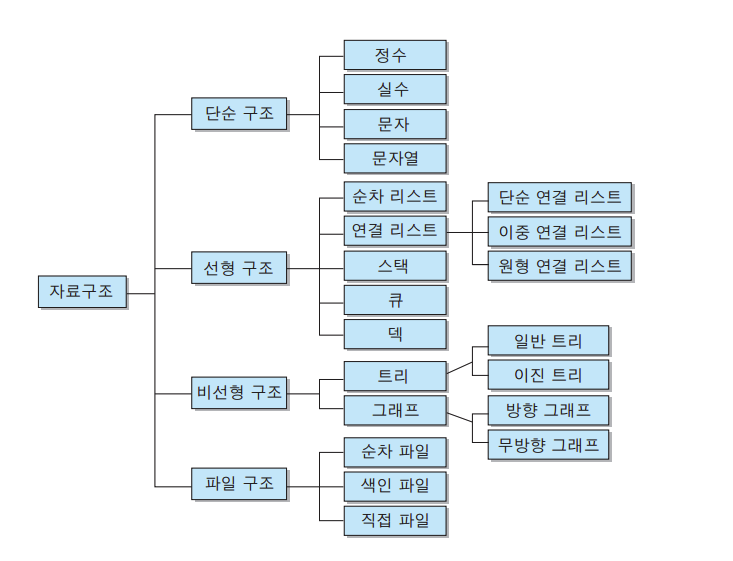
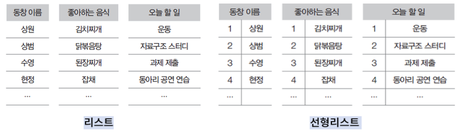
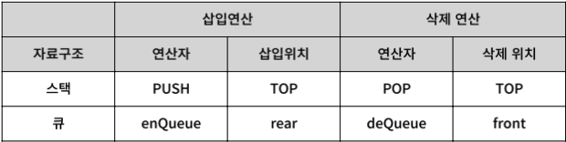
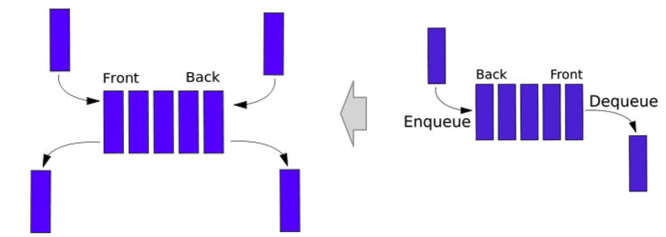

# Data Structure/ Database

## Data Structure

### 자료구조란

---

#### 자료구조의 정의

- 자료를 효율적으로 표현하고 저장하고 처리할 수 있도록 정리하는 것

#### 자료의 분류

- 단순 구조
  - 정수, 실수, 문자, 문자열 등의 기본 자료형
- 선형 구조
  - 자료들 사이의 관계가 1:1관계/ 순차 리스트, 연결 리스트, 스택, 큐, 데크 등 
- 비선형 구조
  - 자료들 사이의 관계가 1:다,  또는 다:다 관계/ 트리, 그래프 등
- 파일 구조
  - 서로 관련 있는 필드로 구성된 레코드의 집합인 파일에 대한 구조
  - 순차 파일, 색인 파일, 직접 파일 등

#### 자료구조의 관계

### 알고리즘

---

#### 알고리즘의 정의

- 문제해결 방법을 추상화하여 단계적 절차를 논리적으로 기술해 놓은 명세서

#### 알고리즘의 조건

- 입력: 알고리즘 수행에 필요한 자료가 외부에서 입력으로 제공
- 출력: 알고리즘 수행 후 하나 이상의 결과를 출력
- 명확성: 수행할 작업의 내용과 순서를 나타내는 알고리즘의 명령어들은 명확하게 정의되어야 함
- 유한성: 알고리즘은 수행 뒤에 반드시 종료
- 효과서이 알고리즘의 모든 명령어들은 기본적이며 실행이 가능해야함

#### 알고리즘의 표현 방법

- 자연어를 이용한 서술적 표현 방법
- 순서도 (Flow Chart)를 이용한 도식화 표현 방법
- 프로그래밍 언어를 이용한 구체화 방법
- 가상코드 (Pseudo-code)를 이용한 추상화 방법

#### 알고리즘 성능 기준

- 정확성: 올바른 자료 입력 시 유한한 시간 내에 올바른 결과 출력 여부
- 명확성: 알고리즘이 얼마나 이해하기 쉽고 명확하게 작성되었는가
- 수행량: 일반적인 연산 제외, 알고리즘 특성 나타내는 중요 연산 모두 분석
- 메모리 사용량: 알고리즘 연산시 메모리의 사용량
- 최적성: 가장 중요

#### 알고리즘 성능 분석 방법

##### 공간 복잡도

- 알고리즘을 프로그램으로 실행하여 완료하기까지 필요한 총 저장 공간의 양
- 공간 복잡도 = 고정 공간 + 가변 공간

##### 시간 복잡도

- 알고리즘을 프로그램으로 실행하여 완료하기까지의 총 소요시간
- 시간 복잡도 = 컴파일 시간 + 실행 시간
- 실행 빈도수의 계산 - 지정문, 조건문, 반복문 내의 제어문과 반환문은 실행시간 차이가 거의 없으므로 하나의 단위시간을 갖는 기본 명령문으로 취급

### 순차 자료 구조와 선형 리스트

---

#### 순차 자료구조의 개념

- 구현할 자료들을 논리적 순서로 메모리에 연속 저장하는 구현 방식

- 논리적인 순서와 물리적인 순서가 항상 일치해야 함

- C 프로그래밍에서 순차 자료구조의 구현 방식을 제공하는 프로그램 기법은 배열

- |       구분       | 순차 자료구조                                                | 연결 자료구조                                                |
  | :--------------: | ------------------------------------------------------------ | ------------------------------------------------------------ |
  | 메모리 저장 방식 | 메모리의 저장 시작 위치부터 빈자리 없이 자료를 순서대로 연속하여 저장 논리적 순서와 물리적 순서가 일치 | 메모리의 저장된 물리적 위치가 순서와 상관없이 링크에 의해서 논리적인 순서를 표현하는 구현 방식 |
  |    연산 특징     | 삽입, 삭제 연산 후 자료가 순서대로 연속하여 저장 변경된 논리적인 순서와 물리적 순서가 일치 | 삽입, 삭제 연산을 하여 논리적인 순서가 변경되어도, 링크 정보만 변경되고, 물리적인 순서가 변경되지 않음 |
  |  프로그램 기법   | 배열을 이용                                                  | 포인터를 이용                                                |

#### 선형 리스트의 표현

##### 리스트

- 자료를 구조화하는 가장 기본적인 방법은 나열하는 것

##### 선형 리스트 (Linear List)

- 순서 리스트 (Ordered List)
- 자료들 간에 순서를 갖는 리스트

#### 선형 리스트 구현

##### 선형 리스트의 저장

- 순차 방식으로 구현하는 선형 순차 리스트 (선형 리스트)
- 순차 자료구조는 원소를 논리적인 순서대로 메모리에 연속하여 저장 

##### 선형 리스트에서 원소 삽입

- 선형리스트 중간에 원소가 삽입되면, 그 이후의 원소들은 한 자리씩 자리를 뒤로 이동하여 물리적 순서를 논리적 순서와 일치시킴

##### 선형 리스트에서 원소 삭제

- 선형리스트 중간에서 원소가 삭제되면, 그 이후의 원소들은 한 자리씩 자리를 앞으로 이동하여 물리적 순서를 논리적 순서와 일치시킴

### 연결 자료구조와 연결리스트

---

#### 연결 자료구조

##### 자료의 논리적인 순서와 물리적인 순서가 불일치

- 각 원소에 저장되어 있는 다음 원소의 주소에 의해 순서가 연결되는 방식
- 물리적인 순서를 맞추기 위한 오버헤드가 발생하지 않음

##### 연결 리스트의 종류

- 연결하는 방식에 따라 단순 연결 리스트와 원형 연결 리스트, 이중 연결
- 리스트, 이중 원형 연결 리스트

#### 순차 자료구조와 연결 자료구조의 비교

|       구분       | 순차 자료구조                                                | 연결 자료구조                                                |
| :--------------: | ------------------------------------------------------------ | ------------------------------------------------------------ |
| 메모리 저장 방식 | 메모리의 저장 시작 위치부터 빈자리 없이 자료를 순서대로 연속하여 저장 논리적 순서와 물리적 순서가 일치 | 메모리의 저장된 물리적 위치가 순서와 상관없이 링크에 의해서 논리적인 순서를 표현하는 구현 방식 |
|    연산 특징     | 삽입, 삭제 연산 후 자료가 순서대로 연속하여 저장 변경된 논리적인 순서와 물리적 순서가 일치 | 삽입, 삭제 연산을 하여 논리적인 순서가 변경되어도, 링크 정보만 변경되고, 물리적인 순서가 변경되지 않음 |
|  프로그램 기법   | 배열을 이용                                                  | 포인터를 이용                                                |

#### 단순 연결 리스트

##### 단순 연결 리스트의 개념

- 노드가 하나의 링크 필드에 의해서 다음 노드와 연결되는 구조를 가짐
- 연결 리스트, 선형 연결 리스트, 단순 연결 선형 리스트

#### 원형 연결 리스트

##### 원형 연결 리스트의 개념

- 단순 연결 리스트에서 마지막 노드가 리스트의 첫 번째 노드를 가리키게 하여 리스트의 구조를 원형으로 만든 연결 리스트
- 단순 연결 리스트의 마지막 노드의 링크 필드에 첫 번째 노드의 주소를 저장하여 구성
- 링크를 따라 계속 순회하면 이전 노드에 접근 가능

#### 이중 연결 리스트

##### 이중 연결 리스트의 개념

- 양쪽 방향으로 순회할 수 있도록 노드를 연결한 리스트

### 스택

---

#### 스택(stack)의 정의

> 접시를 쌓듯이 자료를 차곡차곡 쌓아올린 형태의 자료구조
>
> 스택에 저장된 원소는 top으로 정한 곳에서만 접근 가능

- Top의 위치에서만 원소를 삽입하므로, 먼저 삽입한 원소는 밑에 쌓이고, 나중에 삽입한 원소는 위에 쌓이는 구조
- 마지막에 삽입(Last-In)한 원소는 맨 위에 쌓여 있다가 가장 먼저 삭제(First-Out)됨
- 후입선출 구조(LIFO, Last-In-First-Out)

#### 스택의 응용: 시스템 스택

> 프로그램에서의 호출과 복귀에 따른 수행 순서를 관리

- 가장 마지막에 호출된 함수가 가장 먼저 실행에 완료하고 복귀하는 후입선출 구조
- 후입선출 구조의 스택을 이용하여 수행순서 관리
- 함수 호출이 발생하면 호출한 함수 수행에 필요한 지역변수, 매개변수 및 수행 후 복귀할 주소 등의 정보를 스택 프레임 (stack frame)에 저장하여 시스템 스택에 삽입
- 함수의 실행이 끝나면 시스템 스택의 top 원소 (스택 프레임)를 삭제(pop) 하면서 프레임에 저장되어있던 복귀주소를 확인하고 복귀
- 함수 호출과 복귀에 따라 이 과정을 반복하여 전체 프로그램 수행이 종료되면 시스템 스택은 공백스택이 됨

### 큐

---

#### 큐의 정의

> 스택에 비슷한 삽입과 삭제의 위치가 제한되어 있는 유한 순서 리스트
>
> 큐는 뒤에서는 삽입만 하고, 앞에서는 삭제만 할 수 있는 구조

- 삽입한 순서대로 원소가 나열되어 가장 먼저 삽입 (First-In)한 원소는 맨 앞에 있다가 가장 먼저 삭제  (First-Out)됨
- 선입선출 구조 (FIFO, First-In-First-Out)

#### 스택과 큐의 연산 비교

#### 데크 (Deque: double-ended queue)

> 큐 두 개 중 하나를 좌우로 뒤집어서 붙인 구조, 큐의 양쪽 끝에서 삽입 연산과 삭제 연산을 수행할 수 있도록 확장한 자료구조

