#### Data Structure/ Database

## Data Structure

### 자료구조란

---

#### 자료구조의 정의

- 자료를 효율적으로 표현하고 <u>저장하고 처리</u>할 수 있도록 정리하는 것

#### 자료의 분류

- **단순 구조**
  - 정수, 실수, 문자, 문자열 등의 기본 자료형
- **선형 구조**
  - 자료들 사이의 관계가 1:1관계/ 순차 리스트, 연결 리스트, 스택, 큐, 데크 등 
- **비선형 구조**
  - 자료들 사이의 관계가 1:다,  또는 다:다 관계/ 트리, 그래프 등
- **파일 구조**
  - 서로 관련 있는 필드로 구성된 레코드의 집합인 파일에 대한 구조
  - 순차 파일, 색인 파일, 직접 파일 등

#### 자료구조의 관계

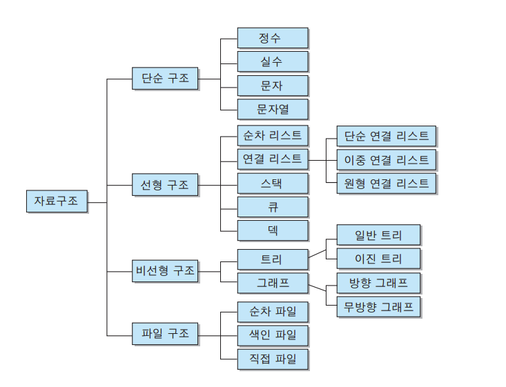

### 알고리즘

---

#### 알고리즘의 정의

- 문제해결 방법을 추상화하여 <u>단계적 절차를 논리적으로 기술</u>해 놓은 명세서
- 데이터들이 있을 때 그 데이터를 우리가 원하는 형태로 정렬하거나, 검색할 때 어떤 식으로 할 것이냐

#### 알고리즘의 조건

- **입력**: 알고리즘 수행에 필요한 자료가 외부에서 입력으로 제공
- **출력**: 알고리즘 수행 후 하나 이상의 결과를 출력
- **명확성**: 수행할 작업의 내용과 순서를 나타내는 알고리즘의 명령어들은 명확하게 정의되어야 함
- **유한성**: 알고리즘은 수행 뒤에 반드시 종료
- **효과성**: 알고리즘의 모든 명령어들은 기본적이며 실행이 가능해야함

#### 알고리즘의 표현 방법

- 자연어를 이용한 서술적 표현 방법
- 순서도 (Flow Chart)를 이용한 도식화 표현 방법
- 프로그래밍 언어를 이용한 구체화 방법
- 가상코드 (Pseudo-code)를 이용한 추상화 방법

#### 알고리즘 성능 기준

- **정확성**: 올바른 자료 입력 시 유한한 시간 내에 올바른 결과 출력 여부
- **명확성**: 알고리즘이 얼마나 이해하기 쉽고 명확하게 작성되었는가
- **수행량**: 일반적인 연산 제외, 알고리즘 특성 나타내는 중요 연산 모두 분석
- **메모리 사용량**: 알고리즘 연산시 메모리의 사용량 (최소한의 메모리를 사용하는지)
- **최적성**: 가장 중요

#### 알고리즘 성능 분석 방법

##### 공간 복잡도

- 알고리즘을 프로그램으로 실행하여 완료하기까지 필요한 총 저장 공간의 양
- 공간 복잡도 = 고정 공간 + 가변 공간

##### 시간 복잡도

- 알고리즘을 프로그램으로 실행하여 완료하기까지의 총 소요시간
- 시간 복잡도 = 컴파일 시간 + 실행 시간
- 실행 빈도수의 계산 - 지정문, 조건문, 반복문 내의 제어문과 반환문은 실행시간 차이가 거의 없으므로 하나의 단위시간을 갖는 기본 명령문으로 취급

### 순차 자료 구조와 선형 리스트

---

#### 순차 자료구조의 개념

- 자료를 저장할 때 **<u>순서대로 저장</u>**하는 것

- 구현할 자료들을 논리적 순서로 메모리에 연속 저장하는 구현 방식

- **논리적인 순서**와 **물리적인 순서**가 **<u>항상 일치</u>**해야 함

- C 프로그래밍에서 순차 자료구조의 구현 방식을 제공하는 프로그램 기법은 배열

- |       구분       | 순차 자료구조                                                | 연결 자료구조                                                |
  | :--------------: | ------------------------------------------------------------ | ------------------------------------------------------------ |
  | 메모리 저장 방식 | 메모리의 저장 시작 위치부터 빈자리 없이 자료를 순서대로 연속하여 저장 **<u>논리적 순서와 물리적 순서가 일치</u>** | 메모리의 저장된 물리적 위치가 순서와 상관없이 링크에 의해서 **<u>논리적인 순서를 표현</u>**하는 구현 방식 |
  |    연산 특징     | 삽입, 삭제 연산 후 자료가 순서대로 연속하여 저장 변경된 논리적인 순서와 물리적 순서가 일치 | 삽입, 삭제 연산을 하여 논리적인 순서가 변경되어도, 링크 정보만 변경되고, 물리적인 순서가 변경되지 않음 |
  |  프로그램 기법   | **배열**을 이용                                              | **포인터**를 이용                                            |

#### 선형 리스트의 표현

##### 리스트

- 자료를 구조화하는 가장 기본적인 방법은 나열하는 것

##### 선형 리스트 (Linear List)

- 순서 리스트 (Ordered List)
- 자료들 간에 순서를 갖는 리스트

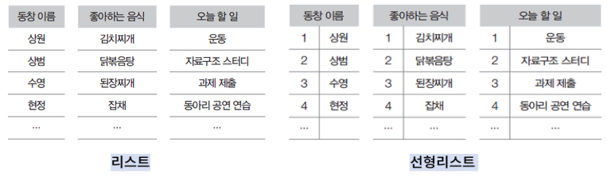

#### 선형 리스트 구현

##### 선형 리스트의 저장

- 순차 방식으로 구현하는 선형 순차 리스트 (선형 리스트)
- 순차 자료구조는 원소를 <u>논리적인 순서</u>대로 메모리에 연속하여 저장 

##### 선형 리스트에서 원소 삽입

- 선형리스트 중간에 원소가 삽입되면, 그 이후의 원소들은 한 자리씩 자리를 뒤로 이동하여 물리적 순서를 논리적 순서와 일치시킴

##### 선형 리스트에서 원소 삭제

- 선형리스트 중간에서 원소가 삭제되면, 그 이후의 원소들은 한 자리씩 자리를 앞으로 이동하여 물리적 순서를 논리적 순서와 일치시킴

### 연결 자료구조와 연결리스트

---

#### 연결 자료구조

##### 자료의 논리적인 순서와 물리적인 순서가 불일치

-  <u>각 원소에 저장되어 있는 다음 원소의 주소에 의해 순서가 연결</u>되는 방식
- **물리적인 순서를 맞추기 위한 오버헤드가 발생하지 않음**

##### 연결 리스트의 종류

- 연결하는 방식에 따라 단순 연결 리스트와 원형 연결 리스트, 이중 연결
- 리스트, 이중 원형 연결 리스트

#### 순차 자료구조와 연결 자료구조의 비교

|       구분       | 순차 자료구조                                                | 연결 자료구조                                                |
| :--------------: | ------------------------------------------------------------ | ------------------------------------------------------------ |
| 메모리 저장 방식 | 메모리의 저장 시작 위치부터 빈자리 없이 자료를 순서대로 연속하여 저장 논리적 순서와 물리적 순서가 일치 | 메모리의 저장된 물리적 위치가 순서와 상관없이 링크에 의해서 논리적인 순서를 표현하는 구현 방식 |
|    연산 특징     | 삽입, 삭제 연산 후 자료가 순서대로 연속하여 저장 변경된 논리적인 순서와 물리적 순서가 일치 | 삽입, 삭제 연산을 하여 논리적인 순서가 변경되어도, 링크 정보만 변경되고, 물리적인 순서가 변경되지 않음 |
|  프로그램 기법   | 배열을 이용                                                  | 포인터를 이용                                                |

#### 단순 연결 리스트

##### 단순 연결 리스트의 개념

- 노드가 하나의 링크 필드에 의해서 다음 노드와 연결되는 구조를 가짐
- 연결 리스트, 선형 연결 리스트, 단순 연결 선형 리스트

#### 원형 연결 리스트

##### 원형 연결 리스트의 개념

- 단순 연결 리스트에서 마**<u>지막 노드가 리스트의 첫 번째 노드를 가리키게 하여</u>** 리스트의 구조를 원형으로 만든 연결 리스트
- 단순 연결 리스트의 마지막 노드의 링크 필드에 첫 번째 노드의 주소를 저장하여 구성
- 링크를 따라 계속 순회하면 이전 노드에 접근 가능
- 데이터들이 구성되어 질 때, 마지막 노드가 첫 번째 노드를 가리키게 된다.

#### 이중 연결 리스트

##### 이중 연결 리스트의 개념

- **<u>양쪽 방향으로 순회</u>**할 수 있도록 노드를 연결한 리스트

### 스택

---

#### 스택(stack)의 정의

> 접시를 쌓듯이 자료를 차곡차곡 쌓아올린 형태의 자료구조
>
> 스택에 저장된 원소는 top으로 정한 곳에서만 접근 가능

- Top의 위치에서만 원소를 삽입하므로, 먼저 삽입한 원소는 밑에 쌓이고, 나중에 삽입한 원소는 위에 쌓이는 구조
- 마지막에 삽입(Last-In)한 원소는 맨 위에 쌓여 있다가 가장 먼저 삭제(First-Out)됨
- 후입선출 구조(LIFO, Last-In-First-Out)

#### 스택의 응용: 시스템 스택

> 프로그램에서의 호출과 복귀에 따른 수행 순서를 관리

- 가장 마지막에 호출된 함수가 가장 먼저 실행에 완료하고 복귀하는 후입선출 구조
- 후입선출 구조의 스택을 이용하여 수행순서 관리
- 함수 호출이 발생하면 호출한 함수 수행에 필요한 지역변수, 매개변수 및 수행 후 복귀할 주소 등의 정보를 스택 프레임 (stack frame)에 저장하여 시스템 스택에 삽입
- 함수의 실행이 끝나면 시스템 스택의 top 원소 (스택 프레임)를 삭제(pop) 하면서 프레임에 저장되어있던 복귀주소를 확인하고 복귀
- 함수 호출과 복귀에 따라 이 과정을 반복하여 전체 프로그램 수행이 종료되면 시스템 스택은 공백스택이 됨

### 큐

---

#### 큐의 정의

> 스택에 비슷한 삽입과 삭제의 위치가 제한되어 있는 유한 순서 리스트
>
> 큐는 뒤에서는 삽입만 하고, 앞에서는 삭제만 할 수 있는 구조

- 삽입한 순서대로 원소가 나열되어 가장 먼저 삽입 (First-In)한 원소는 맨 앞에 있다가 가장 먼저 삭제 (First-Out)됨
- 선입선출 구조 (FIFO, First-In-First-Out)
- 들어가는 것을 enQueue
- 나오는 것을 deQueue

#### 스택과 큐의 연산 비교

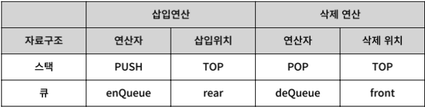

#### 데크 (Deque: double-ended queue)

> 큐 두 개 중 하나를 좌우로 뒤집어서 붙인 구조, 큐의 양쪽 끝에서 삽입 연산과 삭제 연산을 수행할 수 있도록 확장한 자료구조

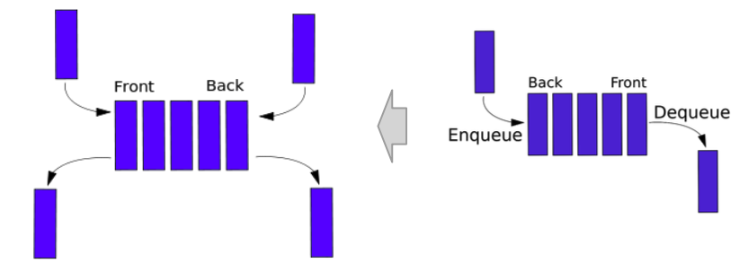

- 큐의 장점과 스택의 장점을 합친 것

#### 큐의 응용

##### 운영 체제의 작업 큐 

- <u>프린터 버퍼 큐 (Printer Buffer Queue)</u>
  - CPU에서 프린터로 보낸 데이터 순서대로 (선입선출) 프린터에서 출력하기 위해서 선입선출 구조의 큐 사용
  - 맨 처음 들어간 것이 먼저 나온다.
- <u>스케줄링 큐 (Scheduling Queue)</u>
  - CPU 사용을 요청한 프로세서들의 순서를 스케줄링 하기 위해서 큐를 사용

##### 시뮬레이션에서의 큐잉 시스템

- 시뮬레이션을 위한 수학적 모델링에서 대기행렬과 대기시간 등을 모델링 하기 위해서 큐잉 이론 (Queue theory)사용

### 트리

---

#### 트리(tree)의 정의

> 원소들 간에 1:n 관계를 가지는 비선형 자료구조
>
> 원소들 간에 계층관계를 가지는 계층형 자료구조(Hierarchical Data STructure)
>
> 상위 원소에서 하위 원소로 내려가면서 확장되는 트리(나무)모양의 구조
>
> 한 곳을 정점으로 퍼져나가는 형태

#### 이진트리 (Binary Tree)

> 트리의 모든 노드의 차수를 2 이하로 제한하여 전체 트리의 차수가 2 이하가 되도록 정의
>
> 이진 트리의 모든 노드는 왼쪽 자식 노드와 오른쪽 자식 노드만 가짐

- 부모 노드와 자식 노드 수와의 관계 → 1:2
- 공백 노드도 자식 노드로 취급
- 0 <= 노드의 차수 <= 2
- 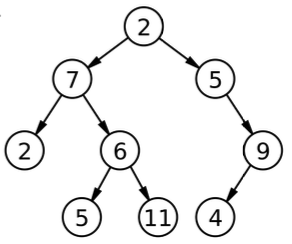

#### 이진 트리의 종류

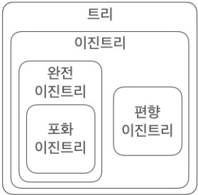

##### 포화 이진 트리 Full Binary Tree

- 모든 레벨에 노드가 포화상태로 차 있는 이진 트리

##### 완전 이진 트리 Complete Binary Tree

- 높이가 h이고 노드 수가 n개일 때 (단, n<2h+1-1), 노드 위치가 포화 이진 트리에서의 노드 1번부터 n번까지의 위치와 완전히 일치하는 이진 트리

##### 편향 이진 트리 Skewed Binary Tree

- 높이가 h일 때 h+1개의 노드를 가지면서 모든 노드가 왼쪽이나 오른쪽 중 한 방향으로만 서브 트리를 가지고 있는 트리

### 그래프

---

#### 그래프 

- 연결되어 있는 원소 사이의 다:다 관계를 표현하는 자료구조

#### 그래프 G

- 객체를 나타내는 정점 (vertex)과 객체를 연결하는 간선(edge)의 집합
- G = (V, E)
  - V는 그래프에 있는 정점들의 집합
  - E는 정점을 연결하는 간선들의 집합

#### 그래프의 종류

##### 무방향 그래프 (undirected graph)

- 두 정점을 연결하는 간선에 방향이 없는 그래프

##### 방향 그래프 (directed graph), 다이그래프 (digraph)

- 간선에 방향이 있는 그래프

##### 완전 그래프 (complete graph)

- 각 정점에서 다른 모든 정점을 연결하여 최대로 많은 간선 수를 가진 그래프

##### 부분 그래프 (subgraph)

- 원래의 그래프에서 정점이나 간선을 일부만 제외하여 만든 그래프

##### 가중 그래프 (weight graph), 네트워크 (network)

- 정점을 연결하는 간선에 가중치 (weight)를 할당한 그래프

#### 신장 트리

##### 신장 트리 (spanning tree)

- n개의 정점으로 이루어진 무방향 그래프 G에서 n개의 모든 정점과 n-1개의 간선으로 만들어진 트리
- 하나의 정점을 통해서 모든 정점들이 그래프가 연결되어 있는 트리

##### 깊이 우선 신장 트리 (depth first spaning tree)

- 깊이 우선 탐색을 이용하여 생성된 신장 트리

##### 너비 우선 신장 트리 (breadth first spanning tree)

- 너비 우선 탐색을 이용하여 생성된 신장 트리

##### 최소 비용 신장 트리 (minimum cost spanning tree)

- 무방향 가중치 그래프에서 신장 트리를 구성하는 간선들의 가중치 합이 최소인 신장 트리
- 최소 비용 신장 트리를 만드는 알고리즘: 크루스칼 (Kruskal)의 알고리즘/ 프림 (Prime)의 알고리즘

#### 최소 비용 신장트리 알고리즘

##### 크루스칼 알고리즘 1

- <u>가중치가 높은 간선을 제거</u>하면서 최소 비용 신장 트리를 만드는 방법

##### 크루스칼 알고리즘 2

- <u>가중치가 낮은 간선을 삽입</u>하면서 최소 비용 신장 트리를 만드는 방법

##### 프림 알고리즘

- <u>간선을 정렬하지 않고 하나의 정점에서 시작</u>하여 트리를 확장해 나가는 방법
- 하나의 정점에서 시작해 하나씩 하나씩 확대

#### 최단 경로 (Shortest Path)

> 신장 트리가 아닌 가중치 그래프, 즉 네트워크에서 양끝단을 연결하는 경로 중에서 <u>가중치의 합이 최소인 경로</u>
>
> 그래프를 만들어 놓고, 하나의 노드에서 이동을 하며 그래프 상에서 객체랑 연결되어있는 그래프에서 어떻게 최소한의 비용으로 갈 것 인지

##### 가중치 인접 행렬

- 최단 경로를 구하려는 가중치 그래프의 가중치를 저장

##### 다익스트라 최단 경로 알고리즘

- 하나의 시작 정점에서 다른 정점까지의 최단 경로를 구함
- 단일점에서의 최단 경로 알고리즘 중 가장 많이 사용

##### 플로이드 최단 경로 알고리즘

- 모든 정점 사이의 최단 경로를 구한 것

### 정렬

---

#### 정렬 (sort)의 이해

- 순서 없이 배열된 자료를 작은 것부터 큰 것 순서인 오름차순(Ascending)이나 큰 것부터 작은 것 순서인 내림차순 (Descending)으로 재배열하는 것
- 키 (Key) - 자료를 정렬하는 데 사용하는 기준이 되는 특정 값
- 예시: 이름, 날짜 순으로 정렬

#### 정렬의 분류

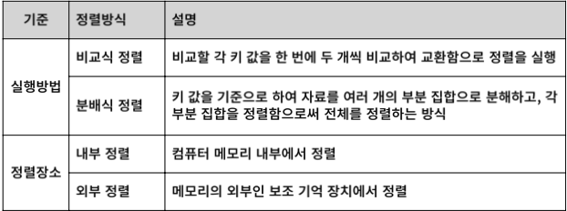

#### 정렬의 종류

##### 선택 정렬 (selection sort)

- 전체 원소들 중에서 **<u>기준 위치에 맞는 원소를 선택하여 자리를 교환</u>**하는 방식으로 정렬

##### 버블 정렬 (bubble sort)

- **<u>인접한 두 개의 원소를 비교하여 자리를 교환</u>**하는 방식

##### 퀵 정렬 (quick sort)

- 정렬할 전체 원소에 대해서 정렬을 수행하지 않고, **<u>기준 값을 중심으로 왼쪽 부분 집합과 오른쪽 부분 집합으로 분할</u>**하여 정렬하는 방법

##### 삽입 정렬 (insert sort)

- 정렬되어있는 부분집합에 정렬할 **<u>새로운 원소의 위치를 찾아 삽입</u>**하는 방법

##### 셀 정렬 (shell sort)

- **일정한 간격 (interval)**으로 떨어져있는 자료들끼리 **<u>부분집합을 구성</u>**하고 **<u>각 부분집합에 있는 원소들에 대해서 삽입 정렬을 수행하는 작업을 반복</u>**하면서 전체 원소들을 정렬하는 방법

##### 병합 정렬 (merge sort)

- 여러 개의 정렬된 **<u>자료의 집합을 병합하여 한 개의 정렬된 집합</u>**으로 만드는 방법

##### 기수 정렬 (radix sort)

- **<u>원소의 키 값을 나타내는 기수를 이용</u>**한 정렬 방법

##### 히프 정렬 (heap sort)

- **<u>히프 자료구조</u>**를 이용한 정렬 방법

##### 트리 정렬 (tree sort)

- **<u>이진 탐색 트리</u>**를 이용하여 정렬하는 방법

### 검색 

---

#### 검색 (search)

- 컴퓨터에 저장한 자료 중에서 원하는 항목을 찾는 작업
- 탐색 키를 가진 항목을 찾는 것
  - **탐색 키 (search key)** - <u>자료를 구별하여 인식</u>할 수 있는 키
- 삽입/삭제 작업에서의 검색
  - 원소를 삽입하거나 삭제할 위치를 찾기 위해서 검색 연산 수행

#### 검색 방법

##### 수행 위치에 따른 분류

- 내부 검색: 메모리 내의 자료에 대해서 검색 수행
- 외부 검색: 보조 기억 장치에 있는 자료에 대해서 검색 수행

##### 검색 방식에 따른 분류

- 비교 검색 방식: 검색 대상의 키를 비교하여 검색, 순차검색, 이진검색, 트리검색
- 계산 검색 방식: 계수적인 성질을 이용한 계산으로 검색, 해싱

#### 순차 검색

##### 순차 검색 (sequential search), 선형 검색 (linear search)

- 일렬로 된 자룔를 **<u>처음부터 마지막까지 순서대로 검색</u>**하는 방법 

##### 색인 순차 검색 (index sequential search)

- **<u>정렬되어 있는 자료에 대한 인덱스 테이블 (index table)을 추가로 사용</u>**하여 **탐색 효율**을 높인 검색 방법 

#### 이진 검색

##### 이진 검색, 이분 검색, 보간 검색

- 자료의 가운데에 있는 항목을 키 값과 비교하여 다음 검색 위치를 결정하여 검색을 계속하는 방법

##### 이진 트리 검색

-  이진 탐색 트리를 사용한 검색 방법

#### 해싱

> 산술적인 **연산**을 이용하여 **키가 있는 위치를 계산**하여 바로 찾아가는 계산 검색 방식

##### 검색 방법

- 키 값에 대해서 **해시 함수를 계산**하여 주소를 구하고, **구한 주소에 해당하는 해시 테이블로 바로 이동**

## 데이터베이스

### 주요 개념

---

- 데이터 (data)
  - 현실 세계에서 단순히 관찰하거나 측정하여 수집한 사실이나 값

- 정보 (information)
  - 의사 결정에 유용하게 활용할 수 있도록 데이터를 처리한 결과물
- 정보 처리 (information processing)
  - 데이터에서 정보를 추출하는 과정 또는 방법
- 정보 시스템 (information system)
  - 조직 운영에 필요한 데이터를 수집하여 저장해두었다가 필요할 때 유용한 정보를 만들어 주는 수단
- 데이터베이스
  - 정보 시스템 안에서 데이터를 저장하고 있다가 필요할 때 제공하는 역할을 담당

### 데이터베이스의 기본개념

---

#### 데이터베이스의 정의 및 특징

> 특정 조직의 여러 사용자가 공유하여 사용할 수 있도록 통합해서 저장한 운영 데이터의 집합

##### 실시간 접근

- 사용자의 데이터 요구에 실시간으로 응답 

##### 계속 변화

- 데이터의 계속적인 삽입, 삭제, 수정을 통해 현재의 정확한 데이터를 유지

##### 동시 공유

- 서로 다른 데이터의 동시 사용뿐만 아니라 같은 데이터의 동시 사용도 지원

##### 내용 기반 참조

-  데이터가 저장된 주소나 위치가 아닌 내용으로 참조
- 예) 재고량이 1,000개 이상인 제품의 이름을 검색하시오.

#### 데이터의 분류

##### 정형 데이터

- 구조화된 데이터, 즉 미리 정해진 구조에 따라 저장된 데이터
- 예) 엑셀의 스프레드시트, 데이터베이스의 테이블 

##### 반정형 데이터

- 구조에 따라 저장된 데이터지만 데이터 내용 안에 구조에 대한 설명이 함께 존재
- 구조를 파악하는 파싱 (parsing) 과정이 필요
- 예) HTML, XML, JSON 문서나 웹 로그, 센서 데이터

##### 비정형 데이터

- 정해진 구조가 없이 저장된 데이터
- 예) 소셜 데이터의 텍스트, 영상, 이미지, 워드나 PDF 문서와 같은 멀티미디어 데이터 

### 데이터베이스 관리 시스템

---

#### 데이터베이스 관리시스템의 정의

> DBMS (DataBase Management System)
>
> 파일 시스템의 문제를 해결하기 위해 제시된 소프트웨어
>
> 조직에 필요한 데이터를 데이터베이스에 통합하여 저장하고 관리함

#### 데이터베이스 관리시스템의 발전과정

- 1세대
  - 네트워크 DBMS (그래프 형태), 계층 DBMS (트리 형태)
- 2세대
  - 관계 DBMS - 데이터베이스를 테이블 형태로 구성 - 오라클, MS SQL 서버, MySQL
- 3세대: 객체지향 DBMS, 객체관계 DBMS
  - 객체지향 DBMS: 객체를 이용해 데이터베이스를 구성 - 오투 (O2), 온투스  (ONTOS),  젬스톤(GemStone)
  - 객체관계 DBMS: 객체 DBMS + 관계 DBMS
- 4세대: NoSQL・NewSQL DBMS
  - NoSQL DBMS: 비정형 데이터를 처리하는데 적합하고 확장성이 뛰어남 - 몽고디비 (MongoDB) , 카산드라 (Cassandra)
  - NewSQL DBMS: 관계 DBMS의 장점 + NoSQL의 확장성 및 유연성 - 구글 스패너 (Spanner), 볼트DB(VoltDB), 누오DB(NuoDB)

### 데이터베이스 시스템

---

#### 데이터베이스 시스템의 정의

> 데이터베이스 시스템 (DBS; DataBase System)
>
> 데이터베이스에 데이터를 저장하고, 이를 관리하여 조직에 필요한 정보를 생성해주는 시스템

#### 데이터베이스의 용어

##### 스키마 (schema)

- 데이터베이스에 저장되는 데이터 구조와 제약조건을 정의한 것

##### 인스턴스 (instance)

- 스키마에 따라 데이터베이스에 실제로 저장된 값

##### 데이터 독립성 (data independency)

- 하위 스키마를 변경하더라도 상위 스키마가 영향을 받지 않는 특성
- 논리적 데이터 독립성 - 개념 스키마가 변경되어도 외부 스키마는 영향을 받지 않음
- 물리적 데이터 독립성 - 내부 스키마가 변경되어도 개념 스키마는 영향을 받지 않음

#### 데이터 언어

##### 데이터 정의어 (DDL; Data Definition Language)

- 스키마를 정의하거나, 수정 또는 삭제하기 위해 사용

##### 데이터 조작어 (DML; Data Manipulation Language)

- 데이터의 삽입 ・ 삭제 ・ 수정 ・ 검색 등의 처리를 요구하기 위해 사용
- 절차적 데이터 조작어와 비절차적 데이터 조작어로 구분

##### 데이터 제어어 (DCL; Data Control Language)

- 내부적으로 필요한 규칙이나 기법을 정의하기 위해 사용

### 데이터모델링

---

#### 데이터 모델링 (data modeling)

- 현실 세계에 존재하는 데이터를 컴퓨터 세계의 데이터베이스로 옮기는 변환 과정
- 데이터베이스 설계의 핵심 과정

#### 2단계 데이터 모델링

- 개념적 데이터 모델링 (conceptual modeling)
  - 현실 세계의 중요 데이터를 추출하여 개념 세계로 옮기는 작업
- 논리적 데이터 모델링 (logical modeling)
  - 개념 세계의 데이터를 데이터베이스에 저장하는 구조로 표현하는 작업

#### 데이터 모델 (data model)

> 데이터 모델링의 결과물을 표현하는 도구

##### 개념적 데이터 모델

- 사람의 머리로 이해할 수 있도록 현실 세계를 개념적 모델링하여 데이터베이스의 개념적 구조로 표현하는 도구
- 예) 개체 - 관계 모델

##### 논리적 데이터 모델

- 개념적 구조를 논리적 모델링하여 데이터베이스의 논리적 구조로 표현하는 도구
- 예) 관계 데이터 모델

#### 개체-관계 모델

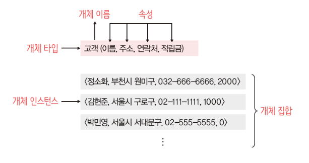

##### 개체-관계 모델 (E-R model; Entity-Relationship model)

- 개체와 개체 간의 관계를 이용해 현실 세계를 개념적 구조로 표현
- 핵심 요소: 개체, 속성, 관계

##### 개체-관계 다이어그램 (E-R diagram)

- E-R 다이어그램
- 개체 - 관계 모델을 이용해 현실 세계를 개념적으로 모델링한 결과물을 그림으로 표현한 것

##### 개체 (entity)

- 현실 세계에서 조직을 운영하는 데 꼭 필요한 사람이나 사물과 같이 구별되는 모든 것
- 저장할 가치가 있는 중요 데이터를 가지고 있는 사람이나 사물, 개념, 사건 등

##### 속성 (attribute)

- 개체나 관계가 가지고 있는 고유의 특성
- 의미 있는 데이터의 가장 작은 논리적 단위

##### 개체 타입 (entity type)

- 개체를 고유의 이름과 속성들로 정의한 것
- 파일 구조의 레코드 타입 (record type)에 대응됨

##### 개체 인스턴스 (entity instance)

- 개체를 구성하고 있는 속성이 실제 값을 가짐으로써 실체화된 개체
- 개체 어커런스 (entity occurrence)라고도 함
- 파일 구조의 레코드 인스턴스  (record instance)에 대응됨

##### 개체 집합 (entity set)

- 특정 개체 타입에 대한 개체 인스턴스들을 모아놓은 것

#### 속성의 분류

##### 단일 값 속성과 다중 값 속성

- 단일 값 속성 (single-valued attribute) vs 다중 값 속성 (multi-valued attribute)

##### 단순 속성과 복합 속성

- 단순 속성 (simple attribute) vs 복합 속성 (composite attribute)

##### 유도 속성 (derived attribute)

- 기존의 다른 속성의 값에서 유도되어 결정되는 속성

##### 널 속성 (null attribute)

- 널 값이 허용되는 속성

##### 키 속성 (key attribute)

- 각 개체 인스턴스를 식별하는 데 사용되는 속성

#### 관계 (relationship)

- 개체와 게체가 맺고 있는 의미 있는 연관성
  - 개체 집합들 사이의 대응 관계, 즉 매핑 (mapping)을 의미
- 관계의 유형: 관계에 참여하는 개체 타입의 수 기준
  - 이항 관계 / 삼항 관계 / 순환 관계
- 관계의 유형: 매핑 카디널리티 기준
  - 일대일 (1:1)  관계/ 일대다(1: n) 관계/ 다대다 (n:m) 관계

#### 논리적 데이터 모델

##### 논리적 데이터 모델의 개념

- E-R 다이어그램으로 표현된 개념적 구조를 데이터베이스에 저장할 형태로 표현한 논리적 구조

##### 관계 데이터 모델

- 일반적으로 많이 사용되는 논리적 데이터 모델 - 데이터베이스의 논리적 구조

##### 계층 데이터 모델 (hierarchical data model)

- 데이터베이스의 논리적 구조가 트리 (tree) 형태임
- 루트 역할을 하는 개체가 존재하고 사이클이 존재하지 않음

##### 네트워크 데이터 모델 (network data model)

- 데이터베이스의 논리적 구조가 네트워크, 즉 그래프 형태임

### 관계 데이터 모델

---

#### 관계 데이터 모델의 기본 개념

> 개념적 구조를 논리적 구조로 표현하는 논리적 데이터 모델
>
> 하나의 개체에 대한 데이터를 하나의 릴레이션에 저장

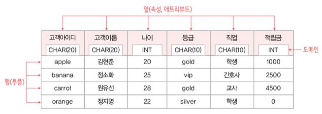

#### 관계 데이터 모델의 기본 용어

- **릴레이션 (relation)** - 하나의 개체에 관한 데이터를 2차원 테이블의 구조로 저장한 것
- **속성 (attribute)** - 릴레이션의 열, 애트리뷰트
- **튜플 (tuple)** - 릴레이션의 행
- **도메인 (domain)** - 하나의 속성이 가질 수 있는 모든 값의 집합, 속성 값을 입력 및 수정할 때 적합성 판단의 기준이 되고, 일반적으로 속성의 특성을 고려한 데이터 타입으로 정의
- **널 (null)** - 속성 값을 아직 모르거나 해당되는 값이 없음을 표현
- **차수 (degree)** - 하나의 릴레이션에서 속성의 전체 개수
- **카디널리티 (cardinality)** - 하나의 릴레이션에서 튜플의 전체 개수

#### 데이터베이스의 구성

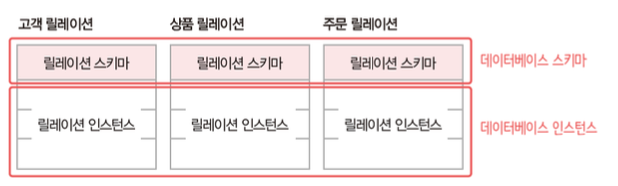

##### 데이터베이스 스키마 (database schema)

- 데이터베이스의 전체 구조
- 데이터베이스를 구성하는 릴레이션 스키마의 모음

##### 데이터베이스 인스턴스  (database instance)

- 데이터베이스를 구성하는 릴레이션 인스턴스의 모음

#### 키 (key)

> 릴레이션에서 튜플들을 유일하게 구별하는 속성 또는 속성들의 집합

##### 키의 특성

- 유일성 (uniqueness): 하나의 릴레이션에서 모든 튜플은 서로 다른 키 값을 가져야 함
- 최소성 (minimality): 꼭 필요한 최소한의 속성들로만 키를 구성함

##### 키의 종류

- 슈퍼키 (super key) - 유일성을 만족하는 속성 또는 속성들의 집합, 고객아이디, (고객아이디, 고객이름)
- 후보키 (candidate key) - 유일성과 최소성을 만족하는 속성 또는 속성들의 집합, 고객아이디, (고객이름, 주소) 등
- 기본키 (primary key) - 후보키 중에서 기본적으로 사용하기 위해 선택한 키, 고객 아이디
- 대체키 (alternate key) - 기본키로 선택되지 못한 후보키
- 외래키 (foreign key) - 다른 릴레이션의 기본키를 참조하는 속성 또는 속성들의 집합

#### 제약조건

##### 무결성 제약조건 (integrity constraint)

- 데이터의 무결성을 보장하고 일관된 상태로 유지하기 위한 규칙
- 무결성: 데이터를 결함이 없는 상태, 즉 정확하고 유효하게 유지하는 것

##### 개체 무결성 제약조건 (entity integrity constraint)

- 기본키를 구성하는 모든 속성은 널 값을 가질 수 없는 규칙

##### 참조 무결성 제약조건 (referential integrity constraint)

- 외래키는 참조할 수 없는 값을 가질 수 없는 규칙

### 데이터베이스 언어 SQL

---

#### SQL의 분류

##### 데이터 정의어 (DDL)

- 테이블을 생성하고 변경, 제거하는 기능을 제공

##### 데이터 조작어 (DDL)

- 테이블에 새 데이터를 삽입하거나, 테이블에 저장된 데이터를 수정, 삭제, 검색하는 기능을 제공

##### 데이터 제어어 (DDL)

- 보안을 위해 데이터에 대한 접근 및 사용 권한을 사용자별로 부여하거나 취소하는 기능을 제공

#### SQL

##### SQL의 데이터 정의 기능: 테이블 생성, 변경, 삭제

- 테이블 생성: CREATE TABLE 문
- 테이블 변경: ALTER TABLE 문
- 테이블 삭제: DROP TABLE 문

##### SQL의 데이터 조작 기능: 데이터 검색, 새로운 데이터 삽입, 데이터 수정, 데이터 삭제

- 데이터 검색: SELECT문
- 데이터 삽입: INSERT 문
- 데이터 삭제: DELETE 문

#### 뷰

> 뷰는 기본 테이블을 들여다 볼 수 있는 창의 역할을 담당
>
> 활용: SELECT문, INSERT, UPDATE, DELETE 문 

##### 뷰의 장점

- 질의문을 좀 더 쉽게 작성할 수 있음
- 데이터의 보안 유지에 도움이 됨
- 데이터를 좀 더 편리하게 관리할 수 있음

### 데이터베이스 설계

---

#### 데이터베이스 설계단계

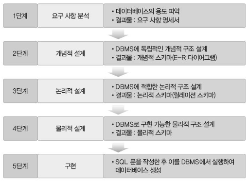

### 정규화

---

#### 정규화의 개념과 이상 현상

##### 이상 (anomaly) 현상

> 불필요한 데이터 중복으로 인해 릴레이션에 대한 데이터 삽입 ・ 수정 ・ 삭제 연산을 수행할 때 발생할 수 있는 부작용

- 삽입 이상 (insertion anomaly) - 릴레이션에 새 데이터를 삽입하려면 불필요한 데이터도 함께 삽입해야 하는 문제
- 갱신 이상 (update anomaly) - 릴레이션의 중복된 튜플들 중 일부만 수정하여 데이터가 불일치하게 되는 모순이 발생하는 문제
- 삭제 이상 (deletion anomaly) - 릴레이션의 튜플을 삭제하면 꼭 필요한 데이터까지 손실되는 연쇄 삭제 현상이 발생하는 문제

##### 정규화

> 이상 현상을 제거하면서 데이터베이스를 올바르게 설계해 나가는 과정
>
> 이상 현상이 발생하지 않도록, 릴레이션을 관련 있는 속성들로만 구성하기 위해 릴레이션을 분해 (decomposition)하는 과정

- 함수적 종속성을 판단하여 정규화를 수행함 

###### 함수적 종속성 (FD; Functional Dependency)

- 속성들 간의 관련성
- 함수 종속성을 이용하여, 릴레이션을 연관성이 있는 속성들로만 구성되도록 분해하여 이상 현상이 발생하지 않는 바람직한 릴레이션으로 만들어 나가는 과정

#### 정규화와 정규형

##### 정규화 (normalization)

- 함수 종속성을 이용해 릴레이션을 연관성이 있는 속성들로만 구성되도록 분해해서 이상 현상이 발생하지 않는 바람직한 릴레이션으로 만들어 가는 과정
- 정규화를 통해 릴레이션은 무손실 분해  (nonloss decomposition) 되어야 함

##### 정규형 (NF; Normal Form)

- 릴레이션이 정규화된 정도로 각 정규형마다 제약조건이 존재
- 릴레이션의 특성을 고려하여 적합한 정규형을 선택

#### 정규형의 종류

- 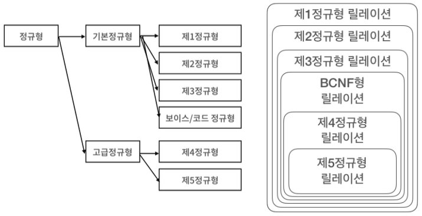

#### 정규화과정

##### 제1정규형 (1NF; First Normal Form)

- 릴레이션의 모든 속성이 더는 분해되지 않는 원자 값 (atomic value)만 가지면 제1정규형을 만족함
- 제1정규형을 만족해야 관계 데이터베이스의 릴레이션이 될 자격이 있음

##### 제2정규형 (2NF; Second Normal Form)

- 릴레이션이 제1정규형에 속하고, 기본키가 아닌 모든 속성이 기본키에 완전 함수 종속되면 제2정규형을 만족함

##### 제3정규형 (3NF; Third Normal Form)

- 릴레이션이 제2정규형에 속하고, 기본키가 아닌 모든 속성이 기본키에 이행적 함수 종속되지 않으면 제3정규형을 만족함

##### 보이스/코드 정규형 (BCNF; Boyce/Codd Normal Form)

- 하나의 릴레이션에 여러 개의 후보키가 존재하는 경우, 제3정규형까지 모두 만족해도 이상 현상이 발생할 수 있음

##### 제4정규형

- 릴레이션이 보이스/코드 정규형을 만족하면서, 함수 종속이 아닌 다치
- 종속 (MVD; MultiValued Dependency) 를 제거하면 제4정규형에 속함

##### 제5정규형 

- 릴레이션이 제4정규형을 만족하면서, 후보키를 통하지 않는 조인 종속 (JD; Join Dependency)을 제거하면 제5정규형에 속함

##### 정규화 시 주의사항

- 모든 릴레이션이 제 5 정규형에 속해야만 바람직한 것은 아님
- 일반적으로 제3정규형이나 보이스/코드 정규형에 속하도록 릴레이션을 분해하여 데이터 중복을 줄이고 이상 현상을 해결하는 경우가 많음

### 트랜잭션

---

