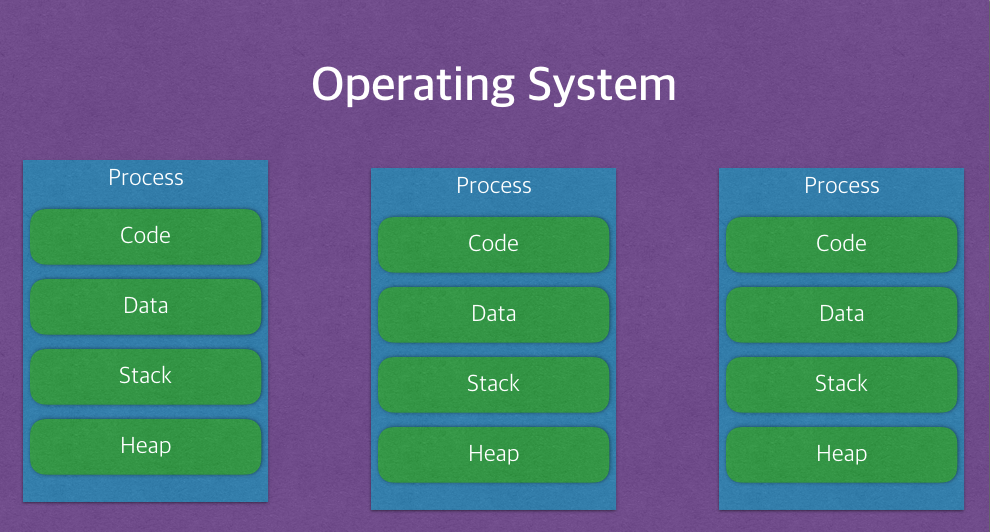

# 프로세스 VS 스레드

## 질문

**4) 프로세스와 스레드에 대해서 설명해보세요** 

- 프로세스는 운영체제로부터 CPU 자원을 할당받는 작업의 단위이다. 그리고 메모리에 올라와 실행되고 있는 프로그램의 인스턴스(독립적인 개체)를 의미한다. Code, Data, Stack, Heap의 구조로 되어 있다, 이러한 구조로 된 독립된 메모리 영역을 할당받는다.
  
    스레드는 프로세스 내에서 실행되는 여러 흐름의 단위이다. 스레드는 프로세스 내에서 각각 Stack만 따로 할당받고 Code, Data, Heap 영역은 공유한다.
    
    멀티 프로세스에 비해 멀티 스레드가 가지는 장점은 먼저 첫 번째로 프로세스를 생성하여 자원을 할당하는 시스템 콜이 감소함으로서 자원을 효율적으로 관리할 수 있다는 점이다. 두 번째로 프로세스 간 통신(IPC)보다 스레드 간의 통신 비용이 더 적게 발생한다. 다만 멀티 스레드 사용 시에는 공유 자원으로 인한 문제를 해결하기 위해 동기화를 신경써 주어야 한다.
    

**4-1) 프로세스란?** 일반적인 정의로 “**실행 중인 프로그램**” 이라고 합니다. 또한 디스크에 저장되어 있던 어떤 프로그램이 메모리에 적재되어 운영체제의 제어를 받는 상태라고 합니다.

**4-2) 스레드 란?** 프로세스에서 실행 제어만 분리한 실행 단위로 프로세스안에 존재하여 1개 이상의 스레드는 공통의 목적 달성을 위해 병렬로 수행하게 됩니다. 즉 동시작업이 가능하다고 할 수 있고 이를 통해 사용자에 대한 응답성이 증가하며 효율적인 자원 관리를 할 수 있습니다.

**4-2-1) 싱글 스레드와 멀티 스레드** 

싱글 스레드는 하나의 스레드로 이루어져 처리하는 방식이고,

멀티 스레드는 두개 이상의 스레드가 생성되어 처리하는 방식을 말합니다. 

**멀티 스레드**는 여러 개의 스레드를 사용하여 동시 작업을 하기 때문에 “자원을 효율적으로 관리한다.”라고 할 수 있습니다. 

**싱글 스레드**는 한 개의 스레드를 사용하기 때문에 실행 순서대로 처리가 된다. 즉, 동시작업은 불가능 하다.

**4-3) 멀티 스레드와 멀티 프로세스** 

**멀티 스레드**는 멀티 프로세스와 비교 했을 때 더 **효과적인 방법**이라고 합니다. 

우선 **멀티 프로세스**는 여러 개의 프로세스를 활용하기에 더 많은 비용이 들거라고 생각했고 들어간 비용에 부흥하는 품질을 제공할 것이라고 생각했습니다. 
물론 요청이 많아질수록 CPU에 부담이 더 커지기는 하지만 충돌이 생기지 않는다는 장점이 있다고 하며 구현이 비교적 쉽다고 합니다. 

이와 비교하여 **멀티 스레드**는 저 비용 고 효율이라고 생각했습니다. 우선 멀티 프로세스와 마찬가지로 여러 흐름을 동시에 처리할 수 있다는 장점을 가지고 있고 각각의 스레드가 프로세스 내의 메모리를 공유하기 때문에 좀 더 효율적인 자원관리가 가능하게 됩니다.

# 간단 정리

## 용어

- 프로그램
    - 파일 단위로 저장 장치에 저장되어 있으며,
    - 아직 실행되지 않은 상태의 코드 덩어리를 의미한다.
- 프로세스
    - 실행 중인 프로그램이다.
    - 프로그램을 실행하기 위해서는 주소 공간, 파일, 메로리 등이 필요한 데 운영체제로부터 이런 것들을 할당 받은 프로그램을 프로세스라고 한다.
- 스레드
    - 프로세스 실행 단위이다. 같은 프로세스 내에 있는 스레드끼리는 자원 공유가 가능하다.

## Process vs Thread

### Process

- 운영체제로부터 **메모리 공간을 할당받는 작업의 단위**
- 컴퓨터에서 실행 중인 컴퓨터 프로그램
    - 우리가 프로그램(카톡, 엑셀, 브라우저 등)을 실행하면 메모리 위에 올라가게 되고 이를 운영체제가 중재하는 역할을 합니다.

### Thread

- 프로세스가 할당받은 자원을 이용하는 **실행**의 단위
- 하나의 프로세스가 생성되면 하나의 스레드가 같이 생성 → 메인 스레드
- 여러 개의 스레드를 가질 수 있음 → 멀티 스레드

`**(추가)**`
1. 컨텍스트 스위칭 오버헤드 정도
2. 자원 공유 가능 여부

## 프로세스

- 프로그램을 **메모리 상**에서 **실행중인 작업**을 말합니다. 디스크로부터 메모리에 적재되어 CPU의 할당을 받을 수 있습니다.
- 운영체제로부터 **시스템 자원을 할당받는 작업의 단위**를 말합니다.
    - 할당받는 시스템 자원의 예시는
        - CPU 시간
        - 운영되기 위해 필요한 주소 공간
        - **Code, Data, Stack, Heap의 구조**로 되어 있는 독립된 메모리 영역을 말합니다.
- 기본적으로 프로세스마다 메인 스레드를 포함해 **최소 1개의 스레드를 소유**합니다.
- 한 프로세스는 다른 프로세스의 변수나 자료구조에 접근할 수 없으며, 접근을 위해서는 IPC 통신이 필요합니다
    - ex) 파이프, 파일, 소켓 등을 이용한 통신 방법 이용

### 프로세스에 할당되는 메모리 영역

- 프로세스는 각각 독립된 메모리 영역(Code, Data, Stack, Heap의 구조)을 할당받는다.
    - **코드 영역**
        - 프로세스가 실행할 **코드가 기계어의 형태로 저장된 공간**
        - 코드 자체를 구성하는 메모리 영역 (프로그램 명령)
        - 컴파일 타임에 결정, read-only
    - **데이터 영역**
        - **전역 변수, static 변수, 배열** 등이 저장된 공간입니다.
            - 초기화 된 데이터는 data 영역에 저장
            - 초기화 되지 않은 데이터는 bss 영역에 저장
        - 전역 변수, static 변수를 참조한 코드는 컴파일한 후, 데이터 영역의 주소값을 가르킵니다.
        - 컴파일 타임에 결정, Read-Write: 실행 도중 변경 가능
    - **힙 영역**
        - **프로그래머가 관리하는 메모리 영역**
        - 힙 영역에 메모리를 할당하는 것을 **동적 할당**이라고 합니다. → 동적할당 시 힙을 사용함 (`new()`, `malloc()` 등)
        - 런타임에 결정, 스택보다 할당할 수 있는 메모리 공간이 많으나, **데이터 읽고 쓰는 속도가 느림**
    - **스택 영역**
        - 함수 안에서 선언된 **지역 변수, 매개변수, 리턴값, 복귀 주소** 등이 저장됩니다.
        - 스택의 LIFO 방식에 따라 함수 호출 시 기록하고 종료되면 제거됩니다.
        - 컴파일 타임에 결정, 정해진 크기가 있으므로 stack overflow 에러 발생 가능
- 각 프로세스는 별도의 주소 공간에서 실행되며, 한 프로세스는 다른 프로세스의 변수나 자료구조에 접근할 수 없다.
- 한 프로세스가 다른 프로세스의 자원에 접근하려면 프로세스 간의 통신(IPC, inter-process communication)을 사용해야 한다. (Ex. 파이프, 파일, 소켓 등을 이용한 통신 방법 이용)

### 프로세스 제어 블록 (Process Control Block, PCB)

- PCB는 **특정 프로세스에 대한 정보를 담고 있는 운영체제의 자료구조**입니다.
- **OS는 프로세스를 관리**하기 위해 **프로세스 생성과 동시에** 그 **프로세스의 고유한 PCB도 함께 생성**합니다.
- 프로세스는 운영체제의 스케줄링 알고리즘에 따라 CPU를 할당 받습니다.
- 프로세스는 CPU를 할당 받아 작업을 진행하다 프로세스 전환이 발생하면 하던 일을 저장하고 CPU를 반환해야 합니다. 이 때 작업의 진행 상황을 모두 PCB에 저장합니다. 그리고 나중에 스케줄링에 의해 CPU를 다시 할당받으면, 재실행되었을 때 **이전에 어디까지 작업이 진행되었는지 그 정보를 알아야 합니**다. 해당 **정보가 담긴 공간이 PCB**입니다. PCB에 저장되었던 내용을 부럴와 종료되었던 시점부터 다시 작업을 수행합니다.
- **프로세스 제어 블록 (PCB)에 저장되는 정보**
    - 프로세스 식별자 (Process ID, PID)
    - 프로세스 상태 (Process state) : new, ready, running, waiting, terminated
    - 프로그램 카운터 (Program counter) : 프로세스가 다음에 실행할 명령어의 주소를 가리킴
    - CPU 레지스터 : Accumulator, Index Register, 범용 레지스터 등
    - CPU 스케줄링 정보 : 프로세스 우선순위, 최종 실행 시각, CPU 점유 시간 등
    - 메모리 관리 정보 : Page table, Segment table 등
    - 계정 정보 : CPU 사용 시간, 제한 시간, 계정 번호 등
    - 입출력 상태 정보 : 프로세스에 할당된 입출력 장치, 개방된 파일 목록 등
- PCB가 어떻게 관리되는가?
    - Linked List 방식으로 관리됨
    - PCB List Head에 PCB들이 생성될 때마다 붙게 됩니다. 주소값으로 연결이 이루어져 있는 연결리스트이기 때문에 삽입 삭제가 용이합니다.
    - 즉, 프로세스가 생성되면 해당 PCB가 생성되고 프로세스 완료시 제거됩니다.

## 스레드

- 스레드는 **프로세스의 실행 단위**라고 할 수 있습니다.  **프로세스의 특정한 수행 경로**를 말합니다. 스레드는 같은 프로세스 내 다른 스레드와 메모리 영역을 공유할 수 있습니다.
- 스레드도 하나의 실행 흐름이므로 실행과 관련된 데이터가 필요합니다.
    - 독립적: **스레드 ID, 프로그램 카운터 (PC), 레지스터 집합, 그리고 스택**
    - 공유: 같은 프로세스 내의 **코드/데이터/힙 영역과 기타 운영체제 자원(열린 파일이나 신호 등)**을 다른 스레드와 공유

### 스레드의 독립적인/공유되는 데이터

- 스레드는 프로세스 내에서 **각각 Stack만 따로 할당**받고 Code, Data, Heap 영역은 공유한다.
- 스레드는 한 프로세스 내에서 동작되는 여러 실행의 흐름으로, 프로세스 내의 주소 공간이나 자원들(힙 공간 등)을 같은 프로세스 내에 스레드끼리 공유하면서 실행된다.
- 같은 프로세스 안에 있는 여러 스레드들은 같은 힙 공간을 공유한다. 반면에 프로세스는 다른 프로세스의 메모리에 직접 접근할 수 없다.
- 각각의 스레드는 별도의 레지스터와 스택을 갖고 있지만, 힙 메모리는 서로 읽고 쓸 수 있다.
- 한 스레드가 프로세스 자원을 변경하면, 다른 이웃 스레드(sibling thread)도 그 변경 결과를 즉시 볼 수 있다.

### 스택을 스레드마다 독립적으로 할당하는 이유

- 스택은 함수 호출 시 전달되는 인자, 되돌아갈 주소값 및 함수 내에서 선언하는 변수 등을 저장하기 위해 사용되는 메모리 공간입니다.
- 그러므로 스택 메모리 공간이 독립적이라는 것은 독립적인 함수 호출이 가능하다는 것이고, 이는 독립적인 실행 흐름이 추가되는 것입니다.

## 멀티프로세스

- 하나의 컴퓨터에 여러 CPU 장착한 것으로, 하나 이상의 프로세스들을 동시에 처리(병렬)
- 하나의 응용프로그램을 여러 개의 프로세스로 구성하여, 각 프로세스가 하나의 작업을 처리하도록 하는 것.

### 멀티 프로세스의 통신 방법 (IPC)

- IPC (Inter-Process Communication)
    - 독립적인 메모리 영역을 가지는 프로세스들끼리 서로 데이터를 교환하기 위해 사용하는 통신 메커니즘입니다.
    - IPC에는 공유 메모리 (shared memory)와 메시지 전달(message passing)의 2가지 모델이 있습니다.
        - 공유 메모리
            - 프로세스가 공유하는 메모리 영역이 설정되며, 각 프로세스는 공유 영역에서 데이터를 읽고 쓰는 방식으로 정보를 교환할 수 있다.
        - 메시지 전달
            - 프로세스 간 메시지를 교환하며 통신한다.

### **장점**

- 안전성 (메모리 침범 문제를 OS 차원에서 해결)
    - 여러 개의 자식 프로세스 중 하나에 문제가 발생하면, 그 자식 프로세스가 죽는 것 이상으로 다른 영향이 확산되지 않는다.

### **단점**

- Context Switching으로 인한 성능 저하/오버헤드
    - 각각 독립된 메모리 영역을 갖고 있어 **공유하는 메모리가 없다.** 따라서, 캐시 메모리 초기화 등의 무거운 작업이 진행되고 많은 시간이 소모되는 등의 오버헤드가 발생할 문제가 있다. **작업량 많을 수록 오버헤드 발생한다.**
    - Context Switching이란 ?
        - 프로세스의 상태 정보를 저장하고 복원하는 일련의 과정을 말합니다.
        - 즉, 동작 중인 프로세스가 대기하면서 해당 프로세스의 상태를 보관하고, 대기하고 있던 다음 순번의 프로세스가 동작하면서 이전에 보관했던 프로세스 상태를 복구하는 과정을 말합니다.
        - → 프로세스는 각 독립된 메모리 영역을 할당받아 사요오디므로, 캐시 메모리 초기화와 같은 무거운 작업이 진행되었을 때 오버헤드가 발생할 수 있는 문제가 존재하기도 합니다.
- 프로세스 간 통신 기법 IPC
    - 프로세스는 각 독립된 메모리 영역을 할당받았기 때문에 프로세스들 사이에서 변수나 자료구조를 공유할 수 없다. 따라서 IPC라는 방법을 사용해야 하며, 이는 어렵고 복잡한 통신 방법이다.

## 멀티쓰레드

- 하나의 프로세스에서 여러 스레드를 구성해, 각 스레드가 하나의 작업을 처리하는 것을 말합니다.
    - 이때, 스레드들이 메모리를 공유해 다수의 작업을 동시에 처리하도록 해줍니다.
- 멀티쓰레드란 하나의 프로세스를 다수의 실행 단위로 구분하여 **자원을 공유**하고, **자원의 생성과 관리의 중복성을 최소화**하여 수행 능력을 향상시키는 것입니다.
- 웹 서버는 대표적인 멀티 스레드 응용 프로그램입니다.

### 장점

- 프로세스를 이용하여 동시에 처리하여 독립적인 프로세스를 갖는 것에 비해 스레드로 구현할 경우 **메모리 공간과 시스템 자원 소모가 줄어들게 됩니다.**
- **자원을 공유할 수 있습니다.**
    - **스레드 간의 통신이 필요한 경우**에도 별도의 자원을 이용하는 것이 아니라 전역 변수의 공간 또는 동적으로 할당된 공간인 **heap 영역을 이용**하여 **데이터를 주고받을 수 있습니다.**
    - 그렇기 때문에 프로세스 간 통신 방법에 비해 **스레드 간의 통신 방법이 훨씬 더 간단**합니다.
- **비용이 적다.**
    - Context switching 시, 캐시 메모리를 비울 필요가 없기 때문에 비용이 적고 더 빠르다.
    - 따라서 시스템의 처리량이 향상되고 자원 소모가 줄어들며, 자연스럽게 프로그램의 응답 시간이 단축된다.
- **응답성이 좋아진다.**
    - 단일 스레드를 사용하면 그 작업이 완료될 때까지 응답을 기다려야 합니다. 멀티 스레드를 사용함으로서 응답성을 향상시킬 수 있습니다.

### 문제점

- **안전성**
    - 하나의 스레드가 데이터 공간 망가뜨리면, 모든 스레드가 작동 불능 상태 (공유 메모리를 갖기 때문)
    - 멀티스레드의 안전성에 대한 단점은 Critical Section 기법을 통해 대비함
        - 하나의 스레드가 공유 데이터 값을 변경하는 시점에 다른 스레드가 그 값을 읽으려할 때 발생하는 문제를 해결하기 위한 동기화 과정
        - 상호 배제, 진행, 한정된 대기를 충족해야함
- **동기화 문제 (공유 자원)**
    - 어떤 스레드가 다른 스레드에서 사용중인 변수나 자료구조에 접근하여 엉뚱한 값을 읽어오거나 수정할 수 있다. 즉, 자원 공유의 문제가 발생한다.(동기화)
    - 공유 자원에 대한 동기화 문제를 고려해야 합니다.

### 멀티 프로세스 대신 멀티 스레드를 사용하는 이유?

- 프로그램을 여러 개 키는 것보다 하나의 프로그램 안에서 여러 작업을 해결할 수 있기 때문에 더 간단합니다.
1. **자원의 효율성 증대**
    - 멀티 프로세스로 실행되는 작업을 멀티 스레드로 실행할 경우, 프로세스를 생성하여 자원을 할당하는 시스템 콜이 줄어들어 자원을 효율적으로 관리할 수 있다.
        - 프로세스 간의 Context Switching시 단순히 CPU 레지스터 교체 뿐만 아니라 RAM과 CPU 사이의 캐시 메모리에 대한 데이터까지 초기화되므로 오버헤드가 크기 때문
    - 스레드는 프로세스 내의 메모리를 공유하기 때문에 독립적인 프로세스와 달리 스레드 간 데이터를 주고 받는 것이 간단해지고 시스템 자원 소모가 줄어들게 된다

2. **처리 비용 감소 및 응답 시간 단축**

- 또한 프로세스 간의 통신(IPC)보다 스레드 간의 통신의 비용이 적으므로 작업들 간의 통신의 부담이 줄어든다.
    - 스레드는 Stack 영역을 제외한 모든 메모리를 공유하기 때문
- 프로세스 간의 전환 속도보다 스레드 간의 전환 속도가 빠르다.
    - Context Switching시 스레드는 Stack 영역만 처리하기 때문

3. **주의할 점!**

- 동기화 문제
    - 스레드 간의 자원 공유는 전역 변수(데이터 세그먼트)를 이용하므로 함께 상용할 때 충돌이 발생할 수 있다.

## 정리: 멀티 스레드 vs 멀티 프로세스

- 멀티 스레드는 멀티 프로세스보다 적은 메모리 공간을 차지하고 문맥 전환이 빠르다는 장점이 있습니다.
    - 하지만 **오류로 인해 하나의 스레드가 종료**되면 **전체 스레드가 종료될 수 있다는 점**과 **동기화 문제를** 안고 있다.
- 반면 멀티 프로세스 방식은 **하나의 프로세스가 죽더라도 다른 프로세스에는 영향을 끼치지 않고 정상적으로 수행**된다는 장점이 있습니다.
    - 멀티 스레드보다 **많은 메모리 공간과 CPU 시간을 차지한다는 단점**이 존재한다.

## **[ 메모리 구조 ]**

- 코드 영역: 실행할 프로그램의 코드가 저장되는 영역으로 텍스트 영역이라고도 부릅니다. 사용자가 프로그램 실행 명령을 내리면 OS가 HDD에서 실행 코드를 메모리로 올리게 되고, CPU는 코드 영역에 저장된 명령어를 하나씩 처리하게 된다.
- 데이터 영역: 프로그램의 전역 변수(global)와 정적 변수(static)가 저장되는 영역입니다. 데이터 영역은 프로그램의 시작과 함께 할당되며, 프로그램이 종료되면 소멸합니다.
- 힙 영역: 프로그래머가 직접 관리할 수 있는 메모리 영역으로 이 공간에 메모리를 할당하는 것을 동적 할당이라고 부릅니다. Java에서는 가비지 컬렉터가 자동으로 해제해줍니다. 힙 영역은 스택 영역과 달리 낮은 주소에서 높은 주소로 메모리가 할당됩니다.
- 스택 영역: 함수의 호출과 함께 할당되며 지역 변수와 매개 변수가 저장되는 영역입니다. 스택 영역에 저장되는 함수의 호출 정보를 스택프레임이라고 합니다. 스택 영역은 함수의 호출이 완료되면 소멸합니다. 스택 영역은 높은 주소에서 낮은 주소로 메모리가 할당됩니다.