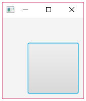

# 레이아웃

# JavaFX 레이아웃 (Layout)

- Scene에는 다양한 control이 포함되는데 이를 배치하는 것이 Layout이다.
- 레이아웃을 작성하는 방법은 2가지이다.
    - 코드로 작성하는 프로그램적 레이아웃
    - FXML로 작성하는 선언적 레이아웃

## 프로그램적 레이아웃

- **Java 코드로 UI 컨트롤을 배치하는 것**을 말한다.
- 자바 코드에 익숙한 개발자들이 선호하는 방식으로 컨트롤 배치, 스타일 지정, 이벤트 처리 등 **모두 자바 코드로 작성**한다.
- 레이아웃이 복잡해지면, 프로그램적 방법은 코드까지 복잡해져 난해한 프로그램이 될 확률이 높다.
- 또한, 모든 것을 개발자가 직접 작성해야 하므로 **디자이너와 협력해서 개발하는 것이 어렵다**.
- 개발 완료 후, 간단한 레이아웃 변경이나 스타일 변경이 필요하면 **Java 코드를 수정하고 재컴파일 해야 한다는 단점**도 존재한다.

### 예시

```java
package javaFX;
 
import javafx.application.Application;
import javafx.collections.ObservableList;
import javafx.geometry.Insets;
import javafx.scene.Node;
import javafx.scene.Scene;
import javafx.scene.control.Button;
import javafx.scene.control.TextField;
import javafx.scene.layout.HBox;
import javafx.stage.Stage;
 
public class HBoxExam extends Application {
    @Override
    public void start(Stage primaryStage) throws Exception {
        HBox hbox = new HBox();
        hbox.setPadding(new Insets(10)); // 안쪽 여백 설정
        hbox.setSpacing(10); // 컨트롤 간의 수평 간격 설정
 
        TextField textField = new TextField();
        textField.setPrefWidth(200);
 
        Button button = new Button();
        button.setText("Confirm");
 
        ObservableList<Node> list = hbox.getChildren();
        list.add(textField);
        list.add(button);
 
        Scene scene = new Scene(hbox);
 
        primaryStage.setTitle("HBoxExam");
        primaryStage.setScene(scene);
        primaryStage.show();
    }
 
    public static void main(String[] args) {
        launch(args);
    }
}
 
```

## FXML 레이아웃

- FXML이란 **XML 기반의 마크업 언어**로 JavaFX App의 **UI 레이아웃을 Java 코드에서 분리**해서 태그로 선언하는 방법을 제공한다. 해당 방법은 Android 앱을 개발하는 방법과 유사한데, 안드로이드는 XML로 레이아웃을 작성하고 Java로 이벤트 처리 및 application 로직을 작성한다.
- FXML 태그로 레이아웃을 정의하기 때문에 **태그에 익숙한 디자이너와 협업이 가능**하다. 또한, 개발 완료 후 **간단한 레이아웃 변경이나 스타일 변경이 필요한 경우**에는 Java 소스를 수정할 필요 없이 **FXML 태그만 수정**하면 된다. 그리고 **레이아웃이 비슷한 장면들 간 재사용이 가능**하기 때문에 개발 기간을 단축시킬 수 있다.

### 예시

- 위와 동일한 레이아웃으로, FXML로 작성한 코드이다.

```java
<HBox xmlns:fx="http://javafx.com/fxml" >    <!-- HBox 컨테이너 선언 -->
    <padding>
        <Insets top="10" right="10" bottom="10" left="10" />
    </padding>
    <spacing>10</spacing>
    
    <children>
        <TextField>
            <prefWidth>200</prefWidth>
        </TextField>
        <Button>
            <text>확인</text>
        </Button>
    </children>
    
</HBox>
```

# Layout 여백: Padding and Margin

- 컨트롤을 보기 좋게 배치하기 위해서 여백이 거의 필수적으로 들어간다.
- Padding은 안쪽 여백, Margin은 바깥 여백을 말한다.
- Margin과 Padding 값은 `javafx.geometry.insets` 객체로 제공해야 하는데 다음과 같이 생성된다.

    ```java
    // top, right, bottom, left 모두 동일한 값으로 설정할 때
    new Insets(double topRightBottomLeft);
     
    // 다른 값으로 설정할 때
    new Insets(double top, double right, double bottom, double left);
    ```

- 파라미터 순서는 top (위) 부터 시작해서 시계 방향으로 나열되어 있다.

## 예제

- Padding과 Margin 설정을 통해 버튼을 구성하는 예제

```java
package javaFX;
 
import javafx.application.Application;
import javafx.geometry.Insets;
import javafx.scene.Scene;
import javafx.scene.control.Button;
import javafx.scene.layout.HBox;
import javafx.stage.Stage;
 
public class PaddingMarginExam extends Application {
    
    @Override
    public void start(Stage stage) throws Exception {
        // 패딩 설정
        HBox hbox = new HBox();
        hbox.setPadding(new Insets(50, 10, 10, 50));
        Button button = new Button();
        button.setPrefSize(100, 100);
        
        // 마진 설정
        /*HBox hbox = new HBox();
        Button button = new Button();
        button.setPrefSize(100, 100);
        hbox.setMargin(button, new Insets(10, 10, 50, 50)); */
        
        hbox.getChildren().add(button);
        
        Scene scene = new Scene(hbox);
        
        stage.setTitle("PaddingMarginExam");
        stage.setScene(scene);
        stage.show();
    }
 
    public static void main(String[] args) {
        launch(args);
    }
}
```

### 패딩 설정 시 결과



### 마진 설정 시 결과


# FXML 작성 규칙

- FXML로 선언된 태그는 Java 코드로 변환되어 실행되기 때문에 **Java 코드와 mapping 관계가 존재**한다.
- 매핑 관계만 잘 이해하면 JavaFX API document를 참조해서 FXML 태그를 쉽게 작성할 수 있다.
- 하단은 프로그램적 레이아웃과 FXML 태그를 매핑시킨 표이다.

    

## 패키지 선언

- 자바 코드의 패키지 선언과 mapping되는 FXML 태그는 `<?import?> 이다.

    

    - **<?import?> 태그를 작성하는 위치**는 정해져 있으며, XML 선언 태그인 **<?xml version="1.0" encoding="UTF-8"?>** 과 **루트 컨테이너 태그 사이**이다.

## 태그 선언

- FXML 태그는 `<`와 `>` 사이에 태그 이름을 작성한 것이다.

    ```java
    <TagName> ... </TagName>
    ```

- **반드시 시작 태그가 있으면 끝 태그도 있어야 하며**, 그렇지 않으면 `javax.xml.stream.XMLStreamException` 예외가 발생한다.
- 시작 태그와 끝 태그 사이에는 태그 내용이 작성되는데, 태그 내용이 없을 경우에는 다음과 같이 시작 태그 끝에 `/>` 를 붙이고 끝 태그를 생략할 수있다.
- 태그 이름은 JavaFX 클래스 명이거나, Setter의 method 명이 될 수 있다.

    

## 속성 선언

- FXML 태그는 아래와 같은 속성을 가질 수 있다. 속성값은 큰따옴표 (`"`) 또는 작은 따옴표 (`'`) 로 반드시 감싸야 한다.

    ```java
    <tagName property1="value" property2="value"> ... </tagName>
    ```

- 속성명은 Setter 메소드 명이 오는데 모든 Setter가 사용될 수 있는 것은 아니고, 기본 타입 (Boolean, Short, Char, Int, Long, Double, Float) 값을 setting하거나 String을 Setting하는 Setter만 올 수 있다.

    

## 객체 선언

- Setter 메소드가 **기본 타입과 String 타입이 아닌 다른 타입의 객체**를 parameter로 갖는다면 속성으로 작성할 수 없고, **태그로 작성**해야 한다.

### <클래스 속성="값"/>

- 일반적으로 다음과 같이 **클래스명으로 태그를 작성**하면 `new` 연산자로 기본 생성자를 호출해서 객체를 생성한다.

    ```java
    <Class>
    ```

- 만약 생성자에 parameter가 있고, parameter에 `@NamedArg(javafx.beans.NamedArg)` 애노테이션이 적용되어 있다면 속성명이나 자식 태그로도 작성할 수 있다.

    ```java
    <Class parameter="value">
     
    or
     
    <Class>
        <parameter>value</parameter>
    </Class>
    ```

**예시**

- HBox 패딩을 설정할 때 `setPadding(Insets value)` 메소드를 사용하는데, Insets는 기본 생성자가 없고, `Insets(double topRightBottomLeft)` 또는 `Insets(double top, double right, double bottom, double left)` 만 있다. 이 경우, Insets 객체를  FXML로 선언하면 아래와 같다.


### <클래스 fx:value="값">

- 클래스가 `valueOf(String)` 메소드를 제공해서 객체를 생성하는 경우가 있다.
- 예를 들어, String, Integer, Boolean 클래스는 valueOf(String)을 호출해서 생성한다. 이 경우, 다음과 같이 FXML 태그를 작성할 수 있다.

    ```java
    <Class fx:value="value"/> 
    ```

- 예를 들어 String, Integer, Boolean 객체를 FXML로 선언하면 다음과 같다.

    

### <클래스 fx:constant="상수" />

- 클래스에 정의된 상수값을 얻고 싶을 경우에는 다음과 같이 FXML 태그를 작성할 수 있다.

    ```java
    <Class fx:constant="constant" />
    ```

- 예를 들어, Double.MAX_VALUE 상수 값을 Button 컨트롤의 maxWidth 속성값으로 설정할 경우 다음과 같이 FXML을 선언할 수 있다.

    

### <클래스 fx:factory="정적메소드" />

- 어떤 클래스는 `new` 연산자로 객체를 생성할 수 없고, **정적 메소드로 객체를 얻어야 하는 경우**도 있다. 이 경우 다음과 같이 FXML 태그를 작성할 수 있다.

    ```java
    <Class fx:factory="StaticMethod">
    ```

- 예시
    - 다음은 ComboBox의 `setItems(ObservableList <T> value)` 메소드는 `javafx.collections.ObservableList` 인터페이스 타입의 구현 객체를 parameter로 가지는데, `ObservableList`의 구현 객체는 `javafx.collections.FXCollections`의 정적 메소드인 `observableArrayList(E.. items)` 메소드로 얻을 수 있다. 그래서 다음과 같이 FXML을 작성해야 한다.

# FXML 로딩과 Scene 생성

- FXML 파일을 작성했다면, FXML 파일을 읽어들여 선언된 내용을 객체화해야 한다. 이를 FXML 로딩이라고 한다.
- FXML 파일을 로딩하기 위해서는 `javafx.fxml.FXMLLoader`를 사용해야 하는데, FXMLLoader는 2가지 종류의 메소드를 가지고 있다.
    1. 정적 메소드인 `load()`
    2. 인스턴스 메소드인 `load()` 
- FXML 파일이 클래스와 **동일한 패키지에 있을 경우** `정적 load() 메소드`로 FXML 파일을 로딩하는 코드이다.

    ```java
    Parent root = FXMLLoader.load(getClass().getResource("xxx.xml"));
    ```

    - `getClass()`는 현재 클래스를 리턴하고,
    - `getResource()`는 클래스가 위치하는 곳에서 **상대 경로로 리소스의 URL을 리**턴한다.
- 인스턴스 `load()` 메소드로 FXML 파일을 로딩하는 코드이다.

    ```java
    FXMLLoader loader = new FXMLLoader(getClass().getResource("xxx.fxml"));
    Parent root = (Parent)loader.load();
    ```

    - `load()` 메소드가 리턴하는 타입은 Parent 타입인데, 실제 객체는 FXML 파일에서 루트 태그로 선언된 컨테이너이다. 만약 FXML 파일에서 루트 태그가 <HBox>라면 아래와 같이 타입 변환이 가능하다.

        ```java
        HBox hbox = (HBox) FXMLLoader.load(getClass().getResource("xxx.fxml"));
        ```

- FXML 파일을 로딩해서 Parent 객체를 얻었다면 이것을 가지고 다음과 같이 객체를 생성하면 된다
    - AppMain.java

    ```java
    package javaFX;
     
    import javafx.application.Application;
    import javafx.fxml.FXMLLoader;
    import javafx.scene.Parent;
    import javafx.scene.Scene;
    import javafx.stage.Stage;
     
    public class AppMain extends Application {
     
        @Override
        public void start(Stage primaryStage) throws Exception {
            Parent root = FXMLLoader.load(getClass().getResource("root.fxml"));
            Scene scene = new Scene(root);
     
            primaryStage.setTitle("AppMain");
            primaryStage.setScene(scene);
            primaryStage.show();
        }
     
        public static void main(String[] args) {
            launch(args);
        }
    }
    ```

- root.fxml

    ```java
    <?xml version="1.0" encoding="UTF-8" ?>
     
    <?import javafx.scene.layout.HBox ?>
    <?import javafx.scene.control.* ?>
    <?import javafx.geometry.Insets ?>
     
    <HBox xmlns:fx="http://javafx.com/fxml" >    <!-- HBox 컨테이너 선언 -->
        <padding>
            <Insets top="10" right="10" bottom="10" left="10" />
        </padding>
        <spacing>10</spacing>
        
        <children>
            <TextField>
                <prefWidth>200</prefWidth>
            </TextField>
            <Button>
                <text>Confirm</text>
            </Button>
        </children>
    </HBox>
    ```


# 참고

[https://palpit.tistory.com/entry/Java-JavaFX-레이아웃Layout?category=843239](https://palpit.tistory.com/entry/Java-JavaFX-%EB%A0%88%EC%9D%B4%EC%95%84%EC%9B%83Layout?category=843239)

