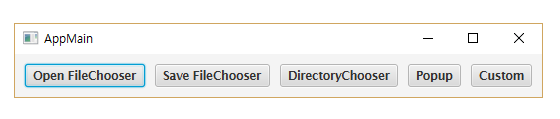

# 메뉴바, 툴바, 타이얼로그

# MenuBar 컨트롤

- 메뉴바 컨트롤은 컨테이너 상단에 배치되어 다양한 작업을 쉽게 선택하도록 해준다.
- Menu에는 메뉴 아이템으로 MenuItem, CheckMenuItem, RadioMenuItem, CustomMenuItem, SeparatorMenuItem을 추가할 수 있고, 서브 메뉴를 갖는 Menu도 추가할 수 있다.
- FXML로 MenuBar 컨트롤을 선언하는 방법이다.

    ```java
    <MenuBar>
        <menus>
            <Menu text="File">...</Menu>
            <Menu text="Edit">...</Menu>
        </menus)
    </MenuBar>
    
    ```

### 예시

- File Menu의 메뉴 아이템을 추가하는 방법

```java
<Menu text="File">
    <items>
        <MenuItem text="New File" onAction="#handleNew">
            <accelerator>
                <KeyCodeCombination alt="DOWN" code="N" countrl="UP" meta="UP"
                    shift="DOWN" shortcut="UP" />
            </accelerator>
            <graphic>
                <ImageView><image><Image url="@icons/new.png"/></image></ImageView>
            </graphic>
        </MenuItem>
    <items>
</Menu>
```

## ActionEvent 처리

- MenuItem도 Button과 마찬가지로 클릭하면 onAction 속성에 지정된 컨트롤러의 메소드를 호출해서 ActionEvent를 처리합니다.
- `<accelerator>` 태그는 단축키를 설정하는데, 단축키는 KeyCodeCombination 객체로 생성한다.
- Alt 키, Ctrl 키, Shfit 키, code 키 조합으로 구성할 수 있는데, DOWN으로 설정된 키와 code 키를 동시에 누르면 onAction 속성에 지정된 메소드가 호출된다.
- "New File" 메뉴 아이템일 경우 Alt + Ctrl + N 을 동시에 누르면 handleNew() 메소드가 실행된다.
- `<graphic>` 태그는 메뉴 아이템 앞에 아이콘이 추가됩니다.

# ToolBar 컨트롤

- 계층적인 작업 선택 기능은 MenuBar 컨트롤이 편리하나, **빠르게 작업을 선택**하고 싶다면 Toolbar 컨트롤을 추가하는 것이 좋다.
- Toolbar 컨트롤은 **UI 컨트롤이면서 컨테이너**이기도 하다. 주로 Button이 추가되지만, ComboBox와 같은 다른 컨트롤도 배치할 수 있다.
- 다음은 FXML로 Toolbar를 선언하는 방법을 보여준다.

    ```java
    <ToolBar>
        <items>
            <Button onAction="#handleNew">
                <graphic>
                    <ImageView><image><Image url="@icons/new.png"/></image></ImageView>
                </graphic>
            </Button>
        </items>
    </ToolBar>
    
    출처: https://palpit.tistory.com/757 [Palpit's Techlog]
    ```

# 다이얼로그

- 다이얼로그는 주 윈도우에서 알림 또는 사용자의 입력을 위해서 실행되는 서브 윈도우라고 볼 수 있다.
- 다이얼로그는 자체적으로 실행될 수 없고, 주 윈도우에 의해서 실행되는데, 다이얼로그를 띄우는 주 윈도우를 다이얼로그의 소유자(owner) 윈도우라고 한다.

## Dialog 종류

- 다이얼로그는 모달(modal)과 모달리스(modaless) 두 가지 종류가 있다.
    - 모달 다이얼로그는 다이얼로그를 닫기 전까지 소유자 윈도우를 사용할 수 없고,
    - 모달리스 다이얼로그는 소유자 윈도우를 계속 사용할 수 있다.
- javaFX에서 제공하는 다이얼로그 종류에는 파일을 선택하는 FileChooser, 디렉터리를 선택하는 DirectoryChooser, 팝업창을 띄우는 popup이 있다.

## FileChooser, Directory Chooser

- FileChooser는 로컬 PC의 파일을 선택할 수 있는 다이얼로그이다.
- 열기 또는 저장 옵션으로 실행할 수 있고, 파일 확장명을 필터링해 원하는 파일만 볼 수 있다.
- FileChooser는 컨트롤이 아니기 때문에 FXML에서 선언할 수 없다.
- 버튼이나 메뉴 아이템의 ActionEvent를 처리할 때 자바 코드로 FileChooser를 생성하고, showOpenDialog() 또는 showSaveDialog()를 호출해야 한다.
- 다음은 열기 옵션으로 FileChooser를 실행한 코드이다.'

    ```java
    FileChooser fileChooser = new FileChooser();
    fileChooser.getExtensionFilters().addAll(
        new ExtensionFilter("Text Files", "*.txt"),
        new ExtensionFilter("Image Files", "*.png", "*.jpg", "*.gif"),
        new ExtensionFilter("Audio Files", "*.wav", "*.mp3", "*.aac"),
        new ExtensionFilter("All Files", "*.*")
    );
    File selectedFile = fileChooser.showOpenDialog(primaryStage);
    String selectedFilePath = selectedFile.getPath();
    ```

- 파일 확장명으로 파일 이름을 필터링하려면 ExtensionFilter를 생성해서 추가하면 된다.
- `showOpenDialog()` 또는 `showSaveDialog()`를 호출할 때에는 소유자 윈도우(Stage)를 파라미터로 제공해야 한다.
- 왜냐하면 다이얼로그는 자체적으로 실행할 수 없고, 소유자 윈도우가 있어야 하기 때문이다.
- FileChooser는 모달 다이얼 로그이므로 [열기] 또는 [저장] 버튼을 클릭하거나, [취소] 버튼을 클릭하기 전까지는 소유자 윈도우를 사용할 수 없다.
- 파일을 선택하고 [열기] 또는 [저장] 버튼을 클릭하면, showOpenDialog() 또는 showSaveDialog()가 File 객체를 리턴한다.

## Popup

- Popup은 투명한 컨테이너를 제공하는 모달리스 다이얼로그이다. 따라서 소유자 윈도우는 계속 사용될 수 있다.
- Popup은 컨트롤의 툴팁(tooltip), 메시지 통지(notification), 드롭다운 박스(drop down boxes), 마우스 오른쪽 버튼을 클릭했을 때 나타나는 메뉴 등을 만들 때 사용될 수 있다.
- 다음은 FXML 파일을 로딩해서 Popup의 내용을 추가하는 코드입니다.

    ```java
    Popup popup = new Popup();
    popup.getContent().add(FXMLLoader.load(getClass().getResource("popup.fxml")));
    ```

- Popup을 실행하려면 다음과 같이 `show()` 메소드를 호출하면 된다.

    ```java
    popup.show(primaryStage);
    popup.show(primaryStage, AnchorX, anchorY);
    ```

### 예시

- 메시지 통지용 Popup을 만드는 예제이다.

```java
<?xml version="1.0" encoding="UTF-8"?>
 
<?import javafx.scene.layout.HBox?>
<?import javafx.scene.image.ImageView?>
<?import javafx.geometry.Insets?>
<?import javafx.scene.control.Label?>
 
<HBox xmlns:fx="http://javafx.com/fxml/1"
    alignment="CENTER_LEFT"
    style="-fx-background-color: black; -fx-background-radius: 20;">
    <children>
        <ImageView id="imgMessage" fitHeight="30" fitWidth="30" preserveRatio="true"/>
        <Label id="lblMessage" style="-fx-text-fill: white;">
            <HBox.margin>
                <Insets left="5" right="5" />
            </HBox.margin>
        </Label>
    </children>
</HBox>
```

# Controller에서 primaryStage 사용

- controller에서 dialog를 실행할 때 소유자 윈도우가 될 `primaryStage`가 필요하다.
- 컨트롤러에서 primaryStage를 얻는 방법은 2가지가 있다.

## Main Class에서 전달하는 방법

- primaryStage는 main class의 `start()` 파라미터로 전달되기 때문에 `start()` 메소드에서 컨트롤러로 `primaryStage`를 전달하면 된다.
- FXML 루트 태그의 fx:controller 속성에 지정된 컨트롤러 클래스는 FXMLLoader가 FXML을 로딩할 때 객체로 생성된다.
- FXMLLoader는 생성된 컨트롤러를 리턴하는 `getController()` 메소드를 제공하고 있다. 그러나 이 메소드는 instance 메소드이기 때문에 FXMLLoader 객체가 필요하다. 그래서 FXMLLoader의 정적 메소드 `load()` 호출 코드는 다음과 같이 instance 메소드 `load()` 호출 코드로 변경해야 한다.

    ```java
    FXMLLoader loader = new FXMLLoader(getClass().getResource("root.fxml"));
    Parent root = loader.load();
     
    RootController controller = loader.getController();
    controller.setPrimaryStage(primaryStage);
    ```

    - 마지막 코드를 보면 컨트롤러의 `setPrimaryStage()`메소드를 호출하면서 primaryStage를 파라미터 값으로 전달하고 있다.
- 따라서 controller 클래스는 다음과 같이 필드와 Setter 메소드를 추가해두어야 한다.

    ```java
    public class RootController implements Initializable {
        private Stage primaryStage;
     
        public void setPrimaryStage(Stage primaryStage) {
            this.primaryStage = primaryStage;
        }
     
        ...
    }
    ```

## 컨테이너 또는 컨트롤러로부터 얻는 방법

- 컨테이너나 컨트롤의 getScene() 메소드는 자신이 포함된 Scene 객체를 리턴한다. 그리고 Scene의 getWindow() 메소드는 자신을 보여주는 Stage 객체를 리턴한다.

    따라서 다음과 같은 코드를 이용하면 컨트롤러에서 primaryStage를 얻을 수 있다.

    ```java
     Stage primaryStage = (Stage) 'ControlName'.getScene().getWindow();
    ```

- 주의할 점은 위 코드는 initialize() 메소드 안에서 사용할 수 없다.
- 그 이유는 아직 primaryStage가 생성되지 않았기 때문이다.
- 메인 클래스의 `start()` 메소드에서 Scene 객체를 생성하고, primaryStage에 Scene을 설정해야만 위 코드가 정상적으로 동작한다.
- 따라서 이벤트 처리 메소드 내에서 위 코드를 사용해야 한다.

### 예시

- 다섯 개의 버튼을 배치하고, 지금까지 설명한 다이얼로그를 실행하도록 했다.
- DialogRoot.fxml

    ```java
    <?xml version="1.0" encoding="UTF-8"?>
     
    <?import javafx.scene.layout.HBox?>
    <?import javafx.scene.control.Button?>
    <?import javafx.geometry.Insets?>
     
    <HBox xmlns:fx="http://javafx.com/fxml/1"
        fx:controller="javaFX.RootController"
        alignment="TOP_LEFT" spacing="10">
        <children>
            <Button onAction="#handleOpenFileChooser" text="Open FileChooser" />
            <Button onAction="#handleSaveFileChooser" text="Save FileChooser" />
            <Button onAction="#handleDirectoryChooser" text="DirectoryChooser" />
            <Button fx:id="btnPopup" onAction="#handlePopup" text="Popup" />
            <Button fx:id="btnCustom" onAction="#handleCustom" text="Custom" />
        </children>
        <padding>
            <Insets bottom="10" left="10" right="10" top="10" />
        </padding>
    </HBox>
    ```

- `popup.fxml`

    ```java
    <?xml version="1.0" encoding="UTF-8"?>
     
    <?import javafx.scene.layout.HBox?>
    <?import javafx.scene.image.ImageView?>
    <?import javafx.geometry.Insets?>
    <?import javafx.scene.control.Label?>
     
    <HBox xmlns:fx="http://javafx.com/fxml/1"
        alignment="CENTER_LEFT"
        style="-fx-background-color: black; -fx-background-radius: 20;">
        <children>
            <ImageView id="imgMessage" fitHeight="30" fitWidth="30" preserveRatio="true"/>
            <Label id="lblMessage" style="-fx-text-fill: white;">
                <HBox.margin>
                    <Insets left="5" right="5" />
                </HBox.margin>
            </Label>
        </children>
    </HBox>
    ```

- custom_dialog.fxml

    ```java
    <?xml version="1.0" encoding="UTF-8"?>
     
    <?import javafx.scene.layout.AnchorPane?>
    <?import javafx.scene.image.ImageView?>
    <?import javafx.scene.image.Image?>
    <?import javafx.scene.control.Button?>
    <?import javafx.scene.control.Label?>
     
    <AnchorPane xmlns:fx="http://javafx.com/fxml/1"
        prefHeight="150" prefWidth="400">
        <children>
            <ImageView fitHeight="50" fitWidth="50" layoutX="15" layoutY="15"
                preserveRatio="true">
                <image>
                    <Image url="@images/dialog-info.png"/>
                </image>
            </ImageView>    
            <Button id="btnOk" layoutX="336" layoutY="104" text="확인" />
            <Label id="txtTitle" layoutX="87" layoutY="33" 
                prefHeight="15" prefWidth="290" />
        </children>
    </AnchorPane>
    ```

- RootController.java

    ```java
    package javaFX;
     
    import java.io.File;
    import java.net.URL;
    import java.util.ResourceBundle;
     
    import javafx.event.ActionEvent;
    import javafx.fxml.FXMLLoader;
    import javafx.fxml.Initializable;
    import javafx.scene.Scene;
    import javafx.scene.control.Button;
    import javafx.scene.control.Label;
    import javafx.scene.image.Image;
    import javafx.scene.image.ImageView;
    import javafx.scene.layout.AnchorPane;
    import javafx.scene.layout.HBox;
    import javafx.stage.DirectoryChooser;
    import javafx.stage.FileChooser;
    import javafx.stage.FileChooser.ExtensionFilter;
    import javafx.stage.Modality;
    import javafx.stage.Popup;
    import javafx.stage.Stage;
    import javafx.stage.StageStyle;
     
    public class RootController implements Initializable {
        
        @Override
        public void initialize(URL loc, ResourceBundle res) {
            
        }
        
        private Stage primaryStage;
        public void setPrimaryStage(Stage primaryStage) {
            this.primaryStage = primaryStage;
        }
        
        public void handleOpenFileChooser(ActionEvent e) {
            FileChooser fileChooser = new FileChooser();
            fileChooser.getExtensionFilters().addAll(
                new ExtensionFilter("Text File", "*.txt"),
                new ExtensionFilter("Image Files", "*.jpg", "*.png", "*.gif"),
                new ExtensionFilter("Audio Files", "*.wav", "*.mp3", "*.aac"),
                new ExtensionFilter("All Files", "*.*")
            );
            File selectedFile = fileChooser.showOpenDialog(primaryStage);
            
            if (selectedFile != null) {
                System.out.println(selectedFile.getPath());
            }
        }
        
        public void handleSaveFileChooser(ActionEvent e) {
            FileChooser fileChooser = new FileChooser();
            fileChooser.getExtensionFilters().add(new ExtensionFilter("All Files", "*.*"));
            File selectedFile = fileChooser.showSaveDialog(primaryStage);
            
            if (selectedFile != null) {
                System.out.println(selectedFile.getPath());
            }
        }
        
        public void handleDirectoryChooser(ActionEvent e) {
            DirectoryChooser dChooser = new DirectoryChooser();
            File selectedDir = dChooser.showDialog(primaryStage);
            
            if (selectedDir != null) {
                System.out.println(selectedDir.getPath());
            }
        }
        
        public void handlePopup(ActionEvent e) throws Exception {
            Popup popup = new Popup();
            
            HBox hbox = (HBox) FXMLLoader.load(getClass().getResource("popup.fxml"));
            ImageView imageView = (ImageView) hbox.lookup("#imgMessage");
            imageView.setImage(
                    new Image(getClass().getResource("images/dialog-info.png").toString())
            );
            imageView.setOnMouseClicked(event -> popup.hide());
            Label lblMessage = (Label) hbox.lookup("#lblMessage");
            lblMessage.setText("메시지가 왔습니다.");
            
            popup.getContent().add(hbox);
            popup.setAutoHide(true);
            popup.show(primaryStage);
        }
        
        public void handleCustom(ActionEvent e) throws Exception {
            Stage dialog = new Stage(StageStyle.UTILITY);
            dialog.initModality(Modality.WINDOW_MODAL);
            dialog.initOwner(primaryStage);
            dialog.setTitle("확인");
            
            AnchorPane aPane = (AnchorPane) FXMLLoader.load(getClass().getResource("custom_dialog.fxml"));
            Label txtTitle = (Label) aPane.lookup("#txtTitle");
            txtTitle.setText("확인하셨습니까?");
            Button btnOk = (Button) aPane.lookup("#btnOk");
            btnOk.setOnAction(event -> dialog.close());
            
            Scene scene = new Scene(aPane);
            dialog.setScene(scene);
            dialog.setResizable(false);
            dialog.show();
        }
        
    }

    ```

- AppMain.java

    ```java
    package javaFX;
     
    import javafx.application.Application;
    import javafx.fxml.FXMLLoader;
    import javafx.scene.Parent;
    import javafx.scene.Scene;
    import javafx.stage.Stage;
     
    public class AppMain extends Application {
     
        @Override
        public void start(Stage primaryStage) throws Exception {
            FXMLLoader loader = new FXMLLoader(getClass().getResource("DialogRoot.fxml"));
            Parent root = loader.load();
            RootController controller = loader.getController();
            controller.setPrimaryStage(primaryStage);
     
            Scene scene = new Scene(root);
     
            primaryStage.setTitle("AppMain");
            primaryStage.setScene(scene);
            primaryStage.show();
        }
     
        public static void main(String[] args) {
            launch(args);
        }
    }
    
    ```



# 출처

- [https://palpit.tistory.com/757](https://palpit.tistory.com/757)