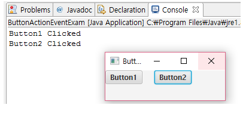

# 이벤트 처리, 속성 감시, 바인딩

# 이벤트 처리

- UI 애플리케이션은 사용자와 상호작용을 하면서 코드를 실행한다.
- 사용자가 UI 컨트롤을 사용하면, 이벤트(event)가 발생하고 프로그램은 이벤트를 처리하기 위해 코드를 실행한다.

## 이벤트 핸들러 (Event Handler)

- JavaFX는 이벤트 발생 컨트롤과 이벤트 핸들러를 분리하는 위임형 (Delegation) 방식을 사용한다.
- **위임형 방식**이란 컨트롤에서 이벤트가 발생하면, **컨트롤이 직접 처리하지 않고 이벤트 핸들러에게 이벤트 처리를 위임하는 방식**이다.
    - 예를 들어 사용자가 Button을 클릭하면 ActionEvent가 발생하고, Button에 등록된 EventHandler가 ActionEvent를 처리한다.
- EventHandler는 control에서 이벤트가 발생하면, 자신의 `handle()` 메소드를 발생시킨다.
    - `handle()` 메소드에는 윈도우 닫기, 컨트롤 내용 변경, 다이얼로그 띄우기 등의 다양한 코드를 작성할 수 있다.
- `EventHandler`는 Generic 타입 이기 때문에 type parameter는 발생된 이벤트의 type이 된다.
    - Generic  타입이란 클래스에서 사용할 타입을 클래스 외부에서 설정하는 타입을 말한다.
        - java Collection에서 많이 사용된다.
        - ArrayList를 생각해보면

            ```java
            List<string> strList = new ArrayList<>();
            List<object> objList = new ArrayList<>();
            ```

        - ArrayList의 기능은 같지만, 리스트에 담는 내용물은 다르다.
        - 위처럼 List의 기능은 같지만, 사용하는 타입이 다를 때 Generic 타입을 사용한다.
        - ArrayList는 ArrayList<T>로 선언되어 있으며, 해당 객체를 생성할 때 T의 타입이 정해진다.

        ```java
        // T는 Generic 변수이다. 타입이 정해져 있지 않다.
        class Test<T>{
            private T t;
              
            public void set(T t) {
                this.t = t;
            }
          
            public T get() {
                return t;
            }
        }
        
        // Test<T> 클래스를 사용한 예시이다.
        public static void main(String[] args) {
             
            Test<String> test = new Test();
            test.set("test");
            System.out.println(test.get());
        }
        ```

- `EventHandler` 가 control에서 발생된 이벤트를 처리하려면 먼저 control에 `EventHandler` 를 등록해야 한다. control은 발생되는 이벤트에 따라 `EventHandler`를 등록하는 다양한 메소드가 있는데, 이 메소드들은 `setOnXXX()`와 같은 이름을 가지고 있다. `ActionEvent`를 처리하는 `EventHandler<ActionEvent>`를 등록하려면 아래와 같이 `SetOnAction()`메소드를 사용한다.

    ```java
    Button button = new Button();
    button.setOnAction(new EventHandler<ActionEvent>() {
        @Override
        public void handle(ActionEvent event) { ... }
    }
    ```

- `EventHandler`는 하나의 메소드를 가진 함수적 interface이므로 람다식을 이용하면 보다 적은 코드로 `EventHandler`를 등록할 수 있다.

    ```java
    button.setOnAction( event -> { ... } );
    tableView.setOnMouseClicked( event -> { ... } );
    stage.setOnCloseRequest( event -> { ... } );
    ```

### 예시

- 프로그램적 레이아웃 작성
- 버튼의 ActionEvent를 처리
    - 첫번째 버튼 - 직접 EventHandler객체 생성 후 등록
    - 두번째 버튼 - 람다식을 이용해 등록

```java
 package javaFX;
 
import javafx.application.Application;
import javafx.event.ActionEvent;
import javafx.event.EventHandler;
import javafx.scene.Scene;
import javafx.scene.control.Button;
import javafx.scene.layout.HBox;
import javafx.stage.Stage;
 
public class ButtonActionEventExam extends Application {
    @Override
    public void start(Stage primaryStage) throws Exception {
        HBox root = new HBox();
        root.setPrefSize(200, 50);
        root.setSpacing(20);
        
        Button btn1 = new Button("Button1");
        btn1.setOnAction(new EventHandler<ActionEvent>() {
            @Override
            public void handle(ActionEvent event) {
                System.out.println("Button1 Clicked");
            }
        });
        
        Button btn2 = new Button("Button2");
        btn2.setOnAction( event -> System.out.println("Button2 Clicked"));
        
        root.getChildren().addAll(btn1, btn2);
        Scene scene = new Scene(root);
        
        primaryStage.setTitle("ButtonActionEventExam");
        primaryStage.setScene(scene);
        primaryStage.show();
    }
    
    public static void main(String[] args) {
        launch(args);
    }
}
```



# FXML 컨트롤러

- 프로그램적 레이아웃은 레이아웃 코드와 이벤트 처리 코드를 모두 자바 코드로 작성해야 하므로 코드가 복잡해지며, 유지보수가 힘들어진다.
- FXML 레이아웃은 **FXML 파일당 별도의 controller를 지정해서 이벤트를 처리**할 수 있기 때문에 FXML 레이아웃과 이벤트 처리 코드를 완전히 분리할 수 있다.

### fx:controller 속성과 컨트롤러 클래스

- FXML 파일의 **루트 태그에서 fx:controller를 지정**하면 **UI control에서 발생하는 이벤트를 controller가 처리**한다.

```java
<RootContainer xmlns:fx="http://javafx.com/fxml"
    fx:controller="packageName.ControllerName">
    ...
</RootContainer>
```

- 컨트롤러는 아래와 같이 `Initializable` 인터페이스를 구현한 클래스로 작성하면 된다.

    ```java
    public class ControllerName implements Initializable {
        @Override
        public void initialize(URL location, ResourceBundle resources) { ... }
    }
    
    ```

    - `initialize()` 메소드는 컨트롤러 객체가 생성되고 나서 호출되는데, 주로 UI 컨트롤러의 초기화, 이벤트 핸들러 등록, 속성 감시 등의 코드가 작성된다.

### fx:id 속성과 @FXML 컨트롤 주입

- controller는 Event Handler를 등록하기 위해서, 그리고 이벤트 처리 시 UI를 변경하기 위해서 **FXML 파일에 포함된 container 및 control의 참조가 필요**하다. 이를 위해서 FXML 파일에 포함된 컨트롤들은 fx:id 속성을 가질 필요가 있습니다.

    ```java
    <?xml version="1.0" encoding="UTF-8"?>
     
    <?import javafx.scene.layout.HBox?>
    <?import javafx.scene.control.Button?>
     
    <HBox xmlns:fx="http://javafx.com/fxml/1"
        fx:controller="JavaFX.javaFX.RootController"
        prefHeight="50" prefWidth="200"
        alignment="CENTER" spacing="20">
        <children>
            <Button fx:id="btn1" text="button1" />
            <Button fx:id="btn2" text="button2" />
            <Button fx:id="btn3" text="button3" />
        </children>
        
    </HBox>
    ```

- fx:id 속성을 가진 control들은 controller의 `**@FXML` 어노테이션이 적용된 필드에 자동 주입**된다. 주의할 점은 `**fx:id` 속성값과 필드명이 동일**해야 한다.

```java
public class ControllerName implements Initializable {
    @FXML private Button btn1;
    @FXML private Button btn2;
    @FXML private Button btn3;
    @Override
    public void initialize(URL location, ResourceBundle resources) {...}
}

```

- FXMLLoader가 FXML 파일을 로딩할 때,
    - 태그로 선언된 control 객체가 생성되고,
    - controller 객체도 함께 생성된다.
    - 이후, `@FXML`애노테이션이 적용된 필드에 컨트롤 객체가 자동 주입된다. 주입이 완료되면 비로소 `initialize()` 메소드가 호출되기 때문에 `initialize()` 내부에서 필드를 안전하게 사용할 수 있다.

# EventHandler 등록

- control에서 발생하는 이벤트를 처리하려면 **controller의 `initialize()` 메소드에서 EventHandler를 생성하고 등록**해야 한다.
- 다음은 세 개의 Button에서 발생하는 ActionEvent를 처리하는 방법을 보여준다.
    - RootController.java

        ```java
        package javaFX;
         
        import java.net.URL;
        import java.util.ResourceBundle;
         
        import javafx.event.ActionEvent;
        import javafx.event.EventHandler;
        import javafx.fxml.FXML;
        import javafx.fxml.Initializable;
        import javafx.scene.control.Button;
         
        public class RootController implements Initializable {
         
            @FXML
            private Button btn1;
            @FXML
            private Button btn2;
            @FXML
            private Button btn3;
         
            @Override
            public void initialize(URL location, ResourceBundle resources) {
                btn1.setOnAction(new EventHandler<ActionEvent>() {
         
                    @Override
                    public void handle(ActionEvent arg0) {
                        handleBtn1Action(arg0);
                    }
                });
         
                btn2.setOnAction(event -> handleBtn2Action(event));
                btn3.setOnAction(event -> handleBtn3Action(event));
            }
         
            public void handleBtn1Action(ActionEvent event) {
                System.out.println("버튼 1 클릭");
            }
         
            public void handleBtn2Action(ActionEvent event) {
                System.out.println("버튼 2 클릭");
            }
         
            public void handleBtn3Action(ActionEvent event) {
                System.out.println("버튼 3 클릭");
            }
         
        }

        ```

    - AppMain.java

        ```java
        package javaFX;
         
        import javafx.application.Application;
        import javafx.fxml.FXMLLoader;
        import javafx.scene.Parent;
        import javafx.scene.Scene;
        import javafx.stage.Stage;
         
        public class AppMain extends Application {
         
            @Override
            public void start(Stage primaryStage) throws Exception {
                Parent root = FXMLLoader.load(getClass().getResource("root.fxml"));
                Scene scene = new Scene(root);
         
                primaryStage.setTitle("AppMain");
                primaryStage.setScene(scene);
                primaryStage.show();
            }
         
            public static void main(String[] args) {
                launch(args);
            }
        }
        
        ```

        

    ## 이벤트 처리 메소드 매핑

    - Controller에서 EventHandler를 생성하지 않고, 바로 이벤트 처리 메소드와 연결할 수 있다.
    - Button 컨트롤을 작성할 때, 다음과 같이 `onAction` 속성값으로 `#메소드명`을 주면 내부적으로 `EventHandler` 객체가 생성되기 때문에 Controller에서 해당 메소드만 작성하면 된다.
    - FXML 파일

        ```java
        <Button fx:id="btn" text="button" onAction="#handleBtnAction"/>
        ```

    - Controller 클래스

        ```java
        public void handleBtnAction(ActionEvent event) { ... }
        ```

    # JavaFX 속성 감시와 바인딩

    - JavaFX는 컨트롤의 속성(Property)을 감시하는 listener를 설정할 수 있습니다.
    - 예시
        - Slider의 value 속성값을 감시하는 listener를 설정해서, value 속성값이 변경되면 listener가 다른 컨트롤러의 폰트나 이미지의 크기를 변경할 수 있습니다.

    ## 속성 감시

    - JavaFX 컨트롤 속성은 3가지 method로 구성된다.
        1. Getter
        2. Setter
        3. Property 객체를 리턴하는 method
    - 예시
        - text 속성은 `getText()`, `setText(Strings tr)`, `textProperty()` 를 갖고 있다.

            ```java
            private StringProperty text = new SimpleStringProperty();
            public void setText(String str) { text.set(str); }
            public String getText() { return text.get(); }
            public StringProperty textProperty() { return text; }
            ```

    - StringProperty는 `get()`과 `set()` 메소드 이외에 리스너를 관리하는 메소드를 가지고 있다.
    - 따라서 text 속성을 감시하는 리스너는 `textProperty()`가 리턴하는 StringProperty에서 한다.
    - 아래는 text 속성값을 감시하는 ChangeListener를 설정하는 코드이다.

        ```java
        textProperty().addListener(new ChangeListener<String>() {
            @Override
            public void changed(ObservableValue<? extends String> observable,
                String oldValue, String newValue) {
            }
        });
        ```

        - `addListener()` 메소드가 `ChangeListener`를 Property 객체에 설정하면, text 속성이 변경되었을 때 `ChangeListener`의 `changed()` 메소드가 자동으로 실행된다.
        - 속성의 이전 값은 oldValue에, 새로운 값은 newValue 파라미터로 전달된다.
        - `ChangeListener`는 제네릭 타입인데, `타입Property<String>`을 구현하고 있기 때문에 타입 파라미터는 String이 된다.
        - 따라서 oldValue와 newValue의 타입은 String이 된다.

    ### 예시

    - Slider의 value 속성에 리스너를 설정하려면 다음과 같이 작성한다.

    ```java
    Slider slider = new Slider();
    slider.valueProperty().addListener(new ChangeListener<Number>() {
        @Override
        public void changed(ObservableValue<? extends Number> observable,
            Number oldValue, Number newValue) {
     
        }
    });
    ```

### 예시

- Slider의 value 속성을 감시해서 value 속성값이 변경되면 Label의 폰트 크기를 변경하도록 리스너를 설정했습니다.
- root.fxml

    ```java
    <?xml version="1.0" encoding="UTF-8"?>
     
    <?import javafx.scene.layout.BorderPane?>
    <?import javafx.scene.control.Label?>
    <?import javafx.scene.text.Font?>
    <?import javafx.scene.control.Slider?>
     
    <BorderPane xmlns:fx="http://javafx.com/fxml/1"
        fx:controller="javaFX.RootController"
        prefHeight="250" prefWidth="350">
        <center>
            <Label fx:id="label" text="JavaFX">
                <font>
                    <Font size="0" />
                </font>
            </Label>
        </center>
        <bottom>
            <Slider fx:id="slider" />
        </bottom>
        
    </BorderPane>
    ```

- RootController.java

    ```java
    package javaFX;
     
    import java.net.URL;
    import java.util.ResourceBundle;
     
    import javafx.beans.value.ChangeListener;
    import javafx.beans.value.ObservableValue;
    import javafx.fxml.FXML;
    import javafx.fxml.Initializable;
    import javafx.scene.control.Label;
    import javafx.scene.control.Slider;
    import javafx.scene.text.Font;
     
    public class RootController implements Initializable {
     
        @FXML
        private Slider slider;
        @FXML
        private Label label;
     
        @Override
        public void initialize(URL location, ResourceBundle resources) {
            slider.valueProperty().addListener(new ChangeListener<Number>() {
                @Override
                public void changed(ObservableValue<? extends Number> observable, Number oldValue, Number newValue) {
                    label.setFont(new Font(newValue.doubleValue()));
                }
            });
        }
    }
    ```


# 속성 바인딩

- JavaFX 속성은 다른 속성과 바인딩될 수 있다.
- 바인딩된 속성들은 하나가 변경되면 자동적으로 다른 하나도 변경된다.
- 예시
    - 두 개의 TextArea 컨트롤이 있고 text 속성들을 바인딩하면 사용자가 한쪽의 TextArea에 내용을 입력했을 때 다른쪽 TextArea도 동일한 내용으로 자동 입력된다.
- 속성 바인딩을 하기 위해서는 `xxxProperty()` 메소드가 리턴하는 Property 구현 객체의 `bind()` 메소드를 이용하면 된다.
    - 예시) textArea1에서 입력된 내용이 textArea2에 자동으로 입력되도록 하려면 다음과 같이 작성하면 된다.

    ```java
    TextArea textArea1 = new TextArea();
    TextArea textArea2 = new TextArea();
     
    textArea2.textProperty().bind(textArea1.textProperty());
    ```

- `bind()`메소드는 단방향인데, textArea1에서 입력된 내용만 textArea2로 자동 입력되고, 반대로 textArea2에 입력된 내용은 textArea1으로 자동 입력되지 않는다.
- 아예 textArea2는 입력조차 할 수 없다.
- 만약 양방향으로 바인딩하고 싶다면??
    - `bind()` 메소드 대신, `**bindBidirectional()` 메소드를 이용하거나 `Bindings.bindBidirectional()` 메소드를 이용**하면된다.

    ```java
    textArea2.textProperty().bindBidirectional(textArea1.textProperty());
    Bindings.bindBidirectional(textArea1.textProperty(), textArea2.textProperty());
    ```

- 바인딩된 속성을 unbind하려면?

    ```java
    textArea2.textProperty().unbind();
    textArea2.textProperty().unbindBidirectional(textArea1.textProperty());
    Bindings.unbindBidirectional(textArea1.textProperty(), textArea2.textProperty());
    ```

- 예시
    - text 속성으로 2개의 TextAr 컨트롤을 양방향으로 바인딩해보자
    - root.fxml

        ```java
        <?xml version="1.0" encoding="UTF-8"?>
         
        <?import javafx.scene.layout.VBox?>
        <?import javafx.geometry.Insets?>
        <?import javafx.scene.control.Label?>
        <?import javafx.scene.control.TextArea?>
         
        <VBox xmlns:fx="http://javafx.com/fxml/1"
            fx:controller="javaFX.RootController"
            prefHeight="200" prefWidth="300" spacing="10">
            <padding>
                <Insets bottom="10" left="10" right="10" top="10" />
            </padding>
            <children>
                <Label text="textArea1" />
                <TextArea fx:id="textArea1" />
                <Label text="textArea2" />
                <TextArea fx:id="textArea2" />
            </children>
         
        </VBox>
        ```

    - RootController.java

        ```java
        package javaFX;
         
        import java.net.URL;
        import java.util.ResourceBundle;
         
        import javafx.beans.binding.Bindings;
        import javafx.fxml.FXML;
        import javafx.fxml.Initializable;
        import javafx.scene.control.TextArea;
         
        public class RootController implements Initializable {
         
            @FXML private TextArea textArea1;
            @FXML private TextArea textArea2;
         
            @Override
            public void initialize(URL loc, ResourceBundle resources) {
                Bindings.bindBidirectional(textArea1.textProperty(), textArea2.textProperty());
            }
            
        }
        ```

    

## Bindings 클래스

- 두 속성이 항상 동일한 값과 타입을 가질 수는 없다. 한쪽 속성값이 다른쪽 송성값과 동일해지기 위해서는 연산 작업이 필요할 수도 있다.
- 예를 들어 윈도우의 크기에 상관없이 항상 화면 정중앙에 원을 그린다고 가정해보자.
    - 루트 컨테이너 폭의 1/2이 원의 X 좌표가 되고, 루트 컨테이너 높이의 1/2이 원의 Y 좌표가 될 것이다.
    - 따라서 루트 컨테이너의 폭과 높이를 원의 중심과 바인딩하기 위해서는 1/2이라는 연산이 필요하다.
- 이때 사용할 수 있는 것이 Bindings 클래스가 제공하는 정적 메소드들이다.
    - Bindings의 정적 메소드는 속성을 연산하거나, 다른 타입으로 변환한 후 바인딩하는 기능을 제공한다.
- 다음은 Bindings 클래스가 제공하는 정적 메소드들을 설명한 표이다.


### 예시

- 윈도우 창의 크기가 변경되더라도 항상 화면 정중앙에 원을 그리는 예제이다.
- 루트 컨테이너의 폭과 높이를 원의 중심과 바인딩 하기 위해 1/2 연산을 해야하므로 `Bindings.divide()` 메소드를 이용했다.
- root.fxml

    ```java
    <?xml version="1.0" encoding="UTF-8"?>
     
    <?import javafx.scene.layout.AnchorPane?>
    <?import javafx.scene.shape.Circle?>
     
    <AnchorPane xmlns:fx="http://javafx.com/fxml/1"
        fx:controller="javaFX.RootController"
        fx:id="root"
        prefHeight="200" prefWidth="200">
        <children>
            <Circle fx:id="circle" fill="DODGERBLUE" radius="50.0" stroke="RED" />
        </children>    
    </AnchorPane>
    ```

- RootController.java

    ```java
    package javaFX;
     
    import java.net.URL;
    import java.util.ResourceBundle;
     
    import javafx.beans.binding.Bindings;
    import javafx.fxml.FXML;
    import javafx.fxml.Initializable;
    import javafx.scene.layout.AnchorPane;
    import javafx.scene.shape.Circle;
     
    public class RootController implements Initializable {
        @FXML private AnchorPane root;
        @FXML private Circle circle;
        
        @Override
        public void initialize(URL loc, ResourceBundle resources) {
            circle.centerXProperty().bind(Bindings.divide(root.widthProperty(), 2));
            circle.centerYProperty().bind(Bindings.divide(root.heightProperty(), 2));
        }
        
    }
    ```


# 참고

- [https://namjackson.tistory.com/18](https://namjackson.tistory.com/18)
- [https://palpit.tistory.com/744](https://palpit.tistory.com/744)