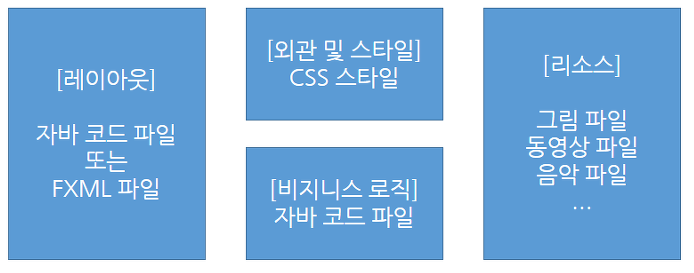

# 전반적인 구조/개요

# Intro

- JavaFx는 Cross-Platform에서 실행하는 rich client application을 개발하기 위한 그래픽과 미디어 패키지를 말한다.
- Swing과 비교하면 훨씬 더 가벼울 뿐만 아니라 JavaFX는 데스크톱 이외에도 embedded 장비에서 실행하는 UI 애플리케이션을 개발할 수 있도록 가볍고 풍부한 UI를 제공하고 있다.
- JavaFX는 API 개발을 통해 UI 생성, 이벤트 처리, 멀티미디어 재생, 웹 뷰 등의 기능 개발이 가능하고, 그 이외의 기능은 Java 표준 API를 활용해서 개발이 가능하다.
    - 또한, 멀티쓰레딩과 같은 서버와의 통신 기능도 가능하다.
- 더불어 화면 레이아웃과 스타일, 그리고 애플리케이션 로직이 분리가 가능해 디자이너와 개발자들이 협력해 개발할 수 있는 구조를 갖고 있다.
    - Java코드와 CSS로 작성할 수 있다.

# JavaFX 애플리케이션 구성 요소



# JavaFX 애플리케이션 개발하기

## Main Class

- JavaFX 애플리케이션을 개발하려면 제일 먼저 main class를 작성해야 한다.
- 메인 클래스는 추상 클래스인 `javafx.application.Application` 을 상속받고, `start()` 메소드를 재정의 (Overriding) 해야 한다.
- 또한, `main()` 메소드에서 Application의 `launch()` 메소드를 호출해야 한다. `launch()` 메소드는 메인 클래스의 객체를 생성한 후, 메인 윈도우를 생성한 후, `start()` 메소드를 호출하는 역할을 한다.

# JavaFX의 구조


- Stage
    - JavafX에서는 윈도우를 무대 (`javafx.stage.Stage`)로 표현한다.
    - `launch()` 메소드에서 생성된 메인 윈도우를 `start()` 의 `primarYStage` 파라미터로 제공하는데, `start()` 메소드의 맨 마지막에서 `primaryStage.show()` 메소드를 호출함으로써 메인 윈도우가 보여진다.
- Scene
- Parent
- XMLFile

- Platform SW팀에서는 AnchorPane을 자주 사용한다.

# JavaFX 라이프사이클

- JavaFX 애플리케이션은 `Application.launch()` 로 시작하여 아래와 같은 순으로 진행된다.


- **메인 클래스의 기본 생성자를 호출해서 객체를 생성**
- `init()` 메소드 호출 (메인 클래스의 실행 파라미터를 얻어 어플리케이션이 이용할 수 있게 해줌)
- `init()` 끝나고 `start()` 메소드 호출하여 메인 윈도우 실행
- JavaFX App 종료
    - 종료 조건의 3가지
        1. 마우스로 마지막 윈도우 (Stage)의 닫기 버튼을 클릭한다.
        2. Java 코드로 마지막 윈도우의 `close()` 메소드를 호출한다.
        3. Java 코드로 `Platform.exit()` 혹은 `System.exit(0)` 을 호출한다.
    - 종료 직전 `stop()` 메소드를 호출하는데, 해당 메소드는 앱이 종료되기 직전에 자원을 정리 (파일 닫기, 네트워크 끊기)할 기회를 준다. `init()`과 `stop()` 메소드는 옵션으로 필요한 경우에 재정의(override)해서 사용하면 된다.
- 주목할 점
    - 라이프사이클 **각 단계에서 호출되는 메소드**는 **서로 다른 스레드 상에서 실행**된다.
    - JVM이 생성한 main 스레드가 Application.launch() 를 실행하면 launch() 메소드는 다음과 같은 이름을 가진 두 스레드를 생성하고 시작시킵니다.
        - `JavaFX-Launcher`: `init()` 실행
        - `JavaFX Application Thread`: 메인 클래스 기본 생성자, `start()` 및 `stop()` 실행

        → 그 이유는 JavaFX API는 스레드에 안전하지 않아서 멀티 스레드가 동시에 UI를 생성하거나 수정하게 되면 문제가 발생하기 떄문이다. 그래서 JavaFX Application Thread만 UI를 생성하거나 수정할 수 있도록 되어있고, 다른 스레드가 UI에 접근하게 되면 예외가 발생한다. `init()` 메소드에서 UI를 생성하는 코드를 작성하면 안되는데, 그 이유는 `init()` 메소드가 JavaFX-Launcher 스레드에서 실행되기 때문이다.

## 어떤 thread에서 실행되는지 살펴보기

```java
package javaFX;
 
import javafx.application.Application;
import javafx.stage.Stage;
 
public class AppMain extends Application {
 
    public AppMain() {
        System.out.println(Thread.currentThread().getName() + ": AppMain() 호출");
    }
 
    @Override
    public void init() throws Exception {
        System.out.println(Thread.currentThread().getName() + ": init() 호출");
    }
 
    @Override
    public void start(Stage primaryStage) throws Exception {
        System.out.println(Thread.currentThread().getName() + ": start() 호출");
        primaryStage.show(); // 윈도우 보여주기
    }
 
    @Override
    public void stop() throws Exception {
        System.out.println(Thread.currentThread().getName() + ": stop() 호출");
    }
 
    public static void main(String[] args) {
        System.out.println(Thread.currentThread().getName() + ": main() 호출");
        launch(args); // AppMain 객체 생성 및 메인 윈도우 생성
    }
}
 
```


# 무대(Stage)와 장면 (Scene)

- JavaFX는 윈도우를 무대(Stage)로 표현한다.
- Stage는 1번에 1개의 scene만 가질 수 있는데, JavaFX는 Scene을 `javafx.scene.Scene` 클래스로 표현된다.
- 메인 윈도우는 `start()` 메소드의 primaryStage 파라미터로 전달되지만, Scene은 직접 생성해야 한다. Scene을 생성하려면 UI의 root container인 `javafx.scene.Parent` 가 필요하다.
    - `Scene scene = new Scene(Parent root);`
    - Parent는 추상 클래스이기 때문에 **하위 클래스로 객체를 생성해서 제공**해야 한다. `javafx.scene.layout` 패키지의 컨테이너들이 사용된다. 실제로 UI 컨트롤들이 추가되는 곳은 parent가 되고, Parent 폭과 높이가 Scene의 포과 높이가 된다.
    - Scene을 생성한 후에는 윈도우에 올려야 하는데, Stage의 `setScene()` 메소드를 사용한다. `seScene()` 메소드는 파라미터로 받은 Scene을 윈도우 내용으로 설정한다.
        - `primaryStage.setScene(scene)`;

### 예시

```java
package javaFX;
 
import javafx.application.Application;
import javafx.application.Platform;
import javafx.geometry.Pos;
import javafx.scene.Scene;
import javafx.scene.control.Button;
import javafx.scene.control.Label;
import javafx.scene.layout.VBox;
import javafx.scene.text.Font;
import javafx.stage.Stage;
 
public class AppMain extends Application {
 
    @Override
    public void start(Stage primaryStage) throws Exception {
        VBox root = new VBox(); // parent 하위 객체인 vBox 샐성
        root.setPrefWidth(300);
        root.setPrefHeight(200);
        root.setAlignment(Pos.CENTER); // 컨트롤을 중앙 정렬
        root.setSpacing(20); // 컨트롤 수직 간격
 
        Label label = new Label(); // Label 컨트롤 생성
        label.setText("Hi, F(x)? ");
        label.setFont(new Font(50));
 
        Button button = new Button();
        button.setText("Confirm");
        button.setOnAction(event -> Platform.exit()); // 클릭 이벤트 처리
 
        // 라벨과 버튼을 VBox의 자식으로 추가
        root.getChildren().add(label);
        root.getChildren().add(button);
 
        // VBox를 루트 컨테이너로 해서 Scene 생성
        Scene scene = new Scene(root);
 
        primaryStage.setTitle("AppMain");
        primaryStage.setScene(scene);
        primaryStage.show();
    }
 
    public static void main(String[] args) {
        launch(args);
    }
}

```


- VBox란?
    - 수직 방향으로 자식 컨트롤을 배치하는 컨테이너로 먼저 Label을 배치하고, 그 아래에 Button을 배치한다. Button 클릭시 이벤트 발생은 `ActionEvent`를 람다식으로 처리한 것이다.

# Scenebuilder

- 왼쪽에는 component 리스트가 나오며,
- 오른쪽은 해당 component의 속성을 볼 수 있다.