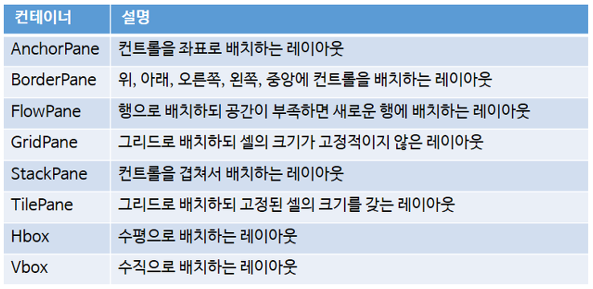

# 컨테이너 (Container)

# Intro

- 레이아웃을 작성할 때 컨트롤들을 쉽게 배치할 수 있도록 도와주는 클래스가 컨테이너이다.
- `javafx.scene.layout` 패키지에는 다양한 컨테이너 클래스들이 존재한다.

# 컨테이너의 종류



## AnchorPane 컨테이너

- AnchorPane 컨테이너는 좌표를 이용하여 AnchorPane의 좌상단 (0, 0)을 기준으로 컨트롤을 배치한다.
- 컨트롤 좌표는 좌상단(layoutX, layoutY) 값을 말하는데 (0, 0)에서 떨어진 거리이다.


### 주요 설정


- AnchorPane 컨테이너는 JavaFX Scene Builder를 사용해서 디자인하는 것이 좋다.
- 눈으로 거리를 확인해서 컨트롤을 할 수 있기 때문이다.

### 예시

- AnchorPane 루트 컨테이너를 사용해 로그인 레이아웃을 정의

```java
<?xml version="1.0" encoding="UTF-8"?>
 
<?import javafx.scene.layout.AnchorPane?>
<?import javafx.scene.control.Label?>
<?import javafx.scene.control.TextField?>
<?import javafx.scene.control.PasswordField?>
<?import javafx.scene.control.Button?>
<?import javafx.scene.chart.BubbleChart?>
 
<AnchorPane xmlns:fx="http://javafx.com/fxml/1" prefHeight="150.0" prefWidth="300.0">
    <children>
        <Label layoutX="42.0" layoutY="28.0" text="아이디" />
        <Label layoutX="42.0" layoutY="66.0" text="패스워드" />
        <TextField layoutX="120.0" layoutY="24.0" />
        <PasswordField layoutX="120.0" layoutY="62.0" />
        <Button layoutX="97.0" layoutY="106.0" text="로그인" />
        <Button layoutX="164.0" layoutY="106.0" text="취소" />
    </children>
</AnchorPane>
```


- AnchorPane에 포함된 컨트롤은 `<children>` 태그의 자식 태그로 선언되는데, `<children>` 은 AnchorPane의 `setChild()` 메소드를 호출하는 것이 아니라, `getChildren()` 메소드가 return하는 ObservableList 컬렉션에 `<children>` 의 자식 태그로 정의된 컨트롤을 추가하는 역할을 한다.
- AnchorPane을 사용해서 컨트롤을 좌표로 배치하면 윈도우 창이 줄거나 늘어날 경우 컨트롤의 재배치가 일어나지 않는다.
- 따라서, AnchorPane으로 재배치할 경우에는 윈도우 창의 크기를 변경할 수 없도록 Stage의 `setResizable(false)` 메소드를 호출하는 것이 좋다.

## HBox와 VBox 컨테이너

- HBox와 VBox는 수평과 수직으로 컨트롤을 배치하는 컨테이너이다.
- HBox와 VBox는 자식 컨트롤의 크기를 재조정하는데, HBox는 컨트롤의 높이를 확장하고, 컨트롤의 폭은 유지한다.
- VBox는 컨트롤의 폭을 확장하고 컨트롤의 높이는 유지한다. 단, 크기 조정이 가능한 컨트롤만 자동확장된다.
- 버튼의 경우, 크기 조정이 되지 않는데 그 이유는 maxWidth와 maxHeight가 -1.0을 가지기 때문이다.
    - 크기 조정을 가능하게 하려면 maxWidth와 maxHeight를 아래와 같이 변경하면 된다.

    ```java
    <Button text="Button">
        <maxWidth><Double fx:constant="MAX_VALUE"/></maxWidth>
        <maxHeight><Double fx:constant="MAX_VALUE"/></maxHeight>
    </Button>
    ```

- HBox에서 컨트롤의 높이를 확장하고 싶지 않다면 `fillHeight` 속성을 `false`로 설정하면 되고, VBox에서 컨트롤의 폭을 확장하고 싶지 않다면 `fillWidth` 속성을 `false` 로 설정하면 된다.
- HBox와 VBox에서 사용할 수 있는 주요 설정은 아래와 같다.


### 예시

- `VBox`로 `ImageView` 컨트롤과 `HBox` 컨테이너를 수직으로 배치하고, `HBox` 안에는 2개의 버튼을 수평으로 배치한다.
- Next 버튼은 `HBox`의 남은 폭을 채우도록 `HBox`의 `hgrow` 속성을 설정했다.

```java
<?xml version="1.0" encoding="UTF-8"?>
 
<?import javafx.scene.layout.VBox?>
<?import javafx.geometry.Insets?>
<?import javafx.scene.image.ImageView?>
<?import javafx.scene.image.Image?>
<?import javafx.scene.layout.HBox?>
<?import javafx.scene.control.Button?>
<?import javafx.scene.layout.Priority?>
<?import java.lang.Double?>
 
<VBox xmlns:fx="http://javafx.com/fxml/1">
    <padding>
        <Insets bottom="10.0" left="10.0" right="10.0" top="10.0" />
    </padding>
    
    <children>
        <ImageView fitWidth="200.0" preserveRatio="true">
            <image>
                <Image url="@images/pal.png" />
            </image>
        </ImageView>
        
        <HBox alignment="CENTER" spacing="20.0">
            <children>
                <Button text="이전" />
                <Button text="다음">
                    <HBox.hgrow><Priority fx:constant="ALWAYS"/></HBox.hgrow>
                    <maxWidth><Double fx:constant="MAX_VALUE"/></maxWidth>
                </Button>
            </children>
            <VBox.margin>
                <Insets top="10.0" />
            </VBox.margin>
        </HBox>
    </children>
</VBox>

```


## BorderPane 컨테이너

- BorderPane은 top, bottom, left, right, center 셀에 컨트롤을 배치하는 컨테이너이다.
- 컨트롤만 배치하는 것이 아니라 다른 컨테이너도 배치할 수 있기에 다양한 레이아웃을 만들어낼 수 있다.
- 주의할 점
    - 각 셀에는 1개의 컨트롤/컨테이너만 배치할 수 있다.

### BorderPane 태그 및 속성


- BorderPane의 특징은 top, bottom, left, right에 컨트롤을 배치하지 않으면 center에 배치된 컨트롤이 top, bottom, left, right까지 확장된다.

### 예제

- BorderPane top 에는 ToolBar 배치
- Center에는 TextArea 배치
- Bottom에는 BorderPane 배치

```java
<?xml version="1.0" encoding="UTF-8"?>
 
<?import javafx.scene.layout.BorderPane?>
<?import javafx.scene.control.ToolBar?>
<?import javafx.scene.control.Button?>
<?import javafx.scene.control.TextArea?>
<?import javafx.scene.control.TextField?>
 
<BorderPane xmlns:fx="http://javafx.com/fxml/1" prefHeight="200" prefWidth="300">
    <top>
        <ToolBar>
            <items>
                <Button text="Button" />
                <Button text="Button" />
            </items>
        </ToolBar>
    </top>
    <center>
        <TextArea />
    </center>
    <bottom>
        <BorderPane>
            <center>
                <TextField />
            </center>        
            <right>
                <Button text="Button" />
            </right>
        </BorderPane>
    </bottom>
</BorderPane>
```

%201a791f170ebd4458adde49faafa4fff4/Untitled%207.png)

## GridPane 컨테이너

- GridPane은 그리드로 컨트롤을 배치하되 셀의 크기가 고정적이지 않고 유동적인 컨테이너이다.
- 셀 병합이 가능하기 때문에 다양한 입력폼 화면을 만들 때 매우 유용하게 사용할 수 있다.
- 각 컨트롤은 자신이 배치될 row index와 column index를 속성으로 가지며, 몇 개의 셀을 병합할 것인지 지정도 가능하다.

### GridPane 속성


### 예시

- 로그인 화면을 GridPane으로 배치

```java
<?xml version="1.0" encoding="UTF-8"?>
 
<?import javafx.scene.layout.GridPane?>
<?import javafx.geometry.Insets?>
<?import javafx.scene.control.Label?>
<?import javafx.scene.control.TextField?>
<?import javafx.scene.layout.HBox?>
<?import javafx.scene.control.Button?>
 
<GridPane xmlns:fx="http://javafx.com/fxml/1" prefWidth="300" hgap="10" vgap="10">
    <padding>
        <Insets topRightBottomLeft="10"/>
    </padding>
    <children>
        <Label text="아이디" GridPane.rowIndex="0" GridPane.columnIndex="0" />
        <TextField GridPane.rowIndex="0" GridPane.columnIndex="1" GridPane.hgrow="ALWAYS" />
        
        <Label text="비밀번호" GridPane.rowIndex="1" GridPane.columnIndex="0" />
        <TextField GridPane.rowIndex="1" GridPane.columnIndex="1" GridPane.hgrow="ALWAYS" />
        
        <HBox GridPane.rowIndex="2" GridPane.columnIndex="0"
            GridPane.columnSpan="2" GridPane.hgrow="ALWAYS"
            alignment="CENTER" spacing="20">
            <children>
                <Button text="로그인" />
                <Button text="취소" />
            </children>    
        </HBox>
    </children>
</GridPane>
```

