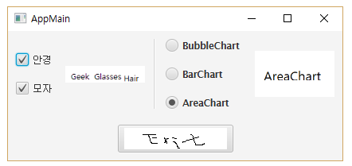

# 컨트롤 (Control)

# Intro

- JavaFX는 다양한 컨트롤을 제공

# 버튼 컨트롤

- 마우스로 클릭할 수 있는 컨트롤로 `ButtonBase`를 상속하는 하위 컨트롤이다.
- Button, checkBox, RadioButton, ToggleButton, Hyperlink 등이 있다.
- 기본 Button은 단순한 글자로 구성되지만, ImageView를 parameter로 해서 `setGraphic()` 메소드를 호출하면 아이콘을 넣을 수 있다.

## 아이콘 버튼을 FXML로 작성하는 법

```java
<Button text="iconbutton">
    <graphic>
        <ImageView>
            <Image url="@images/history_view.gif"/>
        </ImageView>
    </graphic>
</Button>
```

## 2가지 상태

- CheckBox, RadioButton, ToggleButton 컨트롤은 선택과 미선택 2가지 status를 가질 수 있다.
- selected 속성의 값을 통해 제어를 할 수 있다.

## CheckBox 컨트롤

- FXML로 선언한 것으로
- text 속성은 사용자에게 보여주는 문자열이고
- userData 속성은 프로그램에서 처리하는 데이터이다.

```java
<CheckBox text="label1" userData="value1" />
<CheckBox text="label2" userData="value2" selected="true" />
```

## Toggle Group

- RadioButton, ToggleButton 둘은 `toggleGroup` 속성이 있다.
- 같은 `ToggleGroup`을 참조할 경우, 하나의 그룹으로 묶이며, 같은 그룹 내에서는 하나의 컨트롤만 선택되는 효과가 있다.
- 참조할 `ToggleGroup` 객체는 <fx:define> 태그를 사용해서 `<ToggleGroup fx:id="groupName"/>` 작성하고, RadioButton의 `toggleGroup` 속성에서 `$groupName` 으로 참조한다.

### 예시

- RadioButton을 하나의 그룹으로 묶어서 선언

```java
<fx:define>
    <ToggleGroup fx:id="groupName" />
</fx:define>
 
<RadioButton text="label1" userData="value1" toggleGroup="$groupName" />
<RadioButton text="label2" userData="value2" toggleGroup="$groupName" selected="true" />
```

## ActionEvent

- CheckBox, RadioButton, ToggleButton 컨트롤은 사용자가 클릭하면 ActionEvent가 발생하기 때문에 EventHandler로 처리가 가능하고,
- onAction 속성을 작성해서 컨트롤러의 이벤트 처리 메소드로 연결할 수 있다.

## 버튼 선택 변경 감지 (ChangeListener)

- RadioButton 또는 ToggleButton 그룹 내에서 선택 변경을 감지하고 싶다면 ToggleGroup의 selectedToggle 속성을 다음과 같이 작성하면 된다.

```java
groupName.selectedToggleProperty().addListener(new ChangeListener<Toggle>() {
    @Override
    public void changed(ObservableValue<? extends Toggle> observable, Toggle oldValue, Toggle newValue) {
        ...
    }    
});
```

- 선택이 변경되면 `changed()` 메소드가 실행되고 3번째 parameter인 newValue에 마지막으로 선택된 컨트롤이 대입된다.

## 예제

- root.fxml

    ```java
    <?xml version="1.0" encoding="UTF-8"?>
     
    <?import javafx.scene.layout.BorderPane?>
    <?import javafx.scene.layout.HBox?>
    <?import javafx.geometry.Insets?>
    <?import javafx.scene.layout.VBox?>
    <?import javafx.scene.control.CheckBox?>
    <?import javafx.scene.image.ImageView?>
    <?import javafx.scene.image.Image?>
    <?import javafx.scene.control.Separator?>
    <?import javafx.scene.control.Button?>
    <?import javafx.scene.control.ToggleGroup?>
    <?import javafx.scene.control.RadioButton?>
     
    <BorderPane xmlns:fx="http://javafx.com/fxml/1" prefHeight="150"
        prefWidth="420" fx:controller="javaFX.RootController">
        <padding>
            <Insets bottom="10" left="10" right="10" top="10" />
        </padding>
     
        <center>
            <HBox alignment="CENTER" prefHeight="100" prefWidth="200"
                spacing="10">
                <children>
                    <VBox prefHeight="200" prefWidth="100" spacing="20" alignment="CENTER_LEFT">
                        <children>
                            <CheckBox fx:id="chk1" text="안경" onAction="#handleChkAction" />
                            <CheckBox fx:id="chk2" text="모자" onAction="#handleChkAction" />
                        </children>
                    </VBox>
     
                    <ImageView fx:id="checkImageView" fitWidth="100"
                        preserveRatio="true">
                        <image>
                            <Image url="@images/geek.gif" />
                        </image>
                    </ImageView>
     
                    <Separator orientation="VERTICAL" prefHeight="200" />
                    <VBox prefHeight="100" prefWidth="150" spacing="20" alignment="CENTER_LEFT">
                        <fx:define>
                            <ToggleGroup fx:id="group" />
                        </fx:define>
                        <children>
                            <RadioButton fx:id="rd1" text="BubbleChart" userData="BubbleChart"
                                toggleGroup="$group" />
                            <RadioButton fx:id="rd2" text="BarChart" userData="BarChart"
                                toggleGroup="$group" selected="true" />
                            <RadioButton fx:id="rd3" text="AreaChart" userData="AreaChart"
                                toggleGroup="$group" />
                        </children>
                    </VBox>
     
                    <ImageView fx:id="radioImageView" fitWidth="100"
                        preserveRatio="true">
                        <image>
                            <Image url="@images/BarChart.png" />
                        </image>
                    </ImageView>
                </children>
            </HBox>
        </center>
     
        <bottom>
            <Button fx:id="btnExt" BorderPane.alignment="CENTER"
                onAction="#handleBtnExitAction">
                <graphic>
                    <ImageView>
                        <Image url="@images/exit.png" />
                    </ImageView>
                </graphic>
                <BorderPane.margin>
                    <Insets top="20" />
                </BorderPane.margin>
            </Button>
        </bottom>
    </BorderPane>
    ```

- rootController.java

    ```java
    package javaFX;
     
    import java.net.URL;
    import java.util.ResourceBundle;
     
    import javafx.application.Platform;
    import javafx.beans.value.ChangeListener;
    import javafx.beans.value.ObservableValue;
    import javafx.event.ActionEvent;
    import javafx.fxml.FXML;
    import javafx.fxml.Initializable;
    import javafx.scene.control.Button;
    import javafx.scene.control.CheckBox;
    import javafx.scene.control.Toggle;
    import javafx.scene.control.ToggleGroup;
    import javafx.scene.image.Image;
    import javafx.scene.image.ImageView;
     
    public class RootController implements Initializable {
        @FXML
        private CheckBox chk1;
        @FXML
        private CheckBox chk2;
        @FXML
        private ImageView checkImageView;
        @FXML
        private ToggleGroup group;
        @FXML
        private ImageView radioImageView;
        @FXML
        private Button btnExt;
     
        @Override
        public void initialize(URL loc, ResourceBundle resources) {
            group.selectedToggleProperty().addListener(new ChangeListener<Toggle>() {
                @Override
                public void changed(ObservableValue<? extends Toggle> observable, Toggle oldValue, Toggle newValue) {
                    Image image = new Image(
                            getClass().getResource("images/" + newValue.getUserData().toString() + ".png").toString());
                    radioImageView.setImage(image);
                }
            });
        }
     
        public void handleChkAction(ActionEvent e) {
            if (chk1.isSelected() && chk2.isSelected()) {
                checkImageView.setImage(new Image(getClass().getResource("images/geek-glasses-hair.gif").toString()));
            } else if (chk1.isSelected()) {
                checkImageView.setImage(new Image(getClass().getResource("images/geek-glasses.gif").toString()));
            } else if (chk2.isSelected()) {
                checkImageView.setImage(new Image(getClass().getResource("images/geek-hair.gif").toString()));
            } else {
                checkImageView.setImage(new Image(getClass().getResource("images/geek.gif").toString()));
            }
        }
     
        public void handleBtnExitAction(ActionEvent e) {
            Platform.exit();
        }
     
    }
    ```

    

# 입력 컨트롤

- 입력 컨트롤에는 한 줄 입력을 위한 TextField, 다중 행 입력을 위한 TextArea, 패스워드 입력을 위한 PasswordField, 제한된 항목에서 선택하는 ComboBox가 있다.
- 또한 날짜를 선택할 수 있는 DatePicker, 색상을 선택할 수 있는 ColorPicker, HTML을 입력하기 위한 HTMLEditor도 입력 컨트롤이라고 볼 수 있다.
- Label은 입력 컨트롤이 아니지만, 입력 컨트롤의 제목을 표시할 때 사용된다.

## 예시

- 입력 컨트롤로 구성된 폼을 제공한다.
- 제목은 TextField, 비밀번호는 PasswordField, 공개는 ComboBox, 게시 종료는 DatePicker, 내요은 TextArea로 구성한다.
- [등록] 버튼을 클릭하면 모든 입력된 내용이 콘솔에 출력된다.
- noticeRoot.fxml

    ```java
    <?xml version="1.0" encoding="UTF-8"?>
     
    <?import javafx.scene.layout.AnchorPane?>
    <?import javafx.scene.control.Label?>
    <?import javafx.scene.control.TextField?>
    <?import javafx.scene.control.PasswordField?>
    <?import javafx.collections.FXCollections?>
    <?import javafx.scene.control.DatePicker?>
    <?import javafx.scene.control.Separator?>
    <?import javafx.scene.control.ComboBox?>
    <?import java.lang.String?>
    <?import javafx.scene.control.TextArea?>
    <?import javafx.scene.control.Button?>
     
    <AnchorPane xmlns:fx="http://javafx.com/fxml/1"
        fx:controller="javaFX.RootController"
        prefHeight="380" prefWidth="485">
        <children>
            <Label layoutX="22" layoutY="36" text="제목" />
            <TextField fx:id="txtTitle" layoutX="84" layoutY="32"
                prefHeight="23" prefWidth="375" />
            <Label layoutX="22" layoutY="69" text="비밀번호"/>
            <PasswordField fx:id="txtPassword" layoutX="86" layoutY="65"
                prefHeight="23" prefWidth="132" />
            <Label layoutX="22" layoutY="104" text="공개" />
            <ComboBox fx:id="comboPublic" layoutX="86" layoutY="100"
                prefHeight="23" prefWidth="132" promptText="선택하세요" >
                <items>
                    <FXCollections fx:factory="observableArrayList">
                        <String fx:value="공개"/>
                        <String fx:value="비공개"/>
                    </FXCollections>
                </items>    
            </ComboBox>
            
            <Label layoutX="240" layoutY="104" text="게시종료" />
            <DatePicker fx:id="dateExit" layoutX="296" layoutY="100"
                promptText="날짜를 선택하세요"/>
            <Label layoutX="22" layoutY="135" text="내용" />
            <TextArea fx:id="txtContent" layoutX="22" layoutY="154"
                prefHeight="132" prefWidth="440" />
            <Separator layoutX="13" layoutY="320" prefHeight="0" prefWidth="457" />
            <Button fx:id="btnReg" layoutX="189" layoutY="340" text="등록"
                onAction="#handleBtnRegAction" />
            <Button fx:id="btnCancel" layoutX="252" layoutY="340" text="취소"
                onAction="#handleBtnCancelAction" />
        </children>
    </AnchorPane>
    ```

- RootController.java

    ```java
    package javaFX;
     
    import java.net.URL;
    import java.time.LocalDate;
    import java.util.ResourceBundle;
     
    import javafx.application.Platform;
    import javafx.event.ActionEvent;
    import javafx.fxml.FXML;
    import javafx.fxml.Initializable;
    import javafx.scene.control.ComboBox;
    import javafx.scene.control.DatePicker;
    import javafx.scene.control.PasswordField;
    import javafx.scene.control.TextArea;
    import javafx.scene.control.TextField;
     
    public class RootController implements Initializable {
     
        @FXML
        private TextField txtTitle;
        @FXML
        private PasswordField txtPassword;
        @FXML
        private ComboBox<String> comboPublic;
        @FXML
        private DatePicker dateExit;
        @FXML
        private TextArea txtContent;
     
        @Override
        public void initialize(URL loc, ResourceBundle resources) {
        }
     
        public void handleBtnRegAction(ActionEvent e) {
            String title = txtTitle.getText();
            System.out.println("title: " + title);
     
            String password = txtPassword.getText();
            System.out.println("password: " + password);
     
            String strPublic = comboPublic.getValue();
            System.out.println("public: " + strPublic);
     
            LocalDate localDate = dateExit.getValue();
            if (localDate != null) {
                System.out.println("dateExit: " + localDate.toString());
            }
     
            String content = txtContent.getText();
            System.out.println("content: " + content);
        }
     
        public void handleBtnCancelAction(ActionEvent e) {
            Platform.exit();
        }
    }
    
    ```

    %20995fc0496ee44c9ba5a7a0e34cdd9b39/Untitled%201.png)

# 뷰 컨트롤

- 텍스트 또는 이미지 등을 보여주는 데 목록 형태로 보여주는 ListView, 테이블 형태로 보여주는 TableView, 이미지를 보여주는 ImageView가 있다.

## ImageView 컨트롤

- ImageView는 이미지를 보여주는 컨트롤이다.
- 다음과 같이 선언한다.

    ```java
    <ImageView fitWidth="Width" fitHeight="Height" preserveRatio="true" />
    ```

    - fitWidth와 fitHeight는 ImageView의 폭과 높이를 지정합니다.
    - preserveRatio 속성은 이미지의 종횡비를 유지할 것인지를 지정합니다.

### ImageView에 보여줄 이미지 설정

- 2가지 방법으로 설정이 가능하다.
1. ImageView의 생성자 Parameter로 Image 객체를 설정

    ```java
    <ImageView preserveRatio="true">
        <Image url="@images/flower.png"/>
    </Imageview>
    ```

2. ImageView의 `setImage()` 메소드로 설정하며, 파라미터는 image 객체로 설정한다.

    ```java
    <ImageView fitWidth="200" fitHeight="150" preserveRatio="true">
        <image>
            <Image url="@images/flower.png"/>
        </image>
    </ImageView>
    ```

- Image는 url 속성 (생성자 매개 변수)을 가지고 있는데, FXML 파일 위치에서 상대 경로로 `@이미지 경로`를 값으로 주면 된다.

## ListView 컨트롤

- ListView는 항목들을 목록으로 보여주는 컨트롤이다.
- 다음과 같이 선언한다.

    ```java
    <ListView prefWidth="width" prefHeight="height"/>
    ```

- ListView에 항목을 추가하려면 `setItems(ObservableList<T> value)` 메소드를 이용한다.
- `ObservableList` 구현 객체는 `FXCollections.observableArrayList(E... items)` 정적 메소드로 생성하면 된다.

    ```java
    listView.setItems(FXCollections.observableArrayList("Swing", "JavaFX"));
    ```

- 외부 데이터로 항목을 추가하는 경우가 많으므로 controller에서 java code로 추가하는 것이 일반적이지만, 고정 항목일 경우, FXML 파일에서 아래와 같이 선언해도 된다.

    ```java
    <ListView fx:id="listView" prefHeight="100" prefWidth="100">
        <items>
            <FXCollections fx:factory="observableArrayList">
                <String fx:value="Swing"/>
                <String fx:value="JavaFX" />
            </FXCollections>
        </items>
    </ListView>
    ```

## TableView 컨트롤

- TableView는 다음과 같이 선언한다. `<columns>` 태그 안에 만들고자 하는 컬럼의 개수만큼 `<TableColumn>` 태그를 선언한다.

    ```java
    <TableView prefHeight="100" prefWidth="300">
        <columns>
            <TableColumn prefWidth="150" text="iPhone"/>
            <TableColumn prefWidth="150" text="image"/>
        </columns>
    </TableView>
    ```

- TableView에 행(row)를 추가하려면 행의 데이터를 가지고 있는 모델(model) 객체가 필요하다.
- 위 선언방법을 보면, 아이폰과 이미지 컬럼이 있는데, 이 2개의 값을 속성으로 갖는 모델 객체를 생성해서 행의 데이터로 제공해야 한다.
- 다음은 Phone 모델 클레스를 생성하는 코드이다.

    ```java
    package javaFX;
     
    import javafx.beans.property.SimpleStringProperty;
     
    public class Phone {
        private SimpleStringProperty iPhone;
        private SimpleStringProperty image;
     
        public Phone(String iPhone, String image) {
            this.image = new SimpleStringProperty(iPhone);
            this.image = new SimpleStringProperty(image);
        }
     
        public String getiPhone() {
            return iPhone.get();
        }
     
        public void setiPhone(String iPhone) {
            this.iPhone.set(iPhone);
        }
     
        public String getImage() {
            return image.get();
        }
     
        public void setImage(String image) {
            this.image.set(image);
        }
    }
    
    ```

    - 모델의 속성 타입은 컬럼 값의 data type에 따라 `[javafx.beans.property](http://javafx.beans.property)` 패키지의 SimpleXXXProperty를 사용하면 된다. 모델 클래스를 작성했다면, 모델 속성과 TableColumn을 연결시키는 코드를 작성해야 한다.
    - TableColumn은 TableView의 `getColumns().get(index)` 로 얻어내는데, 첫 번째 컬럼의 인덱스는 0이다.
- TableColumn의 `setCellValueFactory()` 메소드는 parameter로 제공되는 `PropertyValueFactory("모델속성명")`을 이용해서 모델 속성값을 TableColumn 값으로 세팅한다.
- TableColumn을 모델 클래스의 iPhone 속성과 연결하는 코드

    ```java
    TableColumn tciPhone = tableView.getColumns().get(0);
    tciPhone.setCellValueFactory(new PropertyValueFactory("iPhone"));
    ```

- cell 내에서 정렬이 필요한 경우, 다음과 같이 TableColumn의 `setStyle()` 메소드로 CSS를 적용하면 된다.

    ```java
    tciPhone.setStyle("-fx-alignment: CENTER;");
    ```

- 행의 데이터를 주기 위해 ObservableList에 모델 객체들을 다음과 같이 저장하고, `ObservableList`를 파라미터로 하여 TableView의 `setItems()` 메소드를 호출하여 행들을 추가한다.

    ```java
    ObservableList phoneList = FXCollections.observableArrayList( 
        new Phone("iPhone", "phone1.png"),
        new Phone("iPhone3g", "phone2.png"),
        new Phone("iPhone3gs", "phone3.png")
     
    );
    tableView.setItems(phoneList);
    ```

- TableView에서 선택된 행의 index와 model 객체를 얻으려면 속성 감시를 이용할 수 있다.
- `getSelectionModel()` 메소드로 TableViewSelectionModel을 얻고 나서, `selectedIndexProperty` 또는 `selectedItemProperty`에 리스너를 설정하면 된다.
- `selectedIndexProperty`는 선택된 행의 인덱스이고, `selectedItemProperty`는 선택된 행의 모델 객체이다.
- 아래는 `selectedItemProperty`에 리스너를 설정하는 코드이다.

    ```java
    tableView.getSelectionModel().selectedItemProperty().addListener(
        new ChangeListener<Phone>() {
            @Override
            public void changed(ObservableValue<? extends Phone> obseravable,
                                Phone oldValue, Phone newValue) {
                ...
            }
        }
    );
    ```

# 미디어 컨트롤

- 미디어 컨트롤에는 비디오를 재생할 수 있는 MediaView 컨트롤과 볼륨 조절 및 재생 위치 조절을 위한 Slider 컨트롤, 그리고 현재 진행 상태를 보여주는 ProgressBar, ProgressIndicator 컨트롤이 있다.
- Slider와 ProgressBar, ProgressIndicator은 미디어와 상관없이 다른 용도로 사용할 수 있다.

## MediaPlayer와 MediaView 컨트롤

- MediaView 컨트롤은 비디오를 보여주는 용도로만 사용되기 때문에 특별한 UI를 가지고 있다.
- 단지, layout상에서 비디오가 위치할 영역을 표시한다.
- MediaView 컨트롤은 다음과 같이 선언한다.

    ```java
    <MediaView fitWidth="200" fitHeight="300" preserveRatio="true"/>
    ```

- MediaView 컨트롤은 비디오를 재생하는 기능이 없기 때문에 미디어를 재생하는 MediaPlayer가 있어야 한다. MediaPlayer는 비디오 뿐만 아니라, 오디오도 재생하는 기능을 가지고 있는데 미디어 소스 경로를 Media 객체 형태로 전달해서 아래와 같이 생성한다.

    ```java
    Media media = new Media("Media Source Path");
    MediaPlayer mediaPlayer = new MediaPlayer(media);
    ```

- 만약 비디오와 오디오 파일이 클래스 경로에 있다면, Media를 생성할 때 상대 경로를 사용하는 것이 좋다. 미디어 소스가 비디오라면 MediaView의 setMediaPlayer() 메소드로 MediaPlayer 객체를 등록할 수 있다. 오디오 소스로부터 MediaPlayer가 생성되었다면 MediaView는 필요없다.

    ```java
    mediaView.setMediaPlayer(mediaPlayer);
    ```

- MediaPlayer를 생성했다고 해서 바로 재생할 수는 없고, 재생할 상태 (READY)가 될 때까지 기다려야 한다.

### MediaPlayer의 상태와 상태 변경 메소드


- UNKNOWN
    - MediaPlayer가 생성된 직후의 상태
    - 미디어 소스를 재생할 준비가 되면, READY 상태로 자동 변경된다.
- READY
    - READY 상태에서 `setAutoPlay(true)` 또는 `play()`를 호출하면 PLAYING 상태가 된다.
- PLAYING
    - PLAYING 상태에서 `pause()` 를 호출하면 PAUSED 상태가 되고, `stop()` 을 호출하면 STOPPED 상태가 된다.
    - 만약 PLAYING 상태에서 재생 버퍼에 충분한 데이터가 없을 경우 STALLED 상태가 된다.
- STALLED
    - 주로 네트워크 상에서 미디어 소스를 받아서 재생할 때, 네트워크 속도가 느리면 STALLED 상태가 된다.
    - 이 상태들은 `MediaPlayer.Status` 열겨 type 으로 모두 정의되어 있는데, 코드에서 MediaPlayer의 상태를 return하는 `getStatus()` 메소드를 통해 확인할 수 있따.
- EndOfMedia
    - MediaPlayer가 미디어 소스를 모두 재생했을 떄의 상태이다.
    - EndOfMedia 상태에서 `play()`를 호출하려면 다시 PLAYING 상태가 될 수 있는데, 먼저 `seek()` 메소드로 재생 위치를 처음으로 돌려야 한다.
    - 상태가 변경되면 자동 실행해야 할 코드들이 있을 수 있다. 이런 코드들은 Runnable의 `run()` 메소드에 작성하고, `setOnXXX()` 메소드로 등록하면 된다.
    - 그러면 해당 상태가 되었을 때 Runnable의 `run()` 메소드가 자동 실행된다.

### Runnable 설정 메소드

- 각 상태로 변경될 때 실행되는 Runnable을 설정하는 메소드이다.


### 예시

- 비디오와 오디오를 재생하는 간단한 플레이어
- RootController의 videoRoot.fxml

    ```java
    <?xml version="1.0" encoding="UTF-8"?>
     
    <?import javafx.scene.layout.AnchorPane?>
    <?import javafx.scene.layout.StackPane?>
    <?import javafx.scene.image.ImageView?>
    <?import javafx.scene.image.Image?>
    <?import javafx.scene.media.MediaView?>
    <?import javafx.scene.control.Button?>
     
    <AnchorPane xmlns:fx="http://javafx.com/fxml/1"
        fx:controller="javaFX.RootController"
        prefHeight="220"
        prefWidth="530">
        <children>
            <StackPane layoutX="10" layoutY="10">
                <children>
                    <ImageView fx:id="imageView" fitHeight="200" fitWidth="360"
                        preserveRatio="false">
                        <image><Image url="@media/audio.png" /></image>
                    </ImageView>
                    <MediaView fx:id="mediaView" fitHeight="200" fitWidth="360"
                        preserveRatio="false"/>
                </children>
            </StackPane>
            <Button fx:id="btnPlay" layoutX="385" layoutY="15" prefHeight="23"
                prefWidth="131" text="재생"/>
            <Button fx:id="btnPause" layoutX="385" layoutY="39" prefHeight="23"
                prefWidth="131" text="멈춤"/>
            <Button fx:id="btnStop" layoutX="385" layoutY="63" prefHeight="23"
                prefWidth="131" text="중지"/>
        </children>
    </AnchorPane>
    ```

- RootController.java

    ```java
    package javaFX;
     
    import java.net.URL;
    import java.util.ResourceBundle;
     
    import javafx.fxml.FXML;
    import javafx.fxml.Initializable;
    import javafx.scene.control.Button;
    import javafx.scene.image.ImageView;
    import javafx.scene.media.Media;
    import javafx.scene.media.MediaPlayer;
    import javafx.scene.media.MediaView;
     
    public class RootController implements Initializable {
     
        @FXML private MediaView mediaView;
        @FXML private ImageView imageView;
        @FXML private Button btnPlay;
        @FXML private Button btnPause;
        @FXML private Button btnStop;
     
        private boolean endOfMedia;
        
        @Override
        public void initialize(URL loc, ResourceBundle resources) {
            Media media = new Media(getClass().getResource("media/audio.mp3").toString());
            
            // 미디어 플레이어 생성 및 미디어 뷰 설정
            MediaPlayer mPlayer = new MediaPlayer(media);
            mediaView.setMediaPlayer(mPlayer);
            
            // 해당 상태가 되면 실행할 Runnable 설정
            mPlayer.setOnReady(new Runnable() {
                @Override
                public void run() {
                    btnPlay.setDisable(false);
                    btnPause.setDisable(true);
                    btnStop.setDisable(true);
                    
                    if (mPlayer.isAutoPlay()) {
                        mediaView.setVisible(false);
                    }
                }
            });
            
            mPlayer.setOnPlaying(() -> {
                btnPlay.setDisable(true); btnPause.setDisable(false); btnStop.setDisable(false);
            });
            
            mPlayer.setOnPaused(() -> {
                btnPlay.setDisable(false); btnPause.setDisable(true); btnStop.setDisable(false);
            });
            
            mPlayer.setOnEndOfMedia(() -> {
                btnPlay.setDisable(false); btnPause.setDisable(true); btnStop.setDisable(true);
            });
     
            mPlayer.setOnStopped(() -> {
                btnPlay.setDisable(false); btnPause.setDisable(true); btnStop.setDisable(true);
            });
            
            btnPlay.setOnAction(event -> {
                if (endOfMedia) {
                    mPlayer.stop();
                    mPlayer.seek(mPlayer.getStartTime());
                }
                mPlayer.play();
                endOfMedia = false;
            });
            
            btnPause.setOnAction(event->mPlayer.pause());
            btnStop.setOnAction(event->mPlayer.stop());
        }
     
    }
    
    ```

## Slider 컨트롤

- Slider 컨트롤은 Track과 Thumb로 구성되어 있다.
- Slider의 value 속성에는 현재 Thumb의 위치 값이 저장되는데, 최소값은 0, 최대값은 100이다.
- 기본적으로 Tick marks와 Tick label이 숨겨져 있는데, `setShowTickMarks(true)`와 `setShowTickLabels(true)`를 호출하면 볼 수 있다.
- Block increment 간격은 `setBlockIncrement()`로 설정할 수 있다.
- 아래는 Slider 컨트롤을 선언하는 방법이다

    ```java
    <Slider prefHeight="Height" prefWidth="width" showTickLabels="true" showTickMarks="true" />
    ```

### ChangeListener - Slider 속성 감시

- MediaPlayer의 볼륨 조절을 위해 Slider 컨트롤의 value 속성을 감시하는 `ChangeListener`에 등록한다.
- MediaPlayer의 volumn 속성은 0.0 ~ 1.0 값을 가지는데, Slider value 속성은 0.0 ~ 100.0 값을 가지므로 Slider의 value 속성을 100.0으로 나누어서 MediaPlayer의 value 속성값으로 설정해야 한다.

```java
sliderVolume.valueProperty().addListener(new ChangeListener<Number>() {
    @Override
    public void changed(ObservableValue<? extends Number> observable, 
                        Number oldValue, Number newValue) {
        ...
    }
});
```

## ProgressBar와 ProgressIndicator 컨트롤

- ProgressBar은 수평 막대 모양의 컨트롤이며, Progress Indicator은 원형 모양 컨트롤이다.
- 둘 다 작업의 진행 정도를 표시하는데, 미디어 재생 시간을 표시하거나, 저장소의 사용량 및 네트워크 통신량을 표시할 때도 사용할 수 있다.
- 아래는 FXML로 선언하는 방법을 보여준다.

    ```java
    <ProgressBar prefHeight="height" prefWidth="width" progress="0.0" />
    <ProgressIndicator prefHeight="height" prefWidth="width" progress="0.0" />
    ```

### 예시

- 이전 예제의 미디어 플레이어를 개선해서 재생 시간을 표시하도록 ProgressBar와 ProgressIndicator 컨트롤을 추가하였고, 볼륨을 조정하기 위해 Slider 컨트롤을 추가했다.
- videoRoot.fxml

    ```java
    <?xml version="1.0" encoding="UTF-8"?>
     
    <?import javafx.scene.layout.AnchorPane?>
    <?import javafx.scene.layout.StackPane?>
    <?import javafx.scene.image.ImageView?>
    <?import javafx.scene.image.Image?>
    <?import javafx.scene.media.MediaView?>
    <?import javafx.scene.control.Button?>
    <?import javafx.scene.control.Label?>
    <?import javafx.scene.control.ProgressBar?>
    <?import javafx.scene.control.Slider?>
     
    <AnchorPane xmlns:fx="http://javafx.com/fxml/1"
        fx:controller="javaFX.RootController"
        prefHeight="220"
        prefWidth="530">
        <children>
            <StackPane layoutX="10" layoutY="10">
                <children>
                    <ImageView fx:id="imageView" fitHeight="200" fitWidth="360"
                        preserveRatio="false">
                        <image><Image url="@media/audio.png" /></image>
                    </ImageView>
                    <MediaView fx:id="mediaView" fitHeight="200" fitWidth="360"
                        preserveRatio="false"/>
                </children>
            </StackPane>
            <Button fx:id="btnPlay" layoutX="385" layoutY="15" prefHeight="23"
                prefWidth="131" text="재생"/>
            <Button fx:id="btnPause" layoutX="385" layoutY="39" prefHeight="23"
                prefWidth="131" text="멈춤"/>
            <Button fx:id="btnStop" layoutX="385" layoutY="63" prefHeight="23"
                prefWidth="131" text="중지"/>
            <Label layoutX="387" layoutY="101" text="시간"/>
            <ProgressBar fx:id="progressBar" layoutX="385" layoutY="121"
                prefHeight="18" prefWidth="98" progress="0.0"/>
            <ProgressBar fx:id="progressIndicator" layoutX="489" layoutY="112"
                prefHeight="47" prefWidth="31" progress="0.0"/>
            <Label fx:id="labelTime" alignment="CENTER" layoutX="386" layoutY="142"
                prefHeight="18" prefWidth="98" text="0/0 sec" />
            <Label layoutX="385" layoutY="169" text="소리" />
            <Slider fx:id="sliderVolume" layoutX="385" layoutY="187"
                prefHeight="14" prefWidth="131" showTickMarks="true" />
        </children>
    </AnchorPane>

    ```

- RootController.java

    ```java
    package javaFX;
     
    import java.net.URL;
    import java.util.ResourceBundle;
     
    import javafx.beans.value.ChangeListener;
    import javafx.beans.value.ObservableValue;
    import javafx.fxml.FXML;
    import javafx.fxml.Initializable;
    import javafx.scene.control.Button;
    import javafx.scene.control.Label;
    import javafx.scene.control.ProgressBar;
    import javafx.scene.control.ProgressIndicator;
    import javafx.scene.control.Slider;
    import javafx.scene.image.ImageView;
    import javafx.scene.media.Media;
    import javafx.scene.media.MediaPlayer;
    import javafx.scene.media.MediaView;
    import javafx.util.Duration;
     
    public class RootController implements Initializable {
     
        @FXML private MediaView mediaView;
        @FXML private ImageView imageView;
        @FXML private Button btnPlay;
        @FXML private Button btnPause;
        @FXML private Button btnStop;
        @FXML private Label labelTime;
        @FXML private Slider sliderVolume;
        @FXML private ProgressBar progressBar;
        @FXML private ProgressIndicator progressIndicator;
     
        private boolean endOfMedia;
        
        @Override
        public void initialize(URL loc, ResourceBundle resources) {
            Media media = new Media(getClass().getResource("media/MV.mp4").toString());
            
            // 미디어 플레이어 생성 및 미디어 뷰 설정
            MediaPlayer mPlayer = new MediaPlayer(media);
            mediaView.setMediaPlayer(mPlayer);
            
            // 해당 상태가 되면 실행할 Runnable 설정
            mPlayer.setOnReady(new Runnable() {
                @Override
                public void run() {
                    mPlayer.currentTimeProperty().addListener(new ChangeListener<Duration>() {
                        @Override
                        public void changed(ObservableValue<? extends Duration> observable,
                                Duration oldValue, Duration newValue) {
                            double progress = mPlayer.getCurrentTime().toSeconds() / 
                                    mPlayer.getTotalDuration().toSeconds();
                            progressBar.setProgress(progress);
                            progressIndicator.setProgress(progress);
                            labelTime.setText(
                                (int)mPlayer.getCurrentTime().toSeconds() + "/" +
                                (int)mPlayer.getTotalDuration().toSeconds() + " sec"
                            );
                        }
                    });
                    btnPlay.setDisable(false);
                    btnPause.setDisable(true);
                    btnStop.setDisable(true);
                    
                    if (mPlayer.isAutoPlay()) {
                        mediaView.setVisible(false);
                    }
                }
            });
            
            mPlayer.setOnPlaying(() -> {
                btnPlay.setDisable(true); btnPause.setDisable(false); btnStop.setDisable(false);
            });
            
            mPlayer.setOnPaused(() -> {
                btnPlay.setDisable(false); btnPause.setDisable(true); btnStop.setDisable(false);
            });
            
            mPlayer.setOnEndOfMedia(() -> {
                progressBar.setProgress(1.0);
                progressIndicator.setProgress(1.0);
                endOfMedia = true;
                btnPlay.setDisable(false); btnPause.setDisable(true); btnStop.setDisable(true);
            });
     
            mPlayer.setOnStopped(() -> {
                btnPlay.setDisable(false); btnPause.setDisable(true); btnStop.setDisable(true);
            });
            
            btnPlay.setOnAction(event -> {
                if (endOfMedia) {
                    mPlayer.stop();
                    mPlayer.seek(mPlayer.getStartTime());
                }
                mPlayer.play();
                endOfMedia = false;
            });
            
            btnPause.setOnAction(event->mPlayer.pause());
            btnStop.setOnAction(event->mPlayer.stop());
            
            sliderVolume.valueProperty().addListener(new ChangeListener<Number>() {
                @Override
                public void changed(ObservableValue<? extends Number> observable, 
                        Number oldValue, Number newValue) {
                    mPlayer.setVolume(sliderVolume.getValue() / 100.0);
                }
            });
            
            sliderVolume.setValue(50.0);
        }
     
    }
    ```