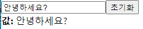

# input 상태 관리하기

# input 변화 포착하기

- onChange 이벤트를 사용한다.

```jsx
    const onChange = (e) => {
        setText(e.target.value);
    }

function InputSample() {
    const [text, setText] = useState(''); 
    const onChange = (e) => {
        setText(e.target.value);
    }

    return (
        <div>
            <input onChange={onChange} value={text}/>
            <div>
                <b>값: </b>
                {text}
            </div>
        </div>
    )
}
```

- 여기서 onChange의 **e는 이벤트 객체**를 말한다.
    - e를 통해 수정 이벤트가 발생했을 때, 그 **이벤트에 대한 내용이 이벤트 객체, parameter로 받아와서 사용**할 수 있다.
    - `e.target.value`는 그 DOM의 value 값을 말한다.
- `setText(e.target.value)`를 통해 input의 값을 받아, 해당 값으로 setting 한다.

## useState 사용하기

- `text`라는 상태관리를 통해 내가 입력한 값이 무엇인지 input 하단에 보여준다.
- import 하기
    - `import React, {useState} from 'react';`
- state 정의하기
    - `const [text, setText] = useState('');`
- JSX 쪽에 `text` 상태 코드 추가하기.

    ```jsx
        return (
            <div>
                <input onChange={onChange} value={text}/>
                <div>
                    <b>값: </b>
                    {text}
                </div>
            </div>
        )
    ```

## 초기화 버튼 추가하기

```jsx
import React, {useState} from 'react';

function InputSample() {
    const [text, setText] = useState('');

    const onReset = () => {
        setText('');
    }

    return (
        <div>
            <input onChange={onChange} value={text}/>
            <button onClick={onReset}>초기화</button>
            <div>
                <b>값: </b>
                {text}
            </div>
        </div>
    )
}

export default InputSample
```

- onReset 이벤트 작성하기
    - 초기화 버튼이 발생할경우, Text를 빈 string으로 변환한다.

    ```jsx
        const onReset = () => {
            setText('');
        }
    ```

- 그리고 onReset 이벤트와 버튼을 연결 시켜준다.

    ```jsx
    <button onClick={onReset}>초기화</button>
    ```

# 최종 코드 및 화면

```jsx
import React, {useState} from 'react';

function InputSample() {
    const [text, setText] = useState('');

    // e는 이벤트 객체를 말한다.
    // 수정 이벤트가 발생했을 때, 그 이벤트에 대한 내용이 이벤트 객체, parameter로 받아와서 사용할 수 있다. 
    const onChange = (e) => {
         // e.target은 현재 input, 이벤트가 발생한 DOM 에 대한 정보를 가지고 있다. 
        // console.log(e.target.value);

        setText(e.target.value);
    }

    const onReset = () => {
        setText('');
    }

    return (
        <div>
            <input onChange={onChange} value={text}/>
            <button onClick={onReset}>초기화</button>
            <div>
                <b>값: </b>
                {text}
            </div>
        </div>
    )
}

export default InputSample
```

