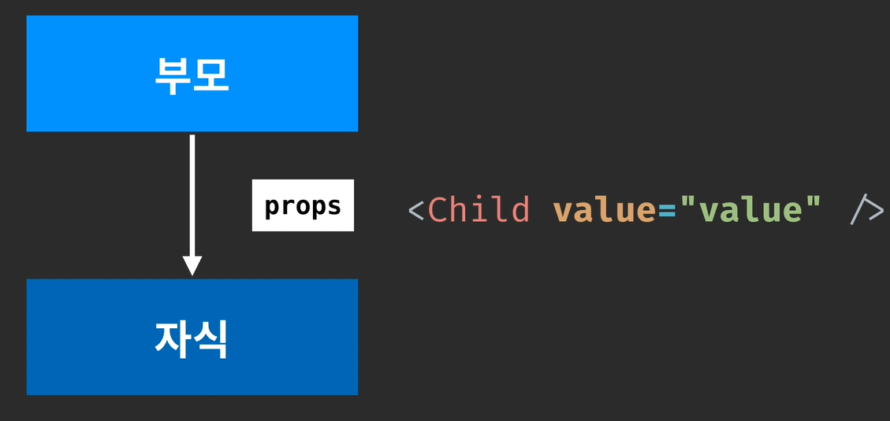

# Props를 통해 컴포넌트에게 값 전달하기

# Props



- properties의 줄임말이다.
- 컴포넌트를 사용하게 될때, 어떤 특정 값을 전달하고 싶을 때 props를 사용한다.

# 간단한 예제

## App.js

```jsx
import React from 'react';
import Hello from './Hello';
import './App.css';

function App() {
  return (
    <Hello name="react" color="red"/>
  );
}

export default App;
```

- 부모에서 name="react"라는 값으로 props를 넘겨준다.
- 또한 color="red"로 props를 함께 넘겨준다.

## Hello.js

```jsx
import React from 'react';

function Hello(props) {
    // style 바로 다음의 중괄호는 -> JS 값이기에 중괄호로 객체를 감싼다. 
    // 그 다음 중괄호는 객체를 위한 중괄호이다.
    return <div style={{
        color: props.color
    }}>안녕하세요 {props.name}</div>
}

export default Hello;
```

- `props.name`으로 props에 접근하고, 이는 중괄호로 묶어 JSX 내부에서 사용할 수 있다.
- 넘어온 color 값을 style에 적용하여 폰트 색상을 변경한다.

# Props 대신 비할당식 구조로 넘기기

```jsx
import React from 'react';

function Hello({color, name}) {
    // style 바로 다음의 중괄호는 -> JS 값이기에 중괄호로 객체를 감싼다. 
    // 그 다음 중괄호는 객체를 위한 중괄호이다.
    return <div style={{
        color
    }}>안녕하세요 {name}</div>
}

export default Hello;
```

# Props의 기본 값 설정하기

## App.js

```jsx
import React from 'react';
import Hello from './Hello';
import './App.css';

function App() {
  return (
    <>
      <Hello name="react" color="red"/>
      <Hello color="pink"/>
    </>
  );
}

export default App;
```

- 아래 Hello Component처럼 name을 넘겨주지 못했을때는?

## Wrapper.js

```jsx
import React from 'react';

function Hello({color, name}) {
    // style 바로 다음의 중괄호는 -> JS 값이기에 중괄호로 객체를 감싼다. 
    // 그 다음 중괄호는 객체를 위한 중괄호이다.
    return <div style={{
        color
    }}>안녕하세요 {name}</div>
}

// 기본값 설정
Hello.defaultProps = {
    name: '이름없음'
};

export default Hello;
```

- `defaultProps`로 props의 기본값을 설정해준다.


# 컴포넌트를 컴포넌트로 감싸기

## App.js

```jsx
import React from 'react';
import Hello from './Hello';
import Wrapper from './Wrapper.js';
import './App.css';

function App() {
  return (
    <Wrapper>
      <Hello name="react" color="red"/>
      <Hello color="pink"/>
    </Wrapper>
  );
}

export default App;
```

## Wrapper.js

```jsx
import React from 'react';

function Wrapper({children}) {
    const style = {
        border: '2px solid black',
        padding: 16
    }

    return <div style={style}>{children}</div>
}

export default Wrapper;
```

- 브라우저에서 Wrapper 하위 컴포넌트를 보여주고 싶다면 `children` 을 사용하면된다.
- props에서 비구조화 할당을 사용해 `children`을 밖으로 추출해주고, `<div>` 태그 안에 rendering 해주면 된다.

