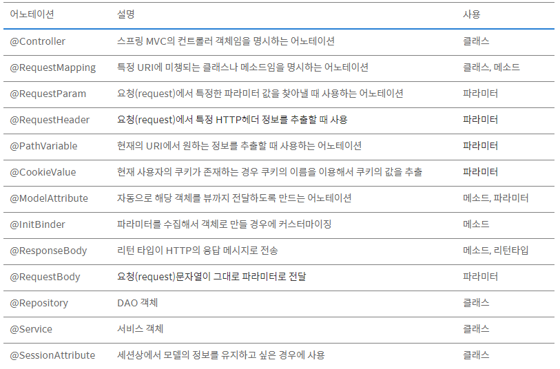

# Spring Annotation 정리

# Annotation이란?

- `Annotation(@)`은 사전적 의미로는 주석이라는 뜻이다.
- 자바에서 `Annotation`은 코드 사이에 주석처럼 쓰이며 **특별한 의미, 기능을 수행하도록 하는 기술**이다.
- 즉, 프로그램에게 **추가적인 정보를 제공해주는 메타데이터**라고 볼 수 있다.*`meta data` : 데이터를 위한 데이터)*

## Annotation의 용도

- **컴파일러에게 코드 작성 문법 에러를 체크하도록 정보를 제공**한다.
- 소프트웨어 개발 툴이 **빌드나 배치시 코드를 자동으로 생성할 수 있도록 정보를 제공**한다.
- **실행시(런타임시)특정 기능을 실행하도록 정보를 제공**한다.

## Annotation 사용 순서

기본적으로 어노테이션을 사용하는 순서는 다음과 같다.

1. **어노테이션을 정의**한다.
2. **클래스에 어노테이션을 배치**한다.
3. **코드가 실행되는 중**에 **Reflection을 이용하여 추가 정보를 획득하여 기능을 실시**한다.
    - reflection: 컴파일 시간이 아닌 실행 시간에 동적으로 특정 클래스의 정보를 객체를 통해 분석 및 추출해내는 프로그래밍 기법

# Annotation의 종류



## `@SpringBootApplication`

- `@SpringBootApplication`으로 인해 스프링 부트의 자동 설정, 스프링 Bean 읽기와 생성을 모두 자동을 설정된다.
- 특히나 `@SpringBootApplication`이 있는 위치부터 설정을 읽어가기 때문에 이 클래스는 항상 프로젝트의 최상단에 위치 해야만 한다.

## `@ComponentScan`

- 자동으로 컴포넌트 클래스를 검색하고, 검색된 컴포넌트 및 클래스를 SpringApplicationContext에 등록하는 역할을 한다.
- 메인 클래스가 위치한 루트패키지부터 이하 모든 클래스를 검색하여 bean으로 등록한다.
- `@Component`와 `@Service`, `@Repository`, `@Controller`, `@Configuration`이 붙은 클래스 Bean들을 찾아서 Context에 bean 등록을 해주는 클래스
    - 다만, `@Component` 대신  `@Service`, `@Repository`, `@Controller`을 사용하는 이유는 해당 애노테이션을 갖는 클래스가 무엇을 하는지 단 번에 알 수 있기 때문이다 (가독성!)
    - 예를들어 `@Repository`는 DAO의 메소드에서 발생할 수 있는 unchecked exception들을 스프링의 DataAccessException으로 처리할 수 있기 때문이다.

## `@Component`

- 특정 패키지 안의 클래스들을 스캔하고, `@Component` 애노테이션이 있는 클래스에 대하여 **bean 인스턴스를 생성**한다.
- **개발자가 직접 작성한 class를 bean으로 등록하기 위해 사용**한다.

```java
@Component
public class Student {
    public Student() {
        System.out.println("hi");
    }
}

@Component(value="mystudent")
public class Student {
    public Student() {
        System.out.println("hi");
    }
}
```

- Component에 대한 추가 정보가 없다면, Class의 이름을 camelCase로 변경한 것이 Bean id로 사용된다. 그러나 `@Bean` 과 다르게, `@Component`는 name이 아닌 **value를 이용**해 **Bean의 이름을 지정**한다.

## `@Controller`

- Spring MVC의 Controller 클래스 선언을 단순화한 것으로, `@Controller`로 등록된 클래스 파일에 대한 bean을 자동으로 생성해준다.

## `@Service`

- **Service Class**에서 쓰인다.
- **비즈니스 로직을 수행**하는 Class라는 것을 나타내는 용도이다.

## `@Repository`

- **DAO class**에서 쓰인다.
- **DataBase에 접근하는 method를 가지고 있는 Class**에서 쓰인다.
- DB 처리 뿐만 아니라 파일 같은 외부 I/O 작업을 처리한다.

# Bean 관련

## `@Configuration`

- Configuration을 클래스에 적용하고 `@Bean`을 해당 Class의 메소드에 적용하면 `@Autowired`로 Bean을 부를 수 있다.

## `@ConfigurationProperties`

- *,properties, *.yml 파일에 정의된 프로퍼티 중 주어진 prefix 를 가지는 프로퍼티들을 POJO 에 매핑하여(자바 클래스에 값을 가져와서) Bean 으로 만들수 있게 해주는 어노테이션이다.
- 이를 통해 property 값을 사용하면, 매핑을 유연하게 할 수 있다.
- 주의할 점은 `@Value` 애노테이션을 활용해 값을 바인딩 하는 것과 다르게, 반드시 setter 메소드를 필요로 한다. `@ConfigurationProperties`는 setter 메소드를 사용해 설정값을 바인딩 하기 때문이다.

## `@EnableAutoConfiguration`

- Spring Application Context를 만들 때 자동으로 설정하는 기능을 켠다.
- classpath의 내용에 기반하여 자동으로 생성해준다.
- 만약 tomcat-embed-core.jar이 존재하면, 톰캣 서버가 setting 된다.

## `@Value`

- properties에서 값을 가져와 적용할 때 사용한다.

```java
@Value("${value.from.file}")
```

- private String valueFromFile; 이라고 구성되어 있으면 value.from.file의 값을 가져와서 해당 변수에 주입해준다.
- spEL을 이용해서 조금 더 고급스럽게 쓸 수 있다.

```java
@Value(#{systemProperties['priority'] ?: 'some default'})
```

## `@Bean`

- `@Bean`은 **개발자가 직접 제어가 불가능한 외부 라이브러리등을 Bean으로 만들려할 때 사용**되는 Annotation이다.

```java
@Configuration
public class ApplicationConfig {
    @Bean
    public ArrayList<String> array(){
        return new ArrayList<String>();
    }
}
```

- ArrayList같은 **라이브러리등을 Bean으로 등록하기 위해서**는 별도로 **해당 라이브러리 객체를 반환하는 Method를 만들고 `@Bean` Annotation을 사용**하면 된다.
- 위의 경우 `@Bean`에 아무런 값을 지정하지 않았으므로 Method 이름을 camelCase로 변경한 것이 Bean id로 등록된다.*method 이름이 arrayList()인 경우 arrayList가 Bean id*

```java
@Configuration
public class ApplicationConfig {
    @Bean(name="myarray")
    public ArrayList<String> array(){
        return new ArrayList<String>();
    }
}
```

- 위와 같이 **`@Bean`에 name이라는 값을 이용하면 자신이 원하는 id로 Bean을 등록**할 수 있다.

## `@Autowired`

- 속성(field), setter method, constructor(생성자)에서 사용하며 **Type에 따라 알아서 Bean을 주입 해준다.**
- 무조건적인 객체에 대한 의존성을 주입시킨다.**이 `Annotation`을 사용할 시, 스프링이 자동적으로 값을 할당**한다.
- **Controller 클래스에서 DAO나 Service에 관한 객체들을 주입 시킬 때 많이 사용**한다.
- 필드, 생성자, 입력 파라미터가 여러 개인 메소드(`@Qualifier`는 메소드의 파라미터)에 적용 가능하다.
- **Type을 먼저 확인한 후 못 찾으면 Name에 따라 주입**한다.*Name으로 강제하는 방법: `@Qualifier`을 같이 명시*


### Bean을 주입받는 방식 (3가지)

1. `@Autowired`
2. setter
3. 생성자 (`@AllArgsConstructor` 사용) -> 권장방식

## `@Required`

- setter 메서드에 적용해주면 빈 생성시 필수 프로퍼티 임을 알린다.

## `@Qualifier`

- `@Autowired`와 같이 쓰이며, 같은 타입의 Bean 객체가 있을 때 해당 아이디를 적어 원하는 Bean이 주입될 수 있도록 하는 애노테이션이다.
    - 같은 타입이 존재하는 경우 ex) 동물, 원숭이, 닭, 개, 돼지
- **같은 타입의 Bean이 두 개 이상이 존재하는 경우**에 Spring이 어떤 Bean을 주입해야 할지 알 수 없어서 **Spring Container를 초기화하는 과정에서 예외를 발생**시킨다.
- 이 경우 `@Qualifier`을 `@Autowired`와 함께 사용하여 **정확히 어떤 bean을 사용할지 지정하여 특정 의존 객체를 주입**할 수 있도록 한다.
- 예시

    

    - xml 설정에서 bean의 한정자 값 (qualifier value)를 설정한다.
    - `@Autowired` 어노테이션이 적용된 주입 대상에 `Qualifer` 어노테이션을 설정한다.

## `@Resource`

- `@Autowired`와 마찬가지로 **빈 객체를 주입**해주는데 차이점은 **Autowired는 타입**으로, **Resource는 이름**으로 연결해준다.
- `javax.annotation.Resource`표준 자바(JSR-250 표준) Annotation으로, Spring Framework 2.5.* 부터 지원 가능한 Annotation이다.

- **Annotation 사용으로 인해 특정 Framework에 종속적인 어플리케이션을 구성하지 않기 위해서는 `@Resource`를 사용할 것을 권장**한다.
- @Resource를 사용하기 위해서는 class path 내에 jsr250-api.jar 파일을 추가해야 한다. **필드, 입력 파라미터가 한 개인 bean property setter method에 적용 가능**하다.

## `@RestController`

- Spring에서 Controller 중 View로 응답하지 않는, Controller를 의미한다.
- method의 반환 결과를 JSON 형태로 반환한다.
- 이 Annotation이 적혀있는 Controller의 method는 HttpResponse로 바로 응답이 가능하다. `@ResponseBody` 역할을 자동적으로 해주는 Annotation이다. *`@Controller` + `@ResponseBody`를 사용하면 `@ResponseBody`를 모든 메소드에서 적용한다.*

### `@Controller` 와 `@RestController` 의 차이

- `@ControllerAPI`와 view를 동시에 사용하는 경우에 사용한다.대신 API 서비스로 사용하는 경우는 `@ResponseBody`를 사용하여 객체를 반환한다.view(화면) return이 주목적이다.
- `@RestControllerview`가 필요없는 API만 지원하는 서비스에서 사용한다.*Spring 4.0.1부터 제공*
- `@RequestMapping` 메서드가 기본적으로 `@ResponseBody` 의미를 가정한다.data(json, xml 등) return이 주목적이다.
- 즉, `@RestController` = `@Controller` + `@ResponseBody` 이다.

# HTTP 요청&응답 관련

## `@RequestMapping`

- **요청 URL을 어떤 method가 처리할지 mapping해주는 Annotation**이다.
- 라우팅 정보를 제공하며, 선언한 경로의 값에 따라 HTTP 요청이 해당 method에 mapping 되어야 하는 것을 알린다.
    - Controller나 Controller의 method에 적용한다.
    - 요청을 받는 형식인 GET, POST, PATCH, PUT, DELETE 를 정의하기도 한다.
    - **요청 받는 형식을 정의하지 않는다면, 자동적으로 GET으로 설정**된다.

```java
@RequestMapping("/list"), @RequestMapping("/home, /about");

@RequestMapping("/admin", method=RequestMethod.GET)
```

```java
@Controller
// 1) Class Level
//모든 메서드에 적용되는 경우 “/home”로 들어오는 모든 요청에 대한 처리를 해당 클래스에서 한다는 것을 의미
@RequestMapping("/home")
public class HomeController {
    /* an HTTP GET for /home */
    @RequestMapping(method = RequestMethod.GET)
    public String getAllEmployees(Model model) {
        ...
    }
    /*
    2) Handler Level
    요청 url에 대해 해당 메서드에서 처리해야 되는 경우
    “/home/employees” POST 요청에 대한 처리를 addEmployee()에서 한다는 것을 의미한다.
    value: 해당 url로 요청이 들어오면 이 메서드가 수행된다.
    method: 요청 method를 명시한다. 없으면 모든 http method 형식에 대해 수행된다.
    */
    /* an HTTP POST for /home/employees */
    @RequestMapping(value = "/employees", method = RequestMethod.POST)
    public String addEmployee(Employee employee) {
        ...
    }
}

```

- **@RequestMapping에 대한 모든 매핑 정보는 Spring에서 제공하는 HandlerMapping Class가 가지고 있다.**

### `@GetMapping`

- `@RequestMapping(Method=RequestMethod.GET)` 과 같은 의미이다.
- HTTP Head에 담아 보내기 때문에 용량 제한이 존재한다.

### `@PostMapping`

- `@RequestMapping(Method=RequestMethod.POST)` 과 같은 의미이다.
- 등록을 할 때 사용하며 HTTP Body에 담아 보낸다

## `@RequestAttribute`

- **Request에 설정되어 있는 속성 값을 가져올 수 있다.**

## `@RequestHeader`

- Request의 header값을 가져올 수 있다. 메소드의 파라미터에 사용한다.

```java
//ko-KR,ko;q=0.8,en-US;q=0.6
@RequestHeader(value="Accept-Language")String acceptLanguage 로 사용
```

## `@RequestParam`

- `@PathVariable`과 비슷하다.
- request의 parameter에서 가져오는 것이다. method의 파라미터에 사용된다.
- ?moviename=thepurge 와 같은 **쿼리 파라미터를 파싱**해준다.
- HTTP GET 요청에 대해 매칭되는 **request parameter** 값이 **자동**으로 들어간다.
    - URI 뒤에 붙는 parameter 값을 가져올 때 사용한다.
    - `http://localhost:8080/home?index=1&page=2`

```java
@GetMapping("/home")
public String show(@RequestParam("page") int pageNum {
}
```

- 위의 경우 GET /home?index=1&page=2와 같이 uri가 전달될 때 page parameter를 받아온다.
- `@RequestParam` 어노테이션의 괄호 안의 문자열이 전달 인자 이름(실제 값을 표시)이다.

```java
@RequestMapping(value = "/search/movie", method = RequestMethod.GET)
public ResponseEntity<?> someMethod(@RequestParam String moviename){
	// request URI would be like '/search/movie?moviename=thepurge'
	try {
	   List<Movie> movies = service.searchByMoviename(moviename);
	} catch(Exception e) {
	   e.printStackTrace();
	}
	// return some response here
}
```

## `@PathVariable`

- method parameter 앞에 사용하면서 **해당 URL에서 {특정값}을 변수**로 받아 올 수 있다.

```java
@RequestMapping(value = "/some/path/{id}", method = RequestMethod.GET)
public ResponseEntity<?> someMethod(@PathVariable int id) {
}
```

- **HTTP 요청에 대해 매핑되는 request parameter 값이 자동으로 Binding 된다.**
- **uri에서 각 구분자에 들어오는 값을 처리해야 할 때 사용**한다.
- REST API에서 값을 호출할 때 주로 많이 사용한다.
- `http://localhost:8080/index/1`

```java
@PostMapping("/index/{idx}")
@ResponseBody
public boolean deletePost(@PathVariable("idx") int postNum) {
return postService.deletePost(postNum);
}
```

- `@RequestParam`와 `@PathVariable` 동시 사용 예제

```java
@GetMapping("/user/{userId}/invoices")
public List<Invoice> listUsersInvoices(@PathVariable("userId") int user,
	                                  @RequestParam(value = "date", required = false) Date dateOrNull) {
}
```

- 위의 경우 `GET /user/{userId}/invoices?date=190101` 와 같이 uri가 전달될 때
- 구분자 `{userId}`는 `@PathVariable(“userId”)`로,
- 뒤에 이어붙은 `parameter`는 `@RequestParam(“date”)`로 받아온다.

## `@CookieValue`

- **쿠키 값을 parameter로 전달 받을 수 있는 방법**이다.
- 해당 쿠키가 존재하지 않으면 500 에러를 발생시킨다.
- 속성으로 required가 있는데 default는 true다.false를 적용하면 해당 쿠키 값이 없을 때 null로 받고 에러를 발생시키지 않는다.

```java
// 쿠키의 key가 auth에 해당하는 값을 가져옴
public String view(@CookieValue(value="auth")String auth){...};
```

## `@CrossOrigin`

- **CORS 보안상의 문제**로 브라우저에서 리소스를 현재 **origin에서 다른 곳으로의 AJAX요청을 방지하는 것**이다.
- `@RequestMapping`이 있는 곳에 사용하면 해당 요청은 타 도메인에서 온 ajax요청을 처리해준다.

```java
//기본 도메인이 http://jeong-pro.tistory.com 인 곳에서 온 ajax요청만 받아주겠다.
@CrossOrigin(origins = "http://jeong-pro.tistory.com", maxAge = 3600)
```

## `@ModelAttribute`

- **view에서 전달해주는 parameter를 Class(VO/DTO)의 멤버 변수로 binding 해주는 Annotation**이다.
- binding 기준은 `<input name="id" />` 처럼 **어떤 태그의 name값이 해당 Class의 멤버 변수명과 일치해야하고 setmethod명도 일치해야한다.**

```java
class Person{

String id;

public void setId(String id){ this.id = id;}
public String getId(){ return this.id }
}

@Controller
@RequestMapping("/person/*")
public class PersonController{
	@RequestMapping(value = "/info", method=RequestMethod.GET)
    	//view에서 myMEM으로 던져준 데이터에 담긴 id 변수를 Person타입의 person이라는 객체명으로 바인딩.
	public void show(@ModelAttribute("myMEM") Person person, Model model)
	{ model.addAttribute(service.read(person.getId())); }
}
```

## `@RequestBody`

- **요청이 온 데이터**(JSON이나 XML형식)를 **바로 Class나 model로 매핑**하기 위한 Annotation이다.
- POST나 PUT, PATCH로 요청을 받을때에, **요청에서 넘어온 body 값들을 자바 타입으로 파싱**해준다.
    - 반드시 HTTP 요청에 대해서만 처리한다.
- HTTP POST 요청에 대해 request body에 있는 request message에서 값을 얻어와 매핑한다. RequestData를 바로 Model이나 클래스로 매핑한다.
- 이를테면 JSON 이나 XML같은 데이터를 적절한 messageConverter로 읽을 때 사용하거나 POJO 형태의 데이터 전체로 받는 경우에 사용한다.

```java
@RequestMapping(value = "/book", method = RequestMethod.POST)
public ResponseEntity<?> someMethod(@RequestBody Book book) {
// we can use the variable named book which has Book model type.
try {
   service.insertBook(book);
} catch(Exception e) {
    e.printStackTrace();
}

// return some response here
}
```

## `@RequestPart`

- **Request로 온 MultipartFile을 바인딩**해준다.

```java
@RequestPart("file") MultipartFile file
```

## `@ResponseBody`

- HttpMessageConverter를 이용하여 JSON 혹은 xml 로 요청에 응답할수 있게 해주는 Annotation이다.
- **view가 아닌 JSON 형식의 값을 응답할 때 사용**하는 Annotation으로 **문자열을 리턴**하면 그 값을 http response header가 아닌 r**esponse body에 들어간다**.
- 이미 `@RestController` Annotation이 붙어 있다면, 쓸 필요가 없다. 허나 그렇지 않은 단순 컨트롤러라면, HttpResponse로 응답 할 수 있게 해준다.
- 만약 **객체를 return하는 경우 JACKSON 라이브러리에 의해 문자열로 변환되어 전송**된다.
- context에 설정된 viewResolver를 무시한다고 보면된다.

## `@ResponseStatus`

- 사용자에게 원하는 response code와 reason을 return해주는 Annotation이다.
- `@ResponseStatus(value = HttpStatus.NOT_FOUND, reason = "my page URL changed..")`
    - 예외처리 함수 앞에 사용한다.
- 요청 클라이언트에게 전달할 응답상태코드 값을 지정한다.
- Default로는 200 OK 응답코드가 반환된다.

# Log 관련

### `@Log4j2`

Logging 프레임워크 제공. 해당 Annotation을 클래스에 선언하면 다음과 같은 변수가 내부적으로 생성되며 실제 선언되어 있지 않더라도 log 변수의 메소드에 접근할 수 있다.

```java
private static final org.apache.logging.log4j.Logger log = org.apache.logging.log4j.LogManager.getLogger(LogExmaple.class);
```

# Lombok 관련

## `@NoArgsConstructor`

- 기본생성자를 자동으로 추가한다.
- `@NoArgsConstructor(access = AccessLevel.PROTECTED)`
    - 기본생성자의 접근 권한을 protected로 제한한다.
    - *생성자로 protected Posts() {}와 같은 효과*
- **Entity Class를 프로젝트 코드상에서 기본생성자로 생성하는 것은 금지하고,** **JPA에서 Entity 클래스를 생성하는것은 허용하기 위해 추가**한다.

## `@AllArgsConstructor`

- **모든 필드 값을 파라미터로 받는 생성자를 추가**한다.

## `@RequiredArgsConstructor`

- **final이나 @NonNull인 필드 값만 파라미터로 받는 생성자를 추가**한다.*final: 값이 할당되면 더 이상 변경할 수 없다.*

## `@Getter`

- Class 내 모든 필드의 **Getter method를 자동 생성**한다.

## `@Setter`

- Class 내 모든 필드의 **Setter method를 자동 생성**한다.
- Controller에서 `@RequestBody`로 외부에서 데이터를 받는 경우엔 기본생성자 + set method를 통해서만 값이 할당된다.
    - 그래서 이때만 setter를 허용한다.
- *Entity Class에는 Setter를 설정하면 안된다.*
- *차라리 DTO 클래스를 생성해서 DTO 타입으로 받도록 하자*

## `@ToString`

- Class 내 모든 필드의 toString method를 자동 생성한다.
- `@ToString(exclude = "password")`특정 필드를 toString() 결과에서 제외한다.
    - 클래스명(필드1이름=필드1값, 필드2이름=필드2값, …) 식으로 출력된다.

## `@EqualsAndHashCode`

- equals와 hashCode method를 오버라이딩 해주는 Annotation이다.
- `@EqualsAndHashCode(callSuper = true)`
    - **callSuper 속성을 통해** equals와 hashCode 메소드 자동 생성 시 **부모 클래스의 필드까지 감안할지 안 할지에 대해서 설정**할 수 있다.
    - 즉, callSuper = true로 설정하면 부모 클래스 필드 값들도 동일한지 체크하며, callSuper = false로 설정(기본값)하면 자신 클래스의 필드 값들만 고려한다.

## `@Builder`

- 어느 필드에 어떤 값을 채워야 할지 명확하게 정하여 생성 시점에 값을 채워준다.

### Constructor와 Builder의 차이

- 생성 시점에 값을 채워주는 역할은 똑같다.하지만 Builder를 사용하면 **어느 필드에 어떤 값을 채워야 할지 명확하게 인지할 수 있다.**해당 Class의 Builder 패턴 Class를 생성 후 생성자 상단에 선언 시 생성자에 포함된 필드만 빌더에 포함된다.

## `@Data`

- `@Getter` `@Setter` `@EqualsAndHashCode` `@AllArgsConstructor`을 포함**한 Lombok에서 제공하는 필드와 관련된 모든 코드를 생성한다.**
- **실제로 사용하지 않는것이 좋다.***전체적인 모든 기능 허용으로 위험 존재*

# 트랜잭션 관련

- **데이터베이스 트랜잭션을 설정하고 싶은 method에 Annotation을 적용**하면 **method 내부에서 일어나는 데이터베이스 로직**이 **전부 성공하게되거나 데이터베이스 접근중 하나라도 실패하면 다시 롤백할 수 있게 해주는 Annotation**이다.
- `@Transaction(readOnly=true, rollbackFor=Exception.class)`
    - readOnly는 읽기전용임을 알리고 rollbackFor는 해당 Exception이 생기면 롤백하라는 뜻이다.
- `@Transaction(noRollbackFor=Exception.class)`
    - 해당 Exception이 나타나도 롤백하지 말라는 뜻이다.
- `@Transaction(timeout = 10)`은 10초안에 해당 로직을 수행하지 못하면 롤백하라는 뜻이다.
- **메소드 내에서 Exception이 발생**하면 **해당 메소드에서 이루어진 모든 DB 작업을 초기**화한다.
    - *save 메소드를 통해서 10개를 등록해야 하는데 5번째에서 Exception이 발생하면 앞에 저장된 4개 까지 모두 롤백*
    - 정확히 얘기하면, **이미 넣은걸 롤백시키는건 아니며, 모든 처리가 정상적으로 됐을때만 DB에 커밋하며 그렇지 않은 경우엔 커밋하지 않는 것**이다.
- 비지니스 로직과 트랜잭션 관리는 대부분 Service에서 관리한다.
- 따라서 일반적으로 DB 데이터를 등록/수정/삭제 하는 Service 메소드는 `@Transactional`를 필수적으로 가져간다.

# 예외 관련

### `@ExceptionHandler`

- `Controller`, `@RestController`가 적용된 bean내에서 발생하는 예외를 잡아서 하나의 메서드에서 처리해주는 기능을 한다.
    - 다만, Controller와 RestController에만 적용이 가능하고 `@Service` 와 같은 빈에서는 적용이 불가하다.
- return type은 자유롭게 해도 된다. (Controller 내부에 있는 메서드들은 여러 타입의 response를 할 수 있고, 해당 타입과 전혀 다른 리턴 타입이어도 상관 없다)
- `@ExceptionHandler`를 등록한 Controller에만 적용된다. 다른 Controller에서 NullPointerException이 발생하더라도 예외를 처리할 수 없다.
- 예시

    ```java
    @RestController public class MyRestController { 
    		@ExceptionHandler(NullPointerException.class) 
    		public Object nullex(Exception e) { 
    				System.err.println(e.getClass()); 
    				return "myService"; 
    		} 
    }
    ```

## `@ControllerAdvice`

- 모든 `@Controller`, 즉, 전역에서 발생할 수 있는 예외를 잡아 처리해주는 annotation이다.
    - `@Controller`나 `@RestController`에서 발생한 예외를 한 곳에서 관리하고 처리할 수 있게 도와주는 어노테이션이다.
- Class 위에 `@ControllerAdvice`를 붙이고 **어떤 예외를 잡아낼 것인지는 각 메소드 상단에 @ExceptionHandler(예외클래스명.class)를 붙여서 기술**한다.

## `@RestControllerAdvice`

- @ControllerAdvice + @ResponseBody다.
- API서버여서 에러 응답으로 객체를 리턴해야한다면 @ResponseBody 어노테이션이 추가된 @RestControllerAdvice를 적용하면 되는 것이다.

# Mapper 관련

## `@MapperScan`

- mapper.xml 파일들이 주시할 **기본 패키지 위치를 지정해주는 어노테이션**.
- mapper 인터페이스를 자동으로 스캐닝하고 등록함

## `@Mapper`

- mapper 인터페이스 작성 시 사용되며,
- mybatis annotation으로 interface 클래스를 통해 sql 컨트롤한다.
- `@Mapper`로 지정된 인터페이스를 `@Service`에 injection하여 사용한다.

# Swagger 관련

## `@EnableSwagger2`

- Swagger 사용을 가능하게 해주는 어노테이션이다.
- main 쪽에 추가도 가능하며 Swagger 관련 Config 파일에 추가해도 된다.

## `@ApiImplicitParams`

- API의 파라미터를 나타내는 어노테이션으로, `@ApiImplicitParam` 여러개를 내부에 사용할 수 있다.

## `@ApiModel`

- Swagger model에 정보를 추가한다 (모델 클래스)

## `@ApiModelProperty`

- Swagger model의 프로퍼티 정보를 추가할 수 있다.

## `@ApiParam`

- api 파라미터에 직접 설명을 붙인다.

## `@ApiResponse`

- api 응답에 관한 정의를 한다.

# 참고 자료

[https://gmlwjd9405.github.io/2018/12/02/spring-annotation-types.html](https://gmlwjd9405.github.io/2018/12/02/spring-annotation-types.html)  

[https://cornswrold.tistory.com/8](https://cornswrold.tistory.com/8)  

[https://jeong-pro.tistory.com/151](https://jeong-pro.tistory.com/151)

[https://hochoon-dev.tistory.com/entry/SpringBoot-주요-Annotation-정리](https://hochoon-dev.tistory.com/entry/SpringBoot-%EC%A3%BC%EC%9A%94-Annotation-%EC%A0%95%EB%A6%AC)

[https://velog.io/@gillog/Spring-Annotation-정리](https://velog.io/@gillog/Spring-Annotation-%EC%A0%95%EB%A6%AC)

[https://jeong-pro.tistory.com/195](https://jeong-pro.tistory.com/195)